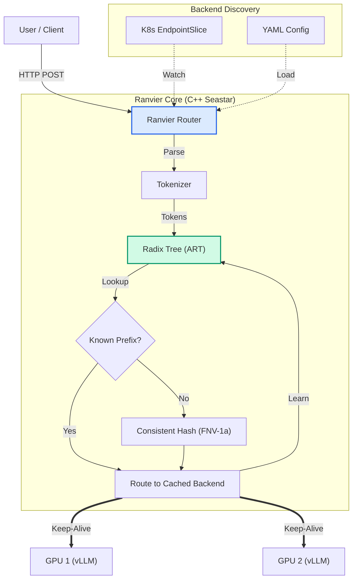

# Ranvier Core

> **33-44% faster Time-To-First-Token** through intelligent prefix-aware routing.
>
> *Named for the Nodes of Ranvier—enabling signals to jump gaps, just as Ranvier enables inference to skip redundant computation.*

A high-performance LLM traffic controller that reduces GPU cache thrashing by routing requests based on **Token Prefixes** rather than connection availability.

**Best for:** RAG, multi-turn chat with system prompts, few-shot learning. **Less benefit for:** short prompts (<500 tokens), small models (<8B).

```bash
# Quick start (requires Docker)
docker run -p 8080:8080 ghcr.io/ranvier-systems/ranvier:latest
```

[](https://opensource.org/licenses/Apache-2.0)
[](https://isocpp.org/)
[](docs/architecture/VISION.md)

---

## Quick Start (Local Mode)

```bash
ranvier --local
```

Auto-discovers Ollama, vLLM, LM Studio, and other local LLM servers.
Routes requests by intent, priority, and cost — no configuration needed.
Point your IDE to `http://localhost:8080` and start coding.

See [Getting Started with Ranvier Local](docs/guides/getting-started-local.md) for details.

---

## ⚡ The Problem: "Blind" Routing
Standard load balancers (Nginx, HAProxy) route LLM requests based on *server availability* (Least Connections or Round Robin). They treat LLM requests as generic HTTP packets.

In the era of **KV-Caching**, this is inefficient.
* **Request A** loads a 4,000-token PDF into `GPU-1`.
* **Request B** (asking a question about that PDF) gets routed to `GPU-2` by Round Robin.
* **Result:** `GPU-2` must re-compute the entire 4,000-token prefill. Throughput collapses; latency spikes.

## 🧠 The Solution: Content-Aware Routing
**Ranvier** acts as a "Layer 7+" Load Balancer. It inspects the **semantic content** (token sequence) of the incoming request and routes it to the GPU that already holds the relevant KV Cache.

Just as the **Nodes of Ranvier** allow biological signals to "jump" gaps (Saltatory Conduction) to increase speed, Ranvier allows LLM inference to skip the prefill phase by jumping straight to the cached state.

### Key Architecture
* **Adaptive Radix Tree (ART):** Uses a cache-oblivious Radix Tree to map `TokenPrefix -> GPU_ID`. Lookups are $O(L)$ where $L$ is the prefix length, independent of total keys.
* **Seastar Framework:** Built on a shared-nothing, thread-per-core architecture. No locks, no atomics, massive concurrency.
* **Model Agnostic:** Uses HuggingFace `tokenizer.json` definitions to adapt to any model architecture (Llama 3, Mistral, GPT-4o) dynamically.

---

## 🚀 Performance Characteristics

| Metric | Measured | Notes |
|--------|----------|-------|
| **Radix Tree Lookup** | < 50μs | Pure routing decision (O(L) where L = prefix length) |
| **Total Routing Overhead** | 1-10ms | Includes tokenization; scales with prompt size |
| **Ranvier P50 Overhead** | ~7ms | Measured vs direct vLLM connection |
| **Cache Hit Rate** | 58-98% | With prefix-heavy workloads (RAG, few-shot) |

**Design Principles:**
* **Minimized Copying:** Uses `string_view` parsing with single network buffer copy; Radix lookups use `std::span` for zero-copy token access.
* **Shared-Nothing Architecture:** Thread-per-core via Seastar; no locks on the hot path. Each shard maintains its own routing tree.
* **Near-Linear Scaling:** Throughput scales well up to 4-8 cores; diminishing returns beyond due to cross-shard route learning broadcasts.

---

## 📊 Benchmark Results

Real-world results from 8x A100 GPUs (30-minute validated runs, February 2026):

### Performance by Model Size

| Model | Cache Hit Rate | XLarge TTFT Improvement | P99 Latency | Throughput |
|-------|----------------|-------------------------|-------------|------------|
| **Llama-3.1-70B** | 25% → **98%** | **44%** faster | ~same | ~same |
| CodeLlama-13b | 12% → **58-98%** | **33%** faster | **-60% to -85%** | **+4% to +22%** |
| Llama-3.1-8B | 12% → **68-98%** | **40%** faster | flat | ~same |

*70B on 80GB A100s (TP=2, 4 backends). 13B/8B on 40GB A100s (8 backends).
13B ranges: 58% hits / -80% P99 (current arch, 30u batched routes) to 98% / -85%
(Instance 3, per-request SMP). Clean runs consistently show P99 -60% to -80%.*

**Key insight:** Benefits scale with model size — larger models save more computation per cache hit. The 13B model is the sweet spot: queue buildup under load makes routing dramatically effective (-60% to -85% P99, +4% to +22% throughput). 70B shows the highest per-request benefit (44% TTFT) but is compute-bound rather than queue-bound.

**Best suited for:**
- RAG applications with shared context documents
- Multi-turn chat with large system prompts
- Few-shot learning with shared examples
- Any workload with 2K+ token shared prefixes

See [Benchmark Guide](docs/benchmarks/benchmark-guide-8xA100.md) for detailed methodology and results.

---

## 🗺️ Architecture & Vision

Ranvier is evolving from a prefix-aware router into a full **Intelligence Layer for AI Inference Infrastructure**.

**Current Capabilities (v1.0):**
- Token prefix-based routing via Adaptive Radix Tree
- Passive route learning (learns which prefixes → which backends)
- Backend health checking with circuit breaker
- Multi-node clustering with gossip protocol

**Planned Capabilities ([see roadmap](docs/architecture/VISION.md)):**
- **Request Intent Classification** - Route by FIM/Chat/Edit detection, not just token count
- **Priority Queues** - Interactive requests never blocked by batch jobs
- **Load-Aware Routing** - Ingest vLLM metrics for GPU-aware decisions
- **Local Mode** - Auto-discover Ollama, LM Studio, llama.cpp

The vision: A dropdown menu sets a global model preference. Ranvier will make **per-request routing decisions** based on intent, cost, and latency requirements.

---

## ⚠️ Backend Requirement: Prefix Caching

Ranvier routes requests to the backend that *should* have the relevant KV cache — but the backend must actually have prefix caching enabled for this to help. Without backend-side caching, Ranvier's routing decisions have no cache to hit.

For **vLLM**, enable Automatic Prefix Caching (APC):
```bash
# vLLM ≥0.4.0
python -m vllm.entrypoints.openai.api_server --enable-prefix-caching ...
```

Other backends with prefix/KV cache reuse (SGLang RadixAttention, TensorRT-LLM, etc.) also benefit. The key requirement is that the backend caches KV state for previously-seen token prefixes so that repeated prefixes skip the prefill phase.

---

## 🛠️ Configuration
Ranvier maps generic HTTP endpoints to specific Tokenizer/Model backends.

```yaml
# config.yaml
routes:
  - path: "/v1/chat/completions"
    model: "meta-llama/Meta-Llama-3-8B"
    backend_pool: "h100-cluster-a"
    # Ranvier uses this to tokenize the raw HTTP body
    tokenizer_config: "./tokenizers/llama-3.json"

    # Optimization settings
    min_prefix_length: 64   # Don't route on "Hello", wait for context
    block_alignment: 16     # Align with vLLM PagedAttention blocks
```



---

## 🐳 Deployment

### Docker

Pre-built images are available on GitHub Container Registry (linux/amd64, linux/arm64):

```bash
# Pull the latest image
docker pull ghcr.io/ranvier-systems/ranvier:latest

# Pull a specific version
docker pull ghcr.io/ranvier-systems/ranvier:1.0.0

# Pull by commit SHA for traceability
docker pull ghcr.io/ranvier-systems/ranvier:sha-abc1234

# Run with required IPC_LOCK capability
docker run --cap-add=IPC_LOCK -p 8080:8080 -p 9180:9180 ghcr.io/ranvier-systems/ranvier:latest
```

Build from source (optional):

```bash
# Build production image locally (standalone, ~20 min)
docker build -f Dockerfile.production -t ranvier:latest .

# Or use the base image strategy for faster rebuilds (~2 min)
docker pull ghcr.io/ranvier-systems/ranvier-base:latest
docker build -f Dockerfile.production.fast -t ranvier:latest .

# Run with required IPC_LOCK capability
docker run --cap-add=IPC_LOCK -p 8080:8080 -p 9180:9180 ranvier:latest
```

---

## 🔧 Development Setup

### Prerequisites
- Docker with BuildKit enabled
- VS Code with Dev Containers extension (recommended)

### Quick Start

1. **Pull the base image** (pre-built from GitHub Container Registry):
   ```bash
   docker pull ghcr.io/ranvier-systems/ranvier-base:latest
   ```
   Or build locally if customizing:
   ```bash
   docker build -f Dockerfile.base -t ghcr.io/ranvier-systems/ranvier-base:latest .
   ```

2. **Open in VS Code:**
   - Open the project folder
   - Press `Ctrl+Shift+P` → "Dev Containers: Reopen in Container"
   - The dev container uses the base image for fast startup

3. **Build Ranvier:**
   ```bash
   mkdir build && cd build
   cmake .. -G Ninja -DCMAKE_BUILD_TYPE=Release
   ninja
   ```

### Disk Management

After benchmarking or when disk usage grows:
```bash
./scripts/docker-cleanup.sh              # Keep 10GB cache (default)
./scripts/docker-cleanup.sh --keep 5GB   # Custom limit
./scripts/docker-cleanup.sh --aggressive # Remove everything unused
```

### Kubernetes (Helm)

Deploy a 3-node Ranvier cluster with gossip synchronization:

```bash
# Install with default values
helm install ranvier ./deploy/helm/ranvier \
  --namespace ranvier --create-namespace

# Production installation with backend discovery
helm install ranvier ./deploy/helm/ranvier \
  --namespace ranvier --create-namespace \
  --set "auth.apiKeys[0].name=admin" \
  --set "auth.apiKeys[0].key=rnv_prod_$(openssl rand -hex 24)" \
  --set "auth.apiKeys[0].roles={admin}" \
  --set backends.discovery.enabled=true \
  --set backends.discovery.serviceName=vllm-backends \
  --set serviceMonitor.enabled=true
```

See [Kubernetes Deployment Guide](docs/deployment/kubernetes.md) for detailed configuration options.

---

## 📖 Documentation

### Guides
- [Getting Started with Ranvier Local](docs/guides/getting-started-local.md)
- [Cloud Deployment Guide](docs/guides/cloud-deployment.md)
- [IDE Integration (Cursor, Claude Code, Cline, Aider)](docs/guides/ide-integration.md)
- [Benchmark Reproduction](docs/guides/benchmark-reproduction.md)

### Reference
- [Architecture & Vision](docs/architecture/VISION.md)
- [Architecture Overview](docs/architecture/system-design.md)
- [API Reference](docs/api/reference.md)
- [Request Flow](docs/request-flow.md)
- [Benchmark Results (8x A100)](docs/benchmarks/benchmark-guide-8xA100.md)
- [Kubernetes Deployment](docs/deployment/kubernetes.md)
- [Performance Tuning](docs/deployment/performance.md)
- **Internals:**
  - [Gossip Protocol](docs/internals/gossip-protocol.md)
  - [Radix Tree](docs/internals/radix-tree.md)
  - [Prefix Affinity Routing](docs/internals/prefix-affinity-routing.md)
- [Changelog](CHANGELOG.md)

---

Ranvier is a project of Minds Aspire, LLC.
