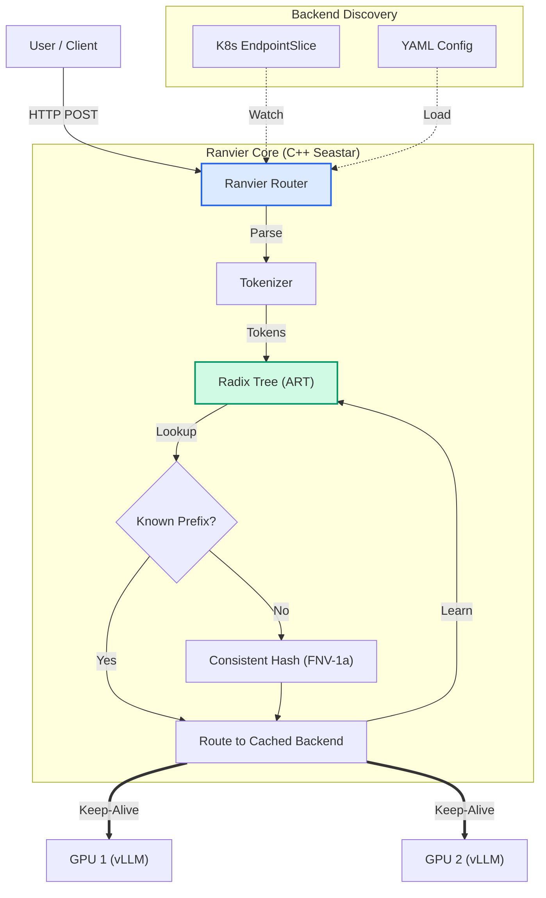

# Ranvier Core

> **Prefix-aware routing for self-hosted LLM fleets, in C++20 on Seastar.** On the representative 50-prefix workload (8×A100, July 2026) it tripled cache-hit rate at every load level and cut P99 time-to-first-token by 9–13% under sustained load, with no reliable effect at moderate load and a 29% P99 regression at low load. See [Benchmark Results](#benchmark-results), which also carries the superseded February figures.
>
> *Named for the Nodes of Ranvier—enabling signals to jump gaps, just as Ranvier enables inference to skip redundant computation.*

A high-performance LLM traffic controller that reduces GPU cache thrashing by routing requests based on **Token Prefixes** rather than connection availability.

**Best for:** RAG, multi-turn chat with system prompts, few-shot learning. **Less benefit for:** short prompts (<500 tokens), small models (<8B).

[](https://opensource.org/licenses/Apache-2.0)
[](https://isocpp.org/)
[](docs/architecture/VISION.md)

---

## Quick Start

Run with Docker — no configuration needed:

```bash
docker run --cap-add=IPC_LOCK -p 8080:8080 -p 9180:9180 \
  ghcr.io/ranvier-systems/ranvier:2.1.0
```

`2.1.0` is the latest release (2026-04-11). The `:latest` tag tracks `main`, which carries
unreleased changes; read [CHANGELOG → Unreleased](CHANGELOG.md#unreleased) before using it.

Point your client at `http://localhost:8080` and start sending requests.
For deployment options (Kubernetes, building from source), see [Deployment](#deployment) below.

---

## The Problem: "Blind" Routing

Standard load balancers (Nginx, HAProxy) route LLM requests based on *server availability* (Least Connections or Round Robin). They treat LLM requests as generic HTTP packets.

In the era of **KV-Caching**, this is inefficient.
* **Request A** loads a 4,000-token PDF into `GPU-1`.
* **Request B** (asking a question about that PDF) gets routed to `GPU-2` by Round Robin.
* **Result:** `GPU-2` must re-compute the entire 4,000-token prefill. Throughput collapses; latency spikes.

## The Solution: Content-Aware Routing

**Ranvier** acts as a "Layer 7+" Load Balancer. It inspects the **semantic content** (token sequence) of the incoming request and routes it to the GPU that already holds the relevant KV Cache.

Just as the **Nodes of Ranvier** allow biological signals to "jump" gaps (Saltatory Conduction) to increase speed, Ranvier allows LLM inference to skip the prefill phase by jumping straight to the cached state.

### Key Architecture
* **Adaptive Radix Tree (ART):** Uses a cache-oblivious Radix Tree to map `TokenPrefix -> GPU_ID`. Lookups are $O(L)$ where $L$ is the prefix length, independent of total keys.
* **Seastar Framework:** Built on a shared-nothing, thread-per-core architecture. No locks, no atomics, massive concurrency.
* **Model Agnostic:** Uses HuggingFace `tokenizer.json` definitions to adapt to any model architecture (Llama 3, Mistral, GPT-4o) dynamically.

---

## Performance Characteristics

| Metric | Measured | Notes |
|--------|----------|-------|
| **Radix Tree Lookup** | < 50μs | Pure routing decision (O(L) where L = prefix length) |
| **Total Routing Overhead** | 1-10ms | Includes tokenization; scales with prompt size |
| **Ranvier P50 Overhead** | ~7ms | Measured vs direct vLLM connection |
| **Cache Hit Rate** | 58-98% | With prefix-heavy workloads (RAG, few-shot) |

**Design Principles:**
* **Minimized Copying:** Uses `string_view` parsing with single network buffer copy; Radix lookups use `std::span` for zero-copy token access.
* **Shared-Nothing Architecture:** Thread-per-core via Seastar; no locks on the hot path. Each shard maintains its own routing tree.
* **Near-Linear Scaling:** Throughput scales well up to 4-8 cores; diminishing returns beyond due to cross-shard route learning broadcasts.

---

## Benchmark Results

Two campaigns have been run on 8×A100 hardware. **The July 2026 re-baseline is the citable one.** The February 2026 numbers are kept below for history: they were measured on a 5-prefix synthetic workload that the project's own methodology review (`.dev-context/benchmark-tooling-review-2026-07-05.md`) found manufactures much of the headline win, and they should not be quoted as expected results.

### July 2026 re-baseline (citable)

Representative workload: 50 large shared prefixes; prefix-aware routing against round-robin on the same fleet; median of three runs per configuration; commit `817a1b5`. Write-up: [benchmark-results-current.md](docs/benchmarks/benchmark-results-current.md).

| Model, load | Cache hit rate | P99 TTFT vs round-robin | Verdict |
|---|---|---|---|
| Llama-3.1-8B, 20 users (~47 req/s) | ~3× higher | **−13.3%** | reliable improvement |
| CodeLlama-13B, 30 users | ~3× higher | **−9.1%** | reliable improvement |
| CodeLlama-13B, 20 users | ~3× higher | no reliable effect | interquartile range spans zero |
| CodeLlama-13B, 10 users (~16 req/s) | ~3× higher | **+29%**, more timeouts | reliable regression |

The effect is monotonic in cluster throughput. Prefix affinity pays when the GPUs are queue-bound, because a skipped prefill shortens the queue behind it, and costs a little when they are idle, because a skipped prefill is then worth less than the transient concentration affinity can cause. Cache-hit rate rose about threefold in every configuration and is decoupled from P99 at low load. Per-request routing overhead (about 1.7 ms at 30 users and about 16 ms at 10 users, against a P99 of several seconds) does not explain the regression; the leading hypothesis and its untested one-flag fix are written up in `.dev-context/prefix-routing-load-gating-proposal.md`.

**What this does and does not show.** Ranvier reliably improves tail latency for prefix-heavy traffic on a saturated fleet. It has not been shown to help an under-utilized fleet, and it has not been compared head-to-head with other prefix-aware routers. A pre-registered comparison is the next planned GPU run.

### February 2026 campaign (superseded)

5-prefix workload, 30-minute runs. Earlier release notes and posts cite these figures. Treat them as an upper bound from a favourable synthetic case, not as expected results.

| Model | Cache Hit Rate | TTFT Improvement | P99 Latency | Throughput |
|-------|----------------|------------------|-------------|------------|
| Llama-3.1-70B | 25% → 98% | 44% faster | ~same | ~same |
| CodeLlama-13b | 12% → 58-98% | 33% faster | -60% to -85% | +4% to +22% |
| Llama-3.1-8B | 12% → 68-98% | 40% faster | flat | ~same |

<sub>Hardware: 70B on 80GB A100s (TP=2, 4 backends); 13B/8B on 40GB A100s (8 backends).</sub>

**Best suited for:** RAG with shared context documents, multi-turn chat with large system prompts, few-shot prompts with shared examples, and any workload with 2K+ token shared prefixes on a fleet that runs hot.

See the [Benchmark Guide](docs/benchmarks/benchmark-guide-8xA100.md) for methodology and [Benchmark Reproduction](docs/guides/benchmark-reproduction.md) to run it yourself.

---

## Architecture & Capabilities

**Shipped in 2.1.0 (2026-04-11):**
- Token-prefix routing via an Adaptive Radix Tree, with consistent-hash and random fallbacks, and passive route learning from backend responses
- Partial tokenization for routing: a byte-budgeted prefix is tokenized for the routing decision and full tokenization is deferred until it is needed
- Request intent classification (autocomplete, edit, chat), priority tiers, and a priority queue with fair per-agent scheduling
- vLLM metrics ingestion, GPU-aware load routing, and per-backend cost budgets
- Backend health checks with a circuit breaker; multi-node clustering over DTLS-encrypted gossip with cache-residency tracking
- Ranvier Local: discovery of local backends such as Ollama and LM Studio
- Kubernetes EndpointSlice discovery and a Helm chart

**On `main`, unreleased:** a Gateway API Inference Extension Endpoint Picker mode (build-gated, off by default), a native vLLM KV-event subscriber, an admission-policy seam, response-side usage accounting, and OpenTelemetry GenAI semantic conventions. See [CHANGELOG → Unreleased](CHANGELOG.md#unreleased). None of these has been exercised on GPU hardware since the July 2026 re-baseline.

The roadmap that produced 2.0.0 is in [VISION.md](docs/architecture/VISION.md).

---

## ⚠️ Backend Requirement: Prefix Caching

Ranvier routes requests to the backend that *should* have the relevant KV cache — but the backend must actually have prefix caching enabled for this to help. Without backend-side caching, Ranvier's routing decisions have no cache to hit.

For **vLLM**, enable Automatic Prefix Caching (APC):
```bash
# vLLM ≥0.4.0
python -m vllm.entrypoints.openai.api_server --enable-prefix-caching ...
```

Other backends with prefix/KV cache reuse (SGLang RadixAttention, TensorRT-LLM, etc.) also benefit. The key requirement is that the backend caches KV state for previously-seen token prefixes so that repeated prefixes skip the prefill phase.

---

## Configuration
Ranvier maps generic HTTP endpoints to specific Tokenizer/Model backends.

```yaml
# config.yaml
routes:
  - path: "/v1/chat/completions"
    model: "meta-llama/Meta-Llama-3-8B"
    backend_pool: "h100-cluster-a"
    # Ranvier uses this to tokenize the raw HTTP body
    tokenizer_config: "./tokenizers/llama-3.json"

    # Optimization settings
    min_prefix_length: 64   # Don't route on "Hello", wait for context
    block_alignment: 16     # Align with vLLM PagedAttention blocks
```


```mermaid
graph TD
    User["User / Client"] -->|HTTP POST| Router["Ranvier Router"]

    subgraph "Ranvier Core (C++ Seastar)"
        Router -->|Parse| Tokenizer["Tokenizer"]
        Tokenizer -->|Tokens| Radix["Radix Tree (ART)"]
        Radix -->|Lookup| Cache{"Known Prefix?"}
        Cache -- Yes --> Route["Route to Cached Backend"]
        Cache -- No --> Hash["Consistent Hash (FNV-1a)"]
        Hash --> Route
        Route -->|Learn| Radix
    end

    subgraph "Backend Discovery"
        K8s["K8s EndpointSlice"] -.->|Watch| Router
        Config["YAML Config"] -.->|Load| Router
    end

    Route == "Keep-Alive" ==> GPU1["GPU 1 (vLLM)"]
    Route == "Keep-Alive" ==> GPU2["GPU 2 (vLLM)"]

    style Router fill:#dbeafe,stroke:#2563eb,stroke-width:2px
    style Radix fill:#d1fae5,stroke:#059669,stroke-width:2px
```

---

## Deployment

### Docker

Pre-built images are available on GitHub Container Registry (linux/amd64, linux/arm64):

```bash
# Pull the latest release
docker pull ghcr.io/ranvier-systems/ranvier:2.1.0

# Pull whatever is on main (unreleased; see CHANGELOG → Unreleased)
docker pull ghcr.io/ranvier-systems/ranvier:latest

# Pull by commit SHA for traceability
docker pull ghcr.io/ranvier-systems/ranvier:sha-abc1234

# Run with required IPC_LOCK capability
docker run --cap-add=IPC_LOCK -p 8080:8080 -p 9180:9180 ghcr.io/ranvier-systems/ranvier:2.1.0
```

Build from source (optional):

```bash
# Build production image locally (standalone, ~20 min)
docker build -f Dockerfile.production -t ranvier:latest .

# Or use the base image strategy for faster rebuilds (~2 min)
docker pull ghcr.io/ranvier-systems/ranvier-base:latest
docker build -f Dockerfile.production.fast -t ranvier:latest .

# Run with required IPC_LOCK capability
docker run --cap-add=IPC_LOCK -p 8080:8080 -p 9180:9180 ranvier:latest
```

---

## Development Setup

### Prerequisites
- Docker with BuildKit enabled
- VS Code with Dev Containers extension (recommended)

### Quick Start

1. **Pull the base image** (pre-built from GitHub Container Registry):
   ```bash
   docker pull ghcr.io/ranvier-systems/ranvier-base:latest
   ```
   Or build locally if customizing:
   ```bash
   docker build -f Dockerfile.base -t ghcr.io/ranvier-systems/ranvier-base:latest .
   ```

2. **Open in VS Code:**
   - Open the project folder
   - Press `Ctrl+Shift+P` → "Dev Containers: Reopen in Container"
   - The dev container uses the base image for fast startup

3. **Build Ranvier:**
   ```bash
   mkdir build && cd build
   cmake .. -G Ninja -DCMAKE_BUILD_TYPE=Release
   ninja
   ```

### Disk Management

After benchmarking or when disk usage grows:
```bash
./scripts/docker-cleanup.sh              # Keep 10GB cache (default)
./scripts/docker-cleanup.sh --keep 5GB   # Custom limit
./scripts/docker-cleanup.sh --aggressive # Remove everything unused
```

### Kubernetes (Helm)

Deploy a 3-node Ranvier cluster with gossip synchronization:

```bash
# Install with default values
helm install ranvier ./deploy/helm/ranvier \
  --namespace ranvier --create-namespace

# Production installation with backend discovery
helm install ranvier ./deploy/helm/ranvier \
  --namespace ranvier --create-namespace \
  --set "auth.apiKeys[0].name=admin" \
  --set "auth.apiKeys[0].key=rnv_prod_$(openssl rand -hex 24)" \
  --set "auth.apiKeys[0].roles={admin}" \
  --set backends.discovery.enabled=true \
  --set backends.discovery.serviceName=vllm-backends \
  --set serviceMonitor.enabled=true
```

See [Kubernetes Deployment Guide](docs/deployment/kubernetes.md) for detailed configuration options.

---

## Project status

- **Latest release:** 2.1.0 (2026-04-11), on the [Releases page](https://github.com/Ranvier-Systems/ranvier-core/releases) and in [CHANGELOG.md](CHANGELOG.md). `main` carries unreleased work.
- **Maintainer:** one, part-time. Issues and pull requests are welcome; expect a response within a week rather than a day. See [CONTRIBUTING.md](CONTRIBUTING.md).
- **Security:** see [SECURITY.md](SECURITY.md) for how to report a vulnerability and for the known hardening gaps. In short: backend connections are not yet encrypted, so terminate TLS in front of Ranvier, and do not expose the metrics/admin port publicly.
- **Provenance:** a large share of this codebase was written with AI coding agents working under the maintainer's direction and review. Every change goes through the same CI (unit tests, sanitizers, fuzzers) and the Seastar rules in `.dev-context/claude-context.md`, and contributions are held to the same bar whether or not an agent helped write them.

---

## Documentation

### Guides
- [Getting Started with Ranvier Local](docs/guides/getting-started-local.md)
- [Cloud Deployment Guide](docs/guides/cloud-deployment.md)
- [IDE Integration (Cursor, Claude Code, Cline, Aider)](docs/guides/ide-integration.md)
- [Benchmark Reproduction](docs/guides/benchmark-reproduction.md)

### Reference
- [Architecture & Vision](docs/architecture/VISION.md)
- [Architecture Overview](docs/architecture/system-design.md)
- [API Reference](docs/api/reference.md)
- [Request Flow](docs/request-flow.md)
- [Benchmark Results (8x A100)](docs/benchmarks/benchmark-guide-8xA100.md)
- [Kubernetes Deployment](docs/deployment/kubernetes.md)
- [Performance Tuning](docs/deployment/performance.md)
- **Internals:**
  - [Gossip Protocol](docs/internals/gossip-protocol.md)
  - [Radix Tree](docs/internals/radix-tree.md)
  - [Prefix Affinity Routing](docs/internals/prefix-affinity-routing.md)
  - [Per-API-Key Attribution](docs/internals/per-api-key-attribution.md)
- [Changelog](CHANGELOG.md)

---

Ranvier is a project of Minds Aspire, LLC.
