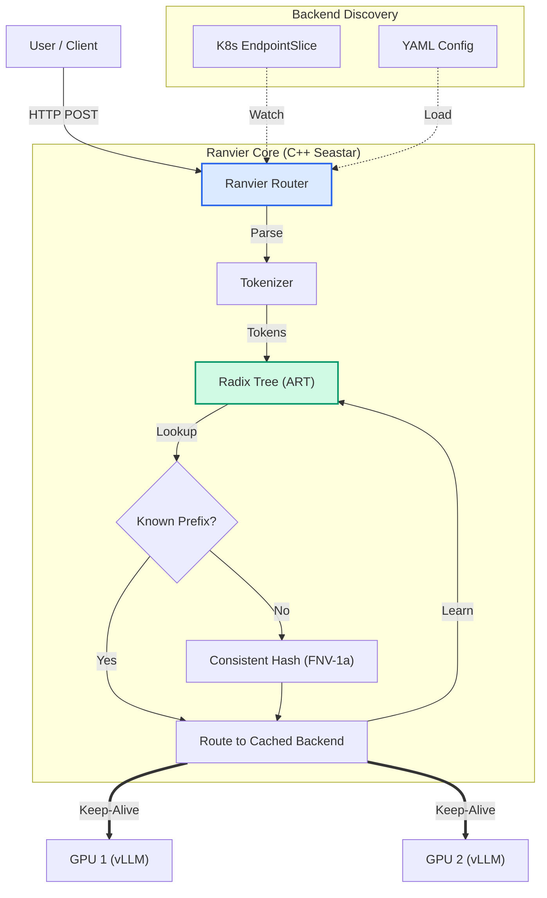

# Ranvier Core

> **Prefix-aware routing for self-hosted LLM fleets, in C++20 on Seastar.** On the representative 50-prefix workload (8×A100, October 2026) it raised vLLM's KV-cache hit rate from 72% to 94% and cut P99 time-to-first-token by 17% on Llama-3.1-8B. On CodeLlama-13B the first campaign regressed P99 by about 10% at 20 users; that was traced to the load-divert policy reading a stale signal at too tight a threshold, and under the defaults shipped on October 5 the same configuration cut P99 by 55–60% (three repeats) with KV hits rising from 12% to 70%.
>
> *Named for the Nodes of Ranvier—enabling signals to jump gaps, just as Ranvier enables inference to skip redundant computation.*

A high-performance LLM traffic controller that reduces GPU cache thrashing by routing requests based on **Token Prefixes** rather than connection availability.

**Best for:** RAG, multi-turn chat with system prompts, few-shot learning. **Less benefit for:** short prompts (<500 tokens), small models (<8B).

[](https://opensource.org/licenses/Apache-2.0)
[](https://isocpp.org/)
[](docs/architecture/VISION.md)

---

## Quick Start

Run with Docker — no configuration needed:

```bash
docker run --cap-add=IPC_LOCK -p 8080:8080 -p 9180:9180 \
  ghcr.io/ranvier-systems/ranvier:2.2.0
```

`2.2.0` is the latest release (2026-10-06). The `:latest` tag tracks `main`, which carries
unreleased changes; read [CHANGELOG → Unreleased](CHANGELOG.md#unreleased) before using it.
Upgrading from 2.1.0 changes five routing defaults; see
[CHANGELOG → 2.2.0 → Upgrade notes](CHANGELOG.md#220---2026-10-06).

Point your client at `http://localhost:8080` and start sending requests.
For deployment options (Kubernetes, building from source), see [Deployment](#deployment) below.

---

## The Problem: "Blind" Routing

Standard load balancers (Nginx, HAProxy) route LLM requests based on *server availability* (Least Connections or Round Robin). They treat LLM requests as generic HTTP packets.

In the era of **KV-Caching**, this is inefficient.
* **Request A** loads a 4,000-token PDF into `GPU-1`.
* **Request B** (asking a question about that PDF) gets routed to `GPU-2` by Round Robin.
* **Result:** `GPU-2` must re-compute the entire 4,000-token prefill. Throughput collapses; latency spikes.

## The Solution: Content-Aware Routing

**Ranvier** acts as a "Layer 7+" Load Balancer. It inspects the **semantic content** (token sequence) of the incoming request and routes it to the GPU that already holds the relevant KV Cache.

Just as the **Nodes of Ranvier** allow biological signals to "jump" gaps (Saltatory Conduction) to increase speed, Ranvier allows LLM inference to skip the prefill phase by jumping straight to the cached state.

### Key Architecture
* **Adaptive Radix Tree (ART):** Uses a cache-oblivious Radix Tree to map `TokenPrefix -> GPU_ID`. Lookups are $O(L)$ where $L$ is the prefix length, independent of total keys.
* **Seastar Framework:** Built on a shared-nothing, thread-per-core architecture. No locks, no atomics, massive concurrency.
* **Model Agnostic:** Uses HuggingFace `tokenizer.json` definitions to adapt to any model architecture (Llama 3, Mistral, GPT-4o) dynamically.

---

## Performance Characteristics

| Metric | Measured | Notes |
|--------|----------|-------|
| **Radix Tree Lookup** | < 50μs | Pure routing decision, O(L) in prefix length; component micro-benchmark (`make bench-hot-prefix`) |
| **Per-request Routing Decision** | ~0.2 ms P50, ~10 ms P99 | Router-side time including tokenization (the P99 is boundary-detection tokenization); Prometheus histogram estimates from the October 2026 13B fitted suite, the same at 10 and 20 users ([raw compare files](docs/benchmarks/results/2026-10-02-fitted/)) |
| **KV-cache hit rate vs round-robin** | 72% → 94% (8B) | vLLM's own prefix-cache counter; 13B rose too (e.g. 17% → 65% on a prefix set that fits its cache) |
| **P99 TTFT vs round-robin** | −17% (8B) … −58% (13B, 20 users) under the October 5 defaults; −17% … +11% under the previous ones | Depends on model, KV headroom and load: see [Benchmark Results](#benchmark-results) |

Figures from the superseded February and July 2026 campaigns (such as "58–98% cache hit rate", "~7 ms P50 overhead", "~2–16 ms overhead" and "+29% P99 at low load") are no longer quoted here; see [Benchmark Results](#benchmark-results) for why.

**Design Principles:**
* **Minimized Copying:** Uses `string_view` parsing with single network buffer copy; Radix lookups use `std::span` for zero-copy token access.
* **Shared-Nothing Architecture:** Thread-per-core via Seastar; no locks on the hot path. Each shard maintains its own routing tree.
* **Near-Linear Scaling:** Throughput scales well up to 4-8 cores; diminishing returns beyond due to cross-shard route learning broadcasts.

---

## Benchmark Results

Three campaigns have been run on 8×A100 hardware. **The October 2026 re-baseline is the citable one.** The July 2026 campaign was measured before a tooling audit found that its arms were not isolated (routing state carried across arms, different prefixes per arm) and its labels were wrong (event counts as req/s, route consistency as "cache hit"); only its 8B row reproduced on fixed tooling, and its 13B rows (including a +29% P99 regression at 10 users) did not. The February 2026 numbers came from a 5-prefix synthetic workload that the project's own methodology review found manufactures much of the headline win. Neither earlier campaign should be quoted as expected results.

### October 1 2026 re-baseline (citable; previous routing defaults)

Representative workload: 50 shared prefixes of 2,000–8,000 tokens; prefix-aware routing against round-robin on the same fleet; three repeats per configuration, alternating arm order; every repeat must agree for a verdict. KV hit rate is vLLM's own prefix-cache counter. Write-up with per-repeat numbers: [benchmark-results-current.md](docs/benchmarks/benchmark-results-current.md).

| Model, load | KV hit rate, round-robin → prefix | P99 TTFT vs round-robin | Verdict |
|---|---|---|---|
| Llama-3.1-8B, 20 users | 72% → 94% | **−17%** (all three repeats −6.5% or better) | consistent improvement |
| CodeLlama-13B, 30 users | 5% → 14% | −2.4%, −1.6%, +3.6% | no reliable effect |
| CodeLlama-13B, 20 users | 4% → 19% | **+11%** | consistent regression |
| CodeLlama-13B, 10 users | 6% → 26% | +12%, −11%, +6% | no reliable effect |

The deciding variable is whether a backend's KV cache can hold its share of the hot prefix set. On a 40 GB A100 an 8B backend holds about 142,000 tokens, so the 250,000-token set fits when split eight ways but not in one place: round-robin is already mostly cache-warm, affinity recovers the rest, and under a 20-user queue that is a sixth off the tail. A 13B backend holds about 11,600 tokens, less than its share of the set and, at 30 users, less than the in-flight requests alone; both arms run nearly cache-cold under constant preemption, and the routing policy's effect is small and unstable. The 13B regression at 20 users is consistent across repeats.

A follow-up "fitted" suite (October 2026) shrank the prefix set to 16 prefixes that fit the 13B cache. At 10 users prefix routing then improved P99 by 5.8% (median, all three repeats agreeing) with KV hits rising from 17% to 65%. At 20 users P99 still regressed by about 10% while P50 improved about 25%. With all load diversion switched off the regression stayed, which places the cause in prefix placement: hashing 16 prefixes onto 8 backends gave one backend four prefixes and another none, and the busiest backend's queue sets the tail. Least-loaded placement of new prefixes (`routing.miss_placement: least_loaded`, off by default) is being tested as the fix; see [benchmark-results-current.md](docs/benchmarks/benchmark-results-current.md) for each run.

**What this does and does not show.** Prefix routing reliably improves tail latency for prefix-heavy traffic on a busy fleet whose caches can hold the hot set, and under the October 5 defaults (next section) it did so on every configuration measured, including the 13B rows that regressed here. Affinity does concentrate requests unevenly across backends (the per-backend request Gini is 3–5× round-robin's in every prefix arm); what decides the tail is whether the divert policy sees the resulting queue live and acts only on a real one. The eviction regime (13B at 30 users, 50 prefixes) is still measured with timeouts in both arms, so its number is directional. It has not been compared head-to-head with other prefix-aware routers or with a least-loaded policy without affinity.

### October 5 2026: new routing defaults (13B rows resolved)

The 13B regression above was traced to the divert policy, not to prefix affinity: bounded-load diversion read a 5-second-stale GPU score plus one shard's share of a node's in-flight count, and at ε 0.25 it diverted 25–30% of requests without reaching the tail. The defaults now read the node's live in-flight count, divert only at twice the mean (ε 1.0), and place new prefixes least-loaded with cluster-wide convergence. Same fleet and method as the re-baseline, fitted prefix set (16 prefixes × 2,000–4,000 tokens) where noted; **the three-repeat rows are citable, the one-repeat rows are confirmation and will be re-run at three repeats.**

| Model, load | KV hit rate, round-robin → prefix | P99 TTFT vs round-robin | P50 TTFT | Repeats |
|---|---|---|---|---|
| CodeLlama-13B, 20 users, fitted | 12–14% → **69–73%** | **−57.5%** median (−60.4, −57.5, −55.2) | −28% | 3, both arm orders |
| CodeLlama-13B, 20 users, fitted, hash placement (isolation) | 10–14% → 49–55% | −51.8% median (−48.4, −51.8, −53.5) | −28% | 3 |
| CodeLlama-13B, 10 users, fitted | 17% → 82% | −34.5% | −30% | 1 |
| Llama-3.1-8B, 20 users | 72% → 96% | −22.6% | −1% | 1 |
| CodeLlama-13B, 30 users, 30 min (eviction regime) | 6% → 23% | −16.4% excl. 1.4–1.6% timeouts in both arms | −20% | 1 |

The request distribution across backends stays uneven under prefix affinity (Gini 0.09–0.12 vs 0.02–0.03 for round-robin); the tail was queue depth, not request count, and a divert policy that sees the queue live removes it without giving back affinity (route consistency 50–53%). Full record, counters and every intermediate leg: [benchmark-results-current.md](docs/benchmarks/benchmark-results-current.md).

### February 2026 campaign (superseded)

5-prefix workload, 30-minute runs. Earlier release notes and posts cite these figures. Treat them as an upper bound from a favourable synthetic case, not as expected results.

| Model | Cache Hit Rate | TTFT Improvement | P99 Latency | Throughput |
|-------|----------------|------------------|-------------|------------|
| Llama-3.1-70B | 25% → 98% | 44% faster | ~same | ~same |
| CodeLlama-13b | 12% → 58-98% | 33% faster | -60% to -85% | +4% to +22% |
| Llama-3.1-8B | 12% → 68-98% | 40% faster | flat | ~same |

<sub>Hardware: 70B on 80GB A100s (TP=2, 4 backends); 13B/8B on 40GB A100s (8 backends).</sub>

**Best suited for:** RAG with shared context documents, multi-turn chat with large system prompts, few-shot prompts with shared examples, and any workload with 2K+ token shared prefixes on a fleet that runs hot.

See the [Benchmark Guide](docs/benchmarks/benchmark-guide-8xA100.md) for methodology and [Benchmark Reproduction](docs/guides/benchmark-reproduction.md) to run it yourself.

---

## Architecture & Capabilities

**Shipped in 2.2.0 (2026-10-06):**
- Routing defaults that read the node's live in-flight count, divert only at twice the mean, and place new prefixes least-loaded with cluster-wide convergence: CodeLlama-13B at 20 users went from +11% to −57.5% P99 TTFT against round-robin (three repeats), and no measured configuration regressed
- A unified weighted route scorer replacing the sequential override chain, with per-signal weights
- Gateway API Inference Extension Endpoint-Picker mode (build-gated, off by default), with an integration test and an overhead microbenchmark
- Native vLLM KV-event subscriber: verified residency, route materialization and replay (opt-in, not yet exercised on GPU hardware)
- Disaggregated prefill/decode pool roles (opt-in, not yet exercised on GPU hardware)
- Embeddability seams: request-admission policy, usage-ledger sink, response-side usage accounting, OpenTelemetry GenAI semantic conventions
- Kimi (Moonshot) chat-template support with a tokenizer-parity harness (not yet exercised on GPU hardware)

**Shipped in 2.1.0 (2026-04-11):**
- Token-prefix routing via an Adaptive Radix Tree, with consistent-hash and random fallbacks, and passive route learning from backend responses
- Partial tokenization for routing: a byte-budgeted prefix is tokenized for the routing decision and full tokenization is deferred until it is needed
- Request intent classification (autocomplete, edit, chat), priority tiers, and a priority queue with fair per-agent scheduling
- vLLM metrics ingestion, GPU-aware load routing, and per-backend cost budgets
- Backend health checks with a circuit breaker; multi-node clustering over DTLS-encrypted gossip with cache-residency tracking
- Ranvier Local: discovery of local backends such as Ollama and LM Studio
- Kubernetes EndpointSlice discovery and a Helm chart

**Measurement status of 2.2.0:** the routing defaults, placement and scorer were measured on 8×A100 in October 2026 (three repeats for 13B/20 users, one confirmation repeat for the other rows). The opt-in features (Endpoint Picker mode, the KV-event subscriber, pool roles, Kimi templates) were off in those campaigns and have not been exercised on GPU hardware; they ship as experimental. See [CHANGELOG → 2.2.0 → Measurement status](CHANGELOG.md#220---2026-10-06).

The roadmap that produced 2.0.0 is in [VISION.md](docs/architecture/VISION.md).

---

## ⚠️ Backend Requirement: Prefix Caching

Ranvier routes requests to the backend that *should* have the relevant KV cache — but the backend must actually have prefix caching enabled for this to help. Without backend-side caching, Ranvier's routing decisions have no cache to hit.

For **vLLM**, enable Automatic Prefix Caching (APC):
```bash
# vLLM ≥0.4.0
python -m vllm.entrypoints.openai.api_server --enable-prefix-caching ...
```

Other backends with prefix/KV cache reuse (SGLang RadixAttention, TensorRT-LLM, etc.) also benefit. The key requirement is that the backend caches KV state for previously-seen token prefixes so that repeated prefixes skip the prefill phase.

---

## Configuration
Ranvier maps generic HTTP endpoints to specific Tokenizer/Model backends.

```yaml
# config.yaml
routes:
  - path: "/v1/chat/completions"
    model: "meta-llama/Meta-Llama-3-8B"
    backend_pool: "h100-cluster-a"
    # Ranvier uses this to tokenize the raw HTTP body
    tokenizer_config: "./tokenizers/llama-3.json"

    # Optimization settings
    min_prefix_length: 64   # Don't route on "Hello", wait for context
    block_alignment: 16     # Align with vLLM PagedAttention blocks
```


```mermaid
graph TD
    User["User / Client"] -->|HTTP POST| Router["Ranvier Router"]

    subgraph "Ranvier Core (C++ Seastar)"
        Router -->|Parse| Tokenizer["Tokenizer"]
        Tokenizer -->|Tokens| Radix["Radix Tree (ART)"]
        Radix -->|Lookup| Cache{"Known Prefix?"}
        Cache -- Yes --> Route["Route to Cached Backend"]
        Cache -- No --> Hash["Consistent Hash (FNV-1a)"]
        Hash --> Route
        Route -->|Learn| Radix
    end

    subgraph "Backend Discovery"
        K8s["K8s EndpointSlice"] -.->|Watch| Router
        Config["YAML Config"] -.->|Load| Router
    end

    Route == "Keep-Alive" ==> GPU1["GPU 1 (vLLM)"]
    Route == "Keep-Alive" ==> GPU2["GPU 2 (vLLM)"]

    style Router fill:#dbeafe,stroke:#2563eb,stroke-width:2px
    style Radix fill:#d1fae5,stroke:#059669,stroke-width:2px
```

---

## Deployment

### Docker

Pre-built images are available on GitHub Container Registry (linux/amd64, linux/arm64):

```bash
# Pull the latest release
docker pull ghcr.io/ranvier-systems/ranvier:2.2.0

# Pull whatever is on main (unreleased; see CHANGELOG → Unreleased)
docker pull ghcr.io/ranvier-systems/ranvier:latest

# Pull by commit SHA for traceability
docker pull ghcr.io/ranvier-systems/ranvier:sha-abc1234

# Run with required IPC_LOCK capability
docker run --cap-add=IPC_LOCK -p 8080:8080 -p 9180:9180 ghcr.io/ranvier-systems/ranvier:2.2.0
```

Build from source (optional):

```bash
# Build production image locally (standalone, ~20 min)
docker build -f Dockerfile.production -t ranvier:latest .

# Or use the base image strategy for faster rebuilds (~2 min)
docker pull ghcr.io/ranvier-systems/ranvier-base:latest
docker build -f Dockerfile.production.fast -t ranvier:latest .

# Run with required IPC_LOCK capability
docker run --cap-add=IPC_LOCK -p 8080:8080 -p 9180:9180 ranvier:latest
```

---

## Development Setup

### Prerequisites
- Docker with BuildKit enabled
- VS Code with Dev Containers extension (recommended)

### Quick Start

1. **Pull the base image** (pre-built from GitHub Container Registry):
   ```bash
   docker pull ghcr.io/ranvier-systems/ranvier-base:latest
   ```
   Or build locally if customizing:
   ```bash
   docker build -f Dockerfile.base -t ghcr.io/ranvier-systems/ranvier-base:latest .
   ```

2. **Open in VS Code:**
   - Open the project folder
   - Press `Ctrl+Shift+P` → "Dev Containers: Reopen in Container"
   - The dev container uses the base image for fast startup

3. **Build Ranvier:**
   ```bash
   mkdir build && cd build
   cmake .. -G Ninja -DCMAKE_BUILD_TYPE=Release
   ninja
   ```

### Disk Management

After benchmarking or when disk usage grows:
```bash
./scripts/docker-cleanup.sh              # Keep 10GB cache (default)
./scripts/docker-cleanup.sh --keep 5GB   # Custom limit
./scripts/docker-cleanup.sh --aggressive # Remove everything unused
```

### Kubernetes (Helm)

Deploy a 3-node Ranvier cluster with gossip synchronization:

```bash
# Install with default values
helm install ranvier ./deploy/helm/ranvier \
  --namespace ranvier --create-namespace

# Production installation with backend discovery
helm install ranvier ./deploy/helm/ranvier \
  --namespace ranvier --create-namespace \
  --set "auth.apiKeys[0].name=admin" \
  --set "auth.apiKeys[0].key=rnv_prod_$(openssl rand -hex 24)" \
  --set "auth.apiKeys[0].roles={admin}" \
  --set backends.discovery.enabled=true \
  --set backends.discovery.serviceName=vllm-backends \
  --set serviceMonitor.enabled=true
```

See [Kubernetes Deployment Guide](docs/deployment/kubernetes.md) for detailed configuration options.

---

## Project status

- **Latest release:** 2.2.0 (2026-10-06), on the [Releases page](https://github.com/Ranvier-Systems/ranvier-core/releases) and in [CHANGELOG.md](CHANGELOG.md). `main` carries unreleased work.
- **Maintainer:** one, part-time. Issues and pull requests are welcome; expect a response within a week rather than a day. See [CONTRIBUTING.md](CONTRIBUTING.md).
- **Security:** see [SECURITY.md](SECURITY.md) for how to report a vulnerability and for the known hardening gaps. In short: backend connections are not yet encrypted, so terminate TLS in front of Ranvier, and do not expose the metrics/admin port publicly.
- **Provenance:** a large share of this codebase was written with AI coding agents working under the maintainer's direction and review. Every change goes through the same CI (unit tests, sanitizers, fuzzers) and the Seastar rules in `.dev-context/claude-context.md`, and contributions are held to the same bar whether or not an agent helped write them.

---

## Documentation

### Guides
- [Getting Started with Ranvier Local](docs/guides/getting-started-local.md)
- [Cloud Deployment Guide](docs/guides/cloud-deployment.md)
- [IDE Integration (Cursor, Claude Code, Cline, Aider)](docs/guides/ide-integration.md)
- [Benchmark Reproduction](docs/guides/benchmark-reproduction.md)

### Reference
- [Architecture & Vision](docs/architecture/VISION.md)
- [Architecture Overview](docs/architecture/system-design.md)
- [API Reference](docs/api/reference.md)
- [Request Flow](docs/request-flow.md)
- [Benchmark Results (8x A100)](docs/benchmarks/benchmark-guide-8xA100.md)
- [Kubernetes Deployment](docs/deployment/kubernetes.md)
- [Performance Tuning](docs/deployment/performance.md)
- **Internals:**
  - [Gossip Protocol](docs/internals/gossip-protocol.md)
  - [Radix Tree](docs/internals/radix-tree.md)
  - [Prefix Affinity Routing](docs/internals/prefix-affinity-routing.md)
  - [Per-API-Key Attribution](docs/internals/per-api-key-attribution.md)
- [Changelog](CHANGELOG.md)

---

Ranvier is a project of Minds Aspire, LLC.
