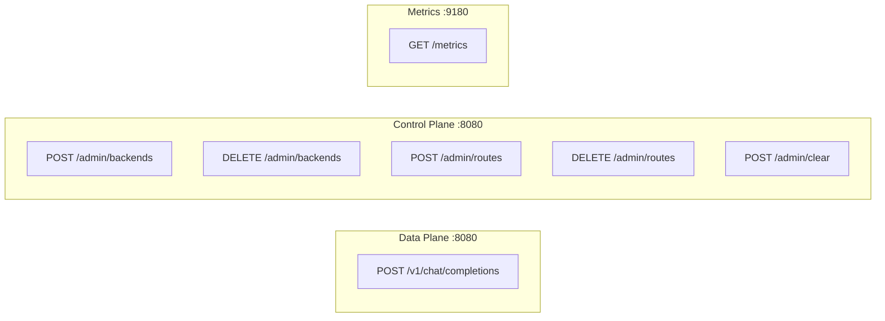

# API Reference

## Endpoints Overview



## Data Plane

### POST /v1/chat/completions

Proxies requests to backend LLM servers with intelligent routing.

**Request**: OpenAI-compatible chat completion request
```json
{
  "model": "llama2",
  "messages": [{"role": "user", "content": "Hello"}],
  "stream": true
}
```

**Response**: Streamed response from backend (SSE format)

**Routing Logic**:
1. Tokenize request body
2. Look up longest prefix match in RadixTree
3. If hit → route to matched backend
4. If miss → route to random healthy backend
5. On success → learn route for future requests

---

## Control Plane

### POST /admin/backends

Register a new GPU backend.

**Query Parameters**:
| Parameter | Type | Required | Description |
|-----------|------|----------|-------------|
| id | int | Yes | Unique backend identifier |
| ip | string | Yes | Backend IP address |
| port | int | Yes | Backend port |

**Example**:
```bash
curl -X POST "http://localhost:8080/admin/backends?id=1&ip=192.168.1.100&port=11434"
```

**Response**:
```json
{"status": "ok"}
```

---

### DELETE /admin/backends

Remove a backend and all its associated routes.

**Query Parameters**:
| Parameter | Type | Required | Description |
|-----------|------|----------|-------------|
| id | int | Yes | Backend ID to remove |

**Example**:
```bash
curl -X DELETE "http://localhost:8080/admin/backends?id=1"
```

**Response**:
```json
{"status": "ok", "backend_deleted": 1}
```

---

### POST /admin/routes

Manually add a route (prefix → backend mapping).

**Query Parameters**:
| Parameter | Type | Required | Description |
|-----------|------|----------|-------------|
| backend_id | int | Yes | Target backend ID |

**Body**: Text content to tokenize and use as route prefix

**Example**:
```bash
curl -X POST "http://localhost:8080/admin/routes?backend_id=1" \
  -d "System prompt for my assistant..."
```

**Response**:
```json
{"status": "ok", "route_added": 1}
```

---

### DELETE /admin/routes

Remove all routes for a specific backend.

**Query Parameters**:
| Parameter | Type | Required | Description |
|-----------|------|----------|-------------|
| backend_id | int | Yes | Backend ID whose routes to remove |

**Example**:
```bash
curl -X DELETE "http://localhost:8080/admin/routes?backend_id=1"
```

**Response**:
```json
{
  "status": "ok",
  "routes_deleted_for_backend": 1,
  "note": "In-memory routes will be cleared on restart"
}
```

---

### POST /admin/clear

Clear all persisted data (backends and routes). **Destructive!**

**Example**:
```bash
curl -X POST "http://localhost:8080/admin/clear"
```

**Response**:
```json
{
  "status": "ok",
  "warning": "All persisted data cleared. Restart to clear in-memory state."
}
```

---

## Metrics

### GET :9180/metrics

Prometheus metrics endpoint.

**Key Metrics**:
| Metric | Type | Description |
|--------|------|-------------|
| ranvier_router_cache_hits | counter | Prefix cache hits |
| ranvier_router_cache_misses | counter | Prefix cache misses |

**Example**:
```bash
curl http://localhost:9180/metrics
```
