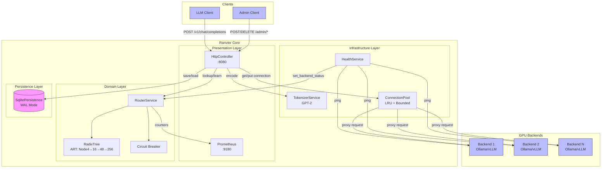

# Ranvier Core Architecture

## Overview

Ranvier Core is a content-aware Layer 7+ load balancer for LLM inference that solves GPU KV-cache thrashing by routing requests to GPUs that already have the relevant token prefix cached.

## Component Diagram

## Layer Responsibilities

### Presentation Layer
- **HttpController**: Handles HTTP endpoints for data plane (proxy) and control plane (admin)
- **Prometheus**: Exposes metrics for monitoring (cache hits/misses, latency)

### Domain Layer
- **RouterService**: Core routing logic with cross-shard broadcasting
- **RadixTree**: Adaptive Radix Tree (ART) for O(k) prefix lookups
- **Circuit Breaker**: Quarantines unhealthy backends

### Infrastructure Layer
- **TokenizerService**: GPT-2 tokenization for request content
- **HealthService**: Periodic health checks on backends
- **ConnectionPool**: Reusable connections with LRU eviction

### Persistence Layer
- **SqlitePersistence**: Durable storage for routes and backends (survives restarts)
