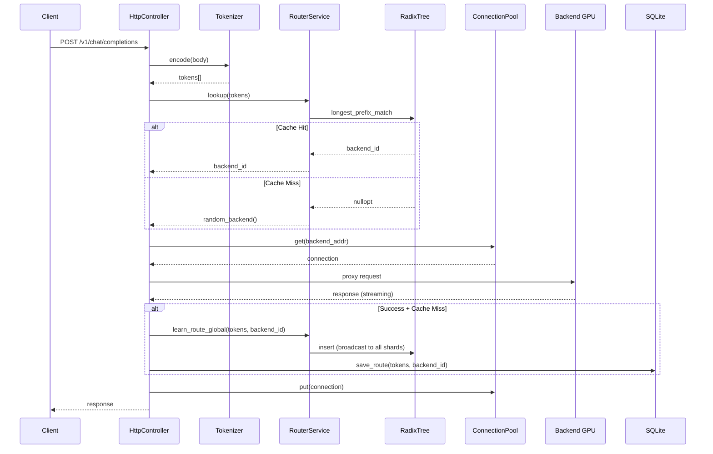
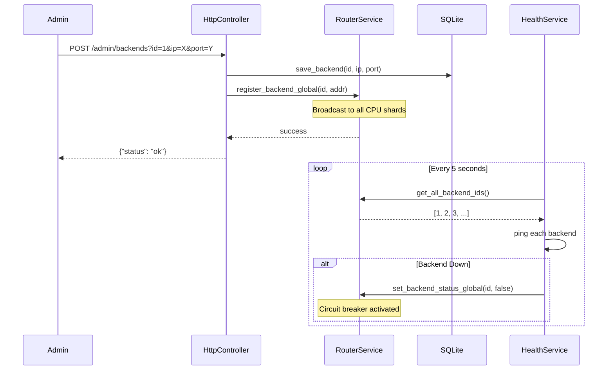
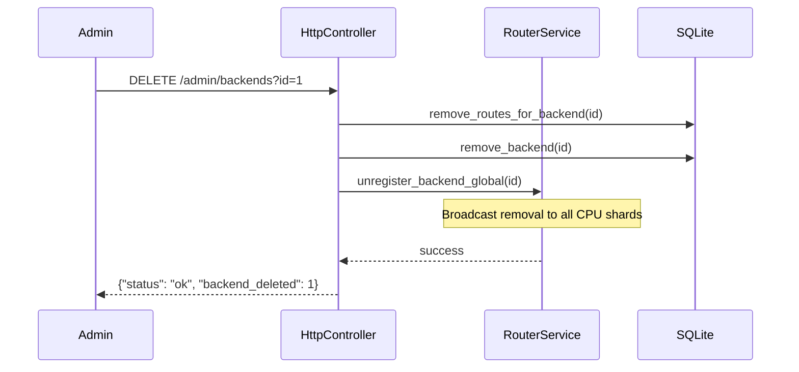

# Request Flow

## Proxy Request Sequence

This diagram shows how a client request flows through Ranvier Core to a backend GPU.

## Key Points

1. **Tokenization**: Request body is tokenized to create the lookup key
2. **Prefix Lookup**: RadixTree finds the longest matching prefix
3. **Cache Hit**: Route directly to the backend that owns this prefix
4. **Cache Miss**: Pick a random healthy backend
5. **Snooping**: On successful response, learn the route for future requests
6. **Persistence**: Learned routes are saved to SQLite for durability

## Backend Registration Flow

## Backend Removal Flow

