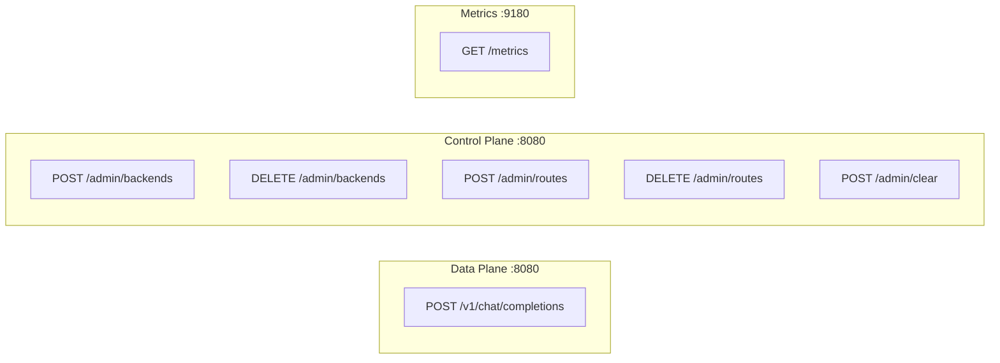

# API Reference

## Endpoints Overview



## Data Plane

### POST /v1/chat/completions

Proxies requests to backend LLM servers with intelligent routing.

**Request**: OpenAI-compatible chat completion request
```json
{
  "model": "llama2",
  "messages": [{"role": "user", "content": "Hello"}],
  "stream": true
}
```

**Response**: Streamed response from backend (SSE format)

**Routing Logic**:
1. Tokenize request body (or use client-provided `prompt_token_ids`)
2. Determine prefix boundary (system messages or client-provided `prefix_token_count`)
3. Look up longest prefix match in RadixTree
4. If hit → route to matched backend
5. If miss → route via consistent hash (deterministic)
6. On success → learn route at prefix boundary for future requests

---

### POST /v1/completions

Proxies completion requests with support for pre-tokenized input.

**Request**: OpenAI-compatible completion request with optional routing hints
```json
{
  "model": "llama2",
  "prompt": "Hello, world!",
  "prompt_token_ids": [15496, 11, 995, 0],
  "prefix_token_count": 128,
  "stream": true
}
```

**Ranvier-Specific Fields**:

| Field | Type | Description |
|-------|------|-------------|
| `prompt_token_ids` | `int[]` | Pre-tokenized prompt (bypasses Ranvier tokenization) |
| `prefix_token_count` | `int` | Number of tokens that constitute the "shared prefix" for routing |
| `prefix_boundaries` | `int[]` | Multi-depth boundaries for route storage (cumulative token counts) |

**When to use `prefix_token_count`**:
- You're sending pre-tokenized requests (`prompt_token_ids`)
- You know exactly how many tokens are your "shared prefix" (e.g., system prompt)
- You want optimal KV-cache locality across requests sharing the same prefix

**Tokenization Format Requirement**: When computing `prefix_token_count`, you must tokenize using Ranvier's internal format: raw message content with `\n` separators. Do **not** use chat template format (e.g., `<|system|>\n{content}`).

```python
# Correct: raw content with newline separator
system_text = system_content + "\n"
prefix_token_count = len(tokenizer.encode(system_text))
```

**When to use `prefix_boundaries`** (multi-depth routing):
- You want routes stored at multiple conversation depths
- Enables cache reuse for branching or continuing conversations
- Example: `[256, 306, 406]` stores routes at each message boundary

**Example**: If your system prompt tokenizes to 256 tokens, set `prefix_token_count: 256`. All requests with the same first 256 tokens will route to the same backend.

**Requirements**:
- `accept_client_tokens` must be enabled for `prompt_token_ids`
- `enable_multi_depth_routing` must be enabled for `prefix_boundaries`
- `accept_client_prefix_boundary` must be enabled for `prefix_token_count`

---

## Control Plane

### POST /admin/backends

Register a new GPU backend.

**Query Parameters**:
| Parameter | Type | Required | Description |
|-----------|------|----------|-------------|
| id | int | Yes | Unique backend identifier |
| ip | string | Yes | Backend IP address |
| port | int | Yes | Backend port |

**Example**:
```bash
curl -X POST "http://localhost:8080/admin/backends?id=1&ip=192.168.1.100&port=11434"
```

**Response**:
```json
{"status": "ok"}
```

---

### DELETE /admin/backends

Remove a backend and all its associated routes.

**Query Parameters**:
| Parameter | Type | Required | Description |
|-----------|------|----------|-------------|
| id | int | Yes | Backend ID to remove |

**Example**:
```bash
curl -X DELETE "http://localhost:8080/admin/backends?id=1"
```

**Response**:
```json
{"status": "ok", "backend_deleted": 1}
```

---

### POST /admin/routes

Manually add a route (prefix → backend mapping).

**Query Parameters**:
| Parameter | Type | Required | Description |
|-----------|------|----------|-------------|
| backend_id | int | Yes | Target backend ID |

**Body**: Text content to tokenize and use as route prefix

**Example**:
```bash
curl -X POST "http://localhost:8080/admin/routes?backend_id=1" \
  -d "System prompt for my assistant..."
```

**Response**:
```json
{"status": "ok", "route_added": 1}
```

---

### DELETE /admin/routes

Remove all routes for a specific backend.

**Query Parameters**:
| Parameter | Type | Required | Description |
|-----------|------|----------|-------------|
| backend_id | int | Yes | Backend ID whose routes to remove |

**Example**:
```bash
curl -X DELETE "http://localhost:8080/admin/routes?backend_id=1"
```

**Response**:
```json
{
  "status": "ok",
  "routes_deleted_for_backend": 1,
  "note": "In-memory routes will be cleared on restart"
}
```

---

### POST /admin/clear

Clear all persisted data (backends and routes). **Destructive!**

**Example**:
```bash
curl -X POST "http://localhost:8080/admin/clear"
```

**Response**:
```json
{
  "status": "ok",
  "warning": "All persisted data cleared. Restart to clear in-memory state."
}
```

---

## Metrics

### GET :9180/metrics

Prometheus metrics endpoint.

**Key Metrics**:
| Metric | Type | Description |
|--------|------|-------------|
| ranvier_router_cache_hits | counter | Prefix cache hits |
| ranvier_router_cache_misses | counter | Prefix cache misses |

**Example**:
```bash
curl http://localhost:9180/metrics
```

---

## rvctl CLI Tool

The `rvctl` command-line tool provides a human-friendly interface for inspecting and managing a running Ranvier instance. It communicates with the Admin API via JSON/HTTP.

**Location**: `tools/rvctl`

### Installation

```bash
# Make executable
chmod +x tools/rvctl

# Optionally symlink to PATH
ln -s $(pwd)/tools/rvctl /usr/local/bin/rvctl
```

### Authentication

Set the `RANVIER_ADMIN_KEY` environment variable or use the `--admin-key` flag:

```bash
export RANVIER_ADMIN_KEY=your-api-key
# or
rvctl --admin-key your-api-key inspect routes
```

### Commands

#### inspect routes

Display the radix tree structure with route mappings.

```bash
# Show all routes
rvctl inspect routes

# Filter by prefix (comma-separated token IDs)
rvctl inspect routes --prefix "1234,5678,9012"
```

**Output**: ASCII tree visualization showing node types, prefixes, backend mappings, and route origins (LOCAL/REMOTE).

#### inspect backends

Show backend health status in table format.

```bash
rvctl inspect backends
```

**Output**:
```
Backend Status (Shard 0)
================================================================================
  ID │       Address       │ Weight │ Priority │     Status
────┼─────────────────────┼────────┼──────────┼───────────────
   1 │ 192.168.1.100:11434 │    100 │        0 │    HEALTHY
   2 │ 192.168.1.101:11434 │    100 │        0 │   DRAINING
     │ └─ Draining since 5m ago

Total Backends: 2
  Healthy: 1  Draining: 1  Dead: 0
```

#### cluster status

Show cluster health and peer status.

```bash
rvctl cluster status
```

**Output**: Quorum state, peer count, local backend ID, and peer table with last-seen timestamps.

#### drain

Initiate graceful drain of a backend.

```bash
rvctl drain <backend_id>
```

**Example**:
```bash
rvctl drain 2
# Success: Backend 2 drain initiated
```

#### route add

Manually register a route (prefix → backend mapping).

```bash
# Content from argument
rvctl route add --backend 1 --content "You are a helpful assistant."

# Content from stdin
echo "System prompt here" | rvctl route add --backend 1 --stdin
```

### Global Options

| Option | Short | Description |
|--------|-------|-------------|
| `--url` | `-u` | Ranvier Admin API URL (default: `http://localhost:8080`) |
| `--admin-key` | `-k` | Admin API key |
| `--verbose` | `-v` | Enable verbose output |

### Environment Variables

| Variable | Description |
|----------|-------------|
| `RANVIER_ADMIN_KEY` | Default admin API key |

---
