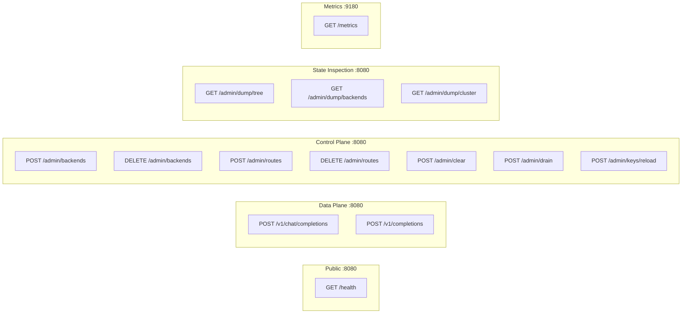

# API Reference

## Endpoints Overview



## Public Endpoints

### GET /health

Public health check endpoint. **No authentication required.**

Returns the server's health status and cluster quorum state.

**Response** (200 OK - Healthy):
```json
{"status": "healthy", "quorum": true}
```

**Response** (200 OK - Healthy but no quorum):
```json
{"status": "healthy", "quorum": false}
```

**Response** (503 Service Unavailable - Draining):
```json
{"status": "draining"}
```

**Notes**:
- Returns `quorum: true` when cluster mode is disabled (single-node mode)
- Returns `quorum: false` when cluster mode is enabled but quorum is lost
- Returns 503 during graceful shutdown (draining state)

**Example**:
```bash
curl http://localhost:8080/health
```

---

## Data Plane

### POST /v1/chat/completions

Proxies requests to backend LLM servers with intelligent routing.

**Request**: OpenAI-compatible chat completion request
```json
{
  "model": "llama2",
  "messages": [{"role": "user", "content": "Hello"}],
  "stream": true
}
```

**Response**: Streamed response from backend (SSE format)

**Routing Logic**:
1. Tokenize request body (or use client-provided `prompt_token_ids`)
2. Determine prefix boundary (system messages or client-provided `prefix_token_count`)
3. Look up longest prefix match in RadixTree
4. If hit → route to matched backend
5. If miss → route via consistent hash (deterministic)
6. On success → learn route at prefix boundary for future requests

---

### POST /v1/completions

Proxies completion requests with support for pre-tokenized input.

**Request**: OpenAI-compatible completion request with optional routing hints
```json
{
  "model": "llama2",
  "prompt": "Hello, world!",
  "prompt_token_ids": [15496, 11, 995, 0],
  "prefix_token_count": 128,
  "stream": true
}
```

**Ranvier-Specific Fields**:

| Field | Type | Description |
|-------|------|-------------|
| `prompt_token_ids` | `int[]` | Pre-tokenized prompt (bypasses Ranvier tokenization) |
| `prefix_token_count` | `int` | Number of tokens that constitute the "shared prefix" for routing |
| `prefix_boundaries` | `int[]` | Multi-depth boundaries for route storage (cumulative token counts) |

**When to use `prefix_token_count`**:
- You're sending pre-tokenized requests (`prompt_token_ids`)
- You know exactly how many tokens are your "shared prefix" (e.g., system prompt)
- You want optimal KV-cache locality across requests sharing the same prefix

**Tokenization Format Requirement**: When computing `prefix_token_count`, you must tokenize using Ranvier's internal format: raw message content with `\n` separators. Do **not** use chat template format (e.g., `<|system|>\n{content}`).

```python
# Correct: raw content with newline separator
system_text = system_content + "\n"
prefix_token_count = len(tokenizer.encode(system_text))
```

**When to use `prefix_boundaries`** (multi-depth routing):
- You want routes stored at multiple conversation depths
- Enables cache reuse for branching or continuing conversations
- Example: `[256, 306, 406]` stores routes at each message boundary

**Example**: If your system prompt tokenizes to 256 tokens, set `prefix_token_count: 256`. All requests with the same first 256 tokens will route to the same backend.

**Requirements**:
- `accept_client_tokens` must be enabled for `prompt_token_ids`
- `enable_multi_depth_routing` must be enabled for `prefix_boundaries`
- `accept_client_prefix_boundary` must be enabled for `prefix_token_count`

---

## Control Plane

### POST /admin/backends

Register a new GPU backend.

**Query Parameters**:
| Parameter | Type | Required | Default | Description |
|-----------|------|----------|---------|-------------|
| id | int | Yes | - | Unique backend identifier |
| ip | string | Yes | - | Backend IP address |
| port | int | Yes | - | Backend port |
| weight | int | No | 100 | Load balancing weight (higher = more traffic) |
| priority | int | No | 0 | Priority for fallback routing (lower = preferred) |

**Example**:
```bash
# Basic registration
curl -X POST "http://localhost:8080/admin/backends?id=1&ip=192.168.1.100&port=11434"

# With weight and priority
curl -X POST "http://localhost:8080/admin/backends?id=2&ip=192.168.1.101&port=11434&weight=200&priority=1"
```

**Response**:
```json
{"status": "ok"}
```

**Notes**:
- `weight` affects consistent hashing distribution for cache-miss routing
- `priority` is used when circuit breaker triggers fallback to alternate backends

---

### DELETE /admin/backends

Remove a backend and all its associated routes.

**Query Parameters**:
| Parameter | Type | Required | Description |
|-----------|------|----------|-------------|
| id | int | Yes | Backend ID to remove |

**Example**:
```bash
curl -X DELETE "http://localhost:8080/admin/backends?id=1"
```

**Response**:
```json
{"status": "ok", "backend_deleted": 1}
```

---

### POST /admin/routes

Manually add a route (prefix → backend mapping).

**Query Parameters**:
| Parameter | Type | Required | Description |
|-----------|------|----------|-------------|
| backend_id | int | Yes | Target backend ID |

**Body**: Text content to tokenize and use as route prefix

**Example**:
```bash
curl -X POST "http://localhost:8080/admin/routes?backend_id=1" \
  -d "System prompt for my assistant..."
```

**Response**:
```json
{"status": "ok", "route_added": 1}
```

---

### DELETE /admin/routes

Remove all routes for a specific backend.

**Query Parameters**:
| Parameter | Type | Required | Description |
|-----------|------|----------|-------------|
| backend_id | int | Yes | Backend ID whose routes to remove |

**Example**:
```bash
curl -X DELETE "http://localhost:8080/admin/routes?backend_id=1"
```

**Response**:
```json
{
  "status": "ok",
  "routes_deleted_for_backend": 1,
  "note": "In-memory routes will be cleared on restart"
}
```

---

### POST /admin/clear

Clear all persisted data (backends and routes). **Destructive!**

**Example**:
```bash
curl -X POST "http://localhost:8080/admin/clear"
```

**Response**:
```json
{
  "status": "ok",
  "warning": "All persisted data cleared. Restart to clear in-memory state."
}
```

---

### POST /admin/drain

Initiate graceful drain of a backend. The backend will stop receiving new routes and be removed after the drain timeout.

**Query Parameters**:
| Parameter | Type | Required | Description |
|-----------|------|----------|-------------|
| backend_id | int | Yes | Backend ID to drain |

**Example**:
```bash
curl -X POST "http://localhost:8080/admin/drain?backend_id=2"
```

**Response**:
```json
{
  "status": "ok",
  "backend_id": 2,
  "action": "drain_initiated",
  "message": "Backend will be removed after drain timeout"
}
```

---

### POST /admin/keys/reload

Trigger a hot-reload of the configuration file to pick up new API keys.

**Example**:
```bash
curl -X POST "http://localhost:8080/admin/keys/reload"
```

**Response**:
```json
{
  "status": "reload_triggered",
  "message": "Configuration reload initiated",
  "current_key_count": 3,
  "current_keys": [
    {"name": "production-key", "expired": false},
    {"name": "staging-key", "expired": false},
    {"name": "legacy-key", "expired": false}
  ]
}
```

**Notes**:
- The response shows the state **before** the reload completes
- New keys will be available shortly after the response is sent
- Key values are never exposed, only names and expiry status

---

## State Inspection

These endpoints are used by `rvctl` for debugging and monitoring.

### GET /admin/dump/tree

Dump the radix tree structure for debugging route lookups.

**Query Parameters**:
| Parameter | Type | Required | Description |
|-----------|------|----------|-------------|
| prefix | string | No | Comma-separated token IDs to filter subtree |

**Example**:
```bash
# Full tree dump
curl "http://localhost:8080/admin/dump/tree"

# Filter by prefix
curl "http://localhost:8080/admin/dump/tree?prefix=1234,5678,9012"
```

**Response**:
```json
{
  "shard_id": 0,
  "tree": {
    "type": "NODE4",
    "prefix": [],
    "backend": null,
    "origin": "NONE",
    "last_accessed_ms": 0,
    "children": [
      {
        "edge": 128000,
        "node": {
          "type": "LEAF",
          "prefix": [128000, 9906, 527],
          "backend": 1,
          "origin": "LOCAL",
          "last_accessed_ms": 1706123456789,
          "children": []
        }
      }
    ]
  }
}
```

**Node Types**: `LEAF`, `NODE4`, `NODE16`, `NODE48`, `NODE256`

**Origin Values**: `LOCAL` (learned from this node), `REMOTE` (replicated from cluster peer), `NONE` (internal node)

---

### GET /admin/dump/backends

List all registered backends with their current state.

**Example**:
```bash
curl "http://localhost:8080/admin/dump/backends"
```

**Response**:
```json
{
  "shard_id": 0,
  "backend_count": 2,
  "backends": [
    {
      "id": 1,
      "address": "192.168.1.100",
      "port": 11434,
      "weight": 100,
      "priority": 0,
      "is_draining": false,
      "is_dead": false
    },
    {
      "id": 2,
      "address": "192.168.1.101",
      "port": 11434,
      "weight": 100,
      "priority": 0,
      "is_draining": true,
      "is_dead": false,
      "drain_start_ms": 1706123456789
    }
  ]
}
```

---

### GET /admin/dump/cluster

Show cluster status and peer information. Returns cluster-disabled status if running in single-node mode.

**Example**:
```bash
curl "http://localhost:8080/admin/dump/cluster"
```

**Response** (Cluster Enabled):
```json
{
  "cluster_enabled": true,
  "quorum_state": "ACTIVE",
  "quorum_required": 2,
  "peers_alive": 2,
  "total_peers": 3,
  "peers_recently_seen": 2,
  "is_draining": false,
  "local_backend_id": 1,
  "peers": [
    {
      "address": "192.168.1.101",
      "port": 7946,
      "is_alive": true,
      "last_seen_ms": 1706123456789,
      "associated_backend": 2
    },
    {
      "address": "192.168.1.102",
      "port": 7946,
      "is_alive": false,
      "last_seen_ms": 1706123400000,
      "associated_backend": 3
    }
  ]
}
```

**Response** (Cluster Disabled):
```json
{
  "error": "Cluster mode not enabled",
  "cluster_enabled": false
}
```

**Quorum States**: `ACTIVE` (has quorum), `QUORUM_LOSS` (lost quorum, still serving)

---

## Metrics

### GET :9180/metrics

Prometheus metrics endpoint. All metrics are prefixed with `ranvier_`.

**Example**:
```bash
curl http://localhost:9180/metrics
```

### Request Counters

| Metric | Type | Description |
|--------|------|-------------|
| `ranvier_http_requests_total` | counter | Total HTTP requests received |
| `ranvier_http_requests_success` | counter | Successful HTTP requests |
| `ranvier_http_requests_failed` | counter | Failed HTTP requests |
| `ranvier_http_requests_timeout` | counter | Timed out HTTP requests |
| `ranvier_http_requests_rate_limited` | counter | Rate-limited HTTP requests |
| `ranvier_http_requests_connection_error` | counter | Requests failed due to connection errors (broken pipe, reset) |
| `ranvier_http_requests_backpressure_rejected` | counter | Requests rejected due to backpressure |

### Circuit Breaker Counters

| Metric | Type | Description |
|--------|------|-------------|
| `ranvier_circuit_breaker_opens` | counter | Circuit breaker open events |
| `ranvier_circuit_breaker_circuits_removed_total` | counter | Circuit breaker entries removed when backends deregistered |
| `ranvier_fallback_attempts` | counter | Fallback routing attempts |

### Routing Counters

| Metric | Type | Description |
|--------|------|-------------|
| `ranvier_tokenizer_validation_failures` | counter | Requests with invalid input (UTF-8, null bytes, length) |
| `ranvier_tokenizer_errors` | counter | Tokenizer exceptions during encode |
| `ranvier_tokenization_skipped` | counter | Requests where tokenization was skipped (random routing) |
| `ranvier_prefix_boundary_used` | counter | Requests where system message prefix boundary was used |
| `ranvier_prefix_boundary_skipped` | counter | Requests where prefix boundary was skipped |
| `ranvier_prefix_boundary_client` | counter | Requests where client-provided prefix_token_count was used |
| `ranvier_stream_parser_size_limit_rejections` | counter | Connections rejected due to stream parser size limit |
| `ranvier_backend_metrics_overflow` | counter | Times backend metrics limit was reached |

### Latency Histograms

| Metric | Type | Buckets | Description |
|--------|------|---------|-------------|
| `ranvier_http_request_duration_seconds` | histogram | 1ms-5min | Legacy HTTP request duration |
| `ranvier_backend_connect_duration_seconds` | histogram | 1ms-5min | Backend connection establishment time |
| `ranvier_backend_response_duration_seconds` | histogram | 1ms-5min | Time to first byte from backend |
| `ranvier_backend_total_duration_seconds` | histogram | 1ms-5min | Total backend request duration |
| `ranvier_router_routing_latency_seconds` | histogram | 100μs-100ms | Router lookup/decision latency |
| `ranvier_router_tokenization_latency_seconds` | histogram | 100μs-100ms | Tokenization latency |
| `ranvier_router_art_lookup_latency_seconds` | histogram | 100μs-100ms | Radix tree lookup latency |
| `ranvier_router_backend_latency_seconds` | histogram | 50ms-10s | Backend LLM inference latency |
| `ranvier_router_request_total_latency_seconds` | histogram | 10ms-5min | Full end-to-end request latency |

### Per-Backend Histograms

These metrics include a `backend_id` label for comparing GPU performance:

| Metric | Type | Description |
|--------|------|-------------|
| `ranvier_backend_latency_seconds{backend_id="X"}` | histogram | Backend processing latency by backend |
| `ranvier_backend_first_byte_latency_seconds{backend_id="X"}` | histogram | Time to first byte by backend |

### Gauges

| Metric | Type | Description |
|--------|------|-------------|
| `ranvier_active_proxy_requests` | gauge | Current in-flight proxy requests |
| `ranvier_cache_hit_ratio` | gauge | Ratio of cache hits to total lookups (0.0-1.0) |
| `ranvier_radix_tree_average_prefix_skip_length` | gauge | Average tokens skipped per lookup via path compression |

### Example Queries

```promql
# Request success rate
rate(ranvier_http_requests_success[5m]) / rate(ranvier_http_requests_total[5m])

# P99 backend latency
histogram_quantile(0.99, rate(ranvier_router_backend_latency_seconds_bucket[5m]))

# Cache hit ratio over time
ranvier_cache_hit_ratio

# Compare backend latencies (identify slow GPUs)
histogram_quantile(0.95, rate(ranvier_backend_latency_seconds_bucket[5m])) by (backend_id)
```

---

## rvctl CLI Tool

The `rvctl` command-line tool provides a human-friendly interface for inspecting and managing a running Ranvier instance. It communicates with the Admin API via JSON/HTTP.

**Location**: `tools/rvctl`

### Installation

```bash
# Make executable
chmod +x tools/rvctl

# Optionally symlink to PATH
ln -s $(pwd)/tools/rvctl /usr/local/bin/rvctl
```

### Authentication

Set the `RANVIER_ADMIN_KEY` environment variable or use the `--admin-key` flag:

```bash
export RANVIER_ADMIN_KEY=your-api-key
# or
rvctl --admin-key your-api-key inspect routes
```

### Commands

#### inspect routes

Display the radix tree structure with route mappings.

```bash
# Show all routes
rvctl inspect routes

# Filter by prefix (comma-separated token IDs)
rvctl inspect routes --prefix "1234,5678,9012"
```

**Output**: ASCII tree visualization showing node types, prefixes, backend mappings, and route origins (LOCAL/REMOTE).

#### inspect backends

Show backend health status in table format.

```bash
rvctl inspect backends
```

**Output**:
```
Backend Status (Shard 0)
================================================================================
  ID │       Address       │ Weight │ Priority │     Status
────┼─────────────────────┼────────┼──────────┼───────────────
   1 │ 192.168.1.100:11434 │    100 │        0 │    HEALTHY
   2 │ 192.168.1.101:11434 │    100 │        0 │   DRAINING
     │ └─ Draining since 5m ago

Total Backends: 2
  Healthy: 1  Draining: 1  Dead: 0
```

#### cluster status

Show cluster health and peer status.

```bash
rvctl cluster status
```

**Output**: Quorum state, peer count, local backend ID, and peer table with last-seen timestamps.

#### drain

Initiate graceful drain of a backend.

```bash
rvctl drain <backend_id>
```

**Example**:
```bash
rvctl drain 2
# Success: Backend 2 drain initiated
```

#### route add

Manually register a route (prefix → backend mapping).

```bash
# Content from argument
rvctl route add --backend 1 --content "You are a helpful assistant."

# Content from stdin
echo "System prompt here" | rvctl route add --backend 1 --stdin
```

### Global Options

| Option | Short | Description |
|--------|-------|-------------|
| `--url` | `-u` | Ranvier Admin API URL (default: `http://localhost:8080`) |
| `--admin-key` | `-k` | Admin API key |
| `--verbose` | `-v` | Enable verbose output |

### Environment Variables

| Variable | Description |
|----------|-------------|
| `RANVIER_ADMIN_KEY` | Default admin API key |

---
