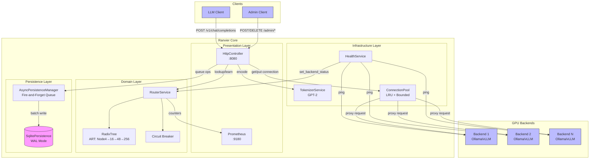
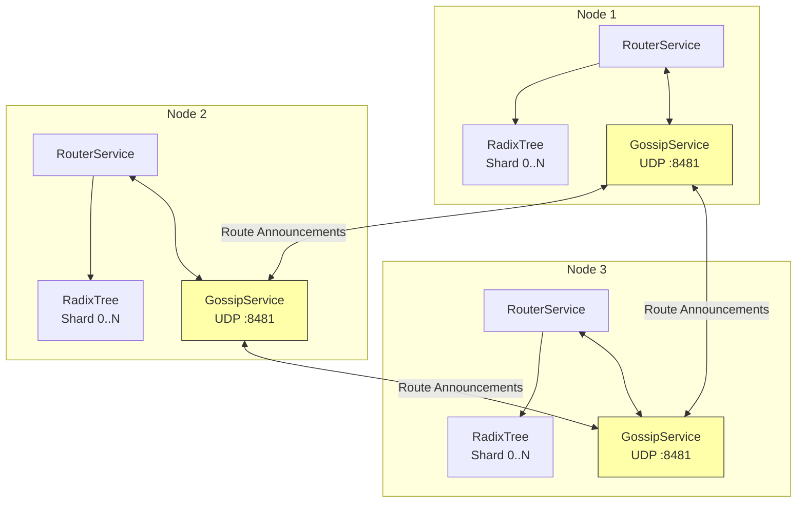

# Ranvier Core Architecture

## Overview

Ranvier Core is a content-aware Layer 7+ load balancer for LLM inference that solves GPU KV-cache thrashing by routing requests to GPUs that already have the relevant token prefix cached.

## Component Diagram



## Layer Responsibilities

### Presentation Layer
- **HttpController**: Handles HTTP endpoints for data plane (proxy) and control plane (admin)
- **Prometheus**: Exposes metrics for monitoring (cache hits/misses, latency)

### Domain Layer
- **RouterService**: Core routing logic with cross-shard broadcasting. Uses `absl::flat_hash_map` for backend lookups, providing SIMD-accelerated operations and improved cache locality over `std::unordered_map`.
- **RadixTree**: Adaptive Radix Tree (ART) for O(k) prefix lookups with node sizes 4→16→48→256 for memory efficiency.
- **Circuit Breaker**: Quarantines unhealthy backends based on health check failures.

### Infrastructure Layer
- **TokenizerService**: GPT-2 tokenization for request content
- **HealthService**: Periodic health checks on backends
- **ConnectionPool**: Reusable connections with LRU eviction

### Persistence Layer
- **AsyncPersistenceManager**: Fire-and-forget queue that decouples SQLite writes from the reactor thread. See [Async Persistence Internals](internals/async-persistence.md).
- **SqlitePersistence**: Durable storage for routes and backends in WAL mode (survives restarts)

## Distributed State

Ranvier Core supports multi-node clustering via the **GossipService**, which maintains consistent RadixTree state across shards without locks.

### Gossip Protocol Architecture



### Lock-Free State Synchronization

The GossipService operates on Shard 0 and uses UDP for low-latency route propagation:

1. **Route Learning**: When a node learns a new route (cache miss → successful response), it broadcasts a `ROUTE_ANNOUNCEMENT` packet to all peers.
2. **Packet Format (v2)**: Fixed 12-byte header + variable token array: `[type:1][version:1][seq_num:4][backend_id:4][token_count:2][tokens:4*N]`
3. **Reliable Delivery**: ACK-based delivery with retries ensures route announcements aren't lost to UDP packet drops.
4. **Duplicate Detection**: Sliding window per peer filters duplicate announcements from retransmissions.
5. **Batched Shard Broadcast**: Remote routes are buffered on Shard 0 and broadcast in batches (every 10ms or 100 routes) to prevent "SMP storms". This reduces cross-core message traffic from O(routes × shards) to O(batches × shards), achieving 99% message reduction at high ingestion rates.
6. **Peer Liveness**: Heartbeat mechanism tracks peer health; stale peers trigger route pruning callbacks.

See [Gossip Protocol Internals](internals/gossip-protocol.md) for detailed wire format and reliability mechanisms.

### Configuration

Enable clustering in your configuration:
```yaml
cluster:
  enabled: true
  gossip_port: 9190
  peers:
    - "10.0.0.2:9190"
    - "10.0.0.3:9190"

  # Reliable delivery (enabled by default)
  gossip_reliable_delivery: true
  gossip_ack_timeout_ms: 100
  gossip_max_retries: 3
  gossip_dedup_window: 1000
```

For Kubernetes deployments, DNS-based peer discovery automatically resolves headless service endpoints.
