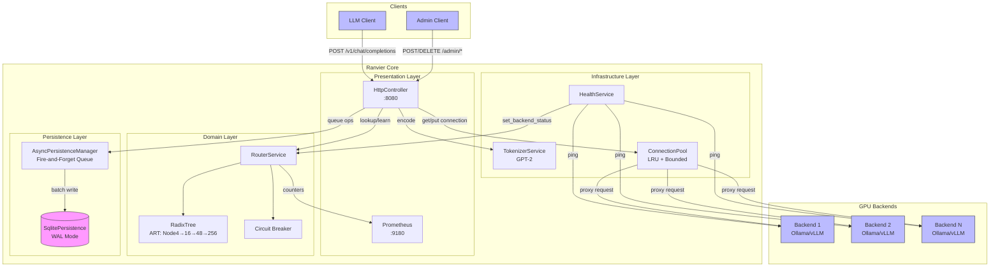
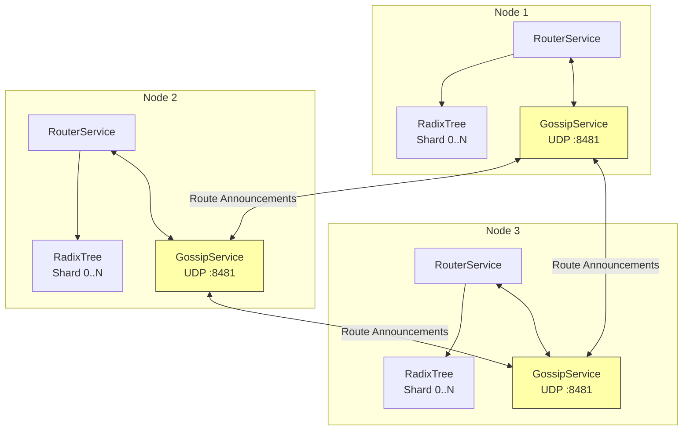

# Ranvier Core Architecture

## Overview

Ranvier Core is a content-aware Layer 7+ load balancer for LLM inference that solves GPU KV-cache thrashing by routing requests to GPUs that already have the relevant token prefix cached.

## Component Diagram



## Application Bootstrap

The `Application` class (`src/application.hpp/cpp`) orchestrates the lifecycle of all Ranvier services. It manages:

1. **Startup Sequence**: Initializes services in dependency order (all I/O is non-blocking):
   - ShardedConfig (distributed to all cores) → TokenizerService (async DMA file load) → TracingService
   - RouterService → HttpController (sharded) → MetricsService
   - PersistenceStore → AsyncPersistenceManager → HealthService
   - K8sDiscoveryService → GossipService → State restoration from SQLite

2. **Shutdown Sequence**: Stops services in reverse order with graceful draining:
   - HealthService → K8sDiscoveryService → GossipService → HTTP Servers
   - HttpController → AsyncPersistenceManager → ShardedConfig
   - WAL checkpoint and cleanup

3. **Lifecycle Protection**: Uses `seastar::gate` to ensure startup completes before any shutdown can proceed.

4. **State Machine**: Tracks lifecycle states (CREATED → STARTING → RUNNING → DRAINING → STOPPING → STOPPED)

5. **Signal Handling**: Uses Seastar-native signal handling for graceful lifecycle management:

   | Signal | Behavior |
   |--------|----------|
   | `SIGINT` | First: Graceful shutdown (drain requests, stop services). Second: Hard kill via `std::exit(1)` for stuck shutdowns. |
   | `SIGTERM` | Graceful shutdown (no hard kill option; process managers use SIGKILL for escalation). |
   | `SIGHUP` | Configuration hot-reload via `sharded<>::invoke_on_all()` to propagate changes across all CPU cores. |

   Signal handlers integrate with the Seastar reactor, enabling async operations within handlers. A `seastar::promise<>` bridges signal reception to the main application loop.

   **SIGHUP Hot-Reload Details**:
   - **Async I/O**: File loading uses `seastar::async()` to offload blocking `std::ifstream` to the thread pool, preventing reactor stalls on slow storage (Hard Rule #12)
   - **Rate Limiting**: Reloads are rate-limited to once per 10 seconds to prevent reload storms from rapid SIGHUP signals
   - **Validation**: New configuration is validated before applying; invalid configs are rejected with error logging
   - **Atomic Propagation**: All shards are updated via `invoke_on_all()` before updating the master config (exception-safe)

6. **Sharded Configuration**: Uses `seastar::sharded<ShardedConfig>` for per-core configuration distribution:
   - Each CPU core has its own config copy for lock-free access
   - Hot-reload updates all shards atomically via `invoke_on_all()`
   - Services access config via `Application::local_config()` for their local shard
   - Master config is only updated after all shards successfully update (exception-safe)

## Layer Responsibilities

### Presentation Layer
- **HttpController**: Handles HTTP endpoints for data plane (proxy) and control plane (admin)
- **Prometheus**: Exposes metrics for monitoring (cache hits/misses, latency)

### Domain Layer
- **RouterService**: Core routing logic with cross-shard broadcasting. Uses `absl::flat_hash_map` for backend lookups, providing SIMD-accelerated operations and improved cache locality over `std::unordered_map`.
- **RadixTree**: Adaptive Radix Tree (ART) for O(k) prefix lookups with node sizes 4→16→48→256 for memory efficiency.
- **NodeSlab**: Shard-local slab allocator for RadixTree nodes. Pre-allocates 2MB chunks with four size-classed pools (one per node type) providing O(1) allocation via intrusive free list. Eliminates malloc overhead on hot paths and improves cache locality for ART traversal.
- **Circuit Breaker**: Quarantines unhealthy backends based on health check failures.

### Infrastructure Layer
- **TokenizerService**: GPT-2 tokenization for request content. Tokenizer vocabulary is loaded asynchronously at startup using Seastar's DMA file I/O (`open_file_dma`) to avoid blocking the reactor thread.
- **HealthService**: Periodic health checks on backends
- **ConnectionPool**: Reusable connections with LRU eviction

### Persistence Layer
- **AsyncPersistenceManager**: Fire-and-forget queue that decouples SQLite writes from the reactor thread. See [Async Persistence Internals](internals/async-persistence.md).
- **SqlitePersistence**: Durable storage for routes and backends in WAL mode (survives restarts)

## Distributed State

Ranvier Core supports multi-node clustering via the **GossipService**, which maintains consistent RadixTree state across shards without locks.

### Gossip Protocol Architecture



### Lock-Free State Synchronization

The GossipService operates on Shard 0 and uses UDP for low-latency route propagation:

1. **Route Learning**: When a node learns a new route (cache miss → successful response), it broadcasts a `ROUTE_ANNOUNCEMENT` packet to all peers.
2. **Packet Format (v2)**: Fixed 12-byte header + variable token array: `[type:1][version:1][seq_num:4][backend_id:4][token_count:2][tokens:4*N]`
3. **Reliable Delivery**: ACK-based delivery with retries ensures route announcements aren't lost to UDP packet drops.
4. **Duplicate Detection**: Sliding window per peer filters duplicate announcements from retransmissions.
5. **Batched Shard Broadcast**: Remote routes are buffered on Shard 0 and broadcast in batches (every 10ms or 100 routes) to prevent "SMP storms". This reduces cross-core message traffic from O(routes × shards) to O(batches × shards), achieving 99% message reduction at high ingestion rates.
6. **Peer Liveness**: Heartbeat mechanism tracks peer health; stale peers trigger route pruning callbacks.

See [Gossip Protocol Internals](internals/gossip-protocol.md) for detailed wire format and reliability mechanisms.

### Configuration

Enable clustering in your configuration:
```yaml
cluster:
  enabled: true
  gossip_port: 9190
  peers:
    - "10.0.0.2:9190"
    - "10.0.0.3:9190"

  # Reliable delivery (enabled by default)
  gossip_reliable_delivery: true
  gossip_ack_timeout_ms: 100
  gossip_max_retries: 3
  gossip_dedup_window: 1000
```

For Kubernetes deployments, DNS-based peer discovery automatically resolves headless service endpoints.

## Backpressure and Stability

Ranvier implements a multi-layer backpressure mechanism to prevent OOM crashes during traffic spikes. The system uses fail-fast rejection (HTTP 503) rather than queueing to maintain predictable latency under load.

### Concurrency Limits

Per-shard semaphore limits prevent unbounded request accumulation:

```yaml
backpressure:
  max_concurrent_requests: 1000  # Per shard (0 = unlimited)
  retry_after_seconds: 1         # Retry-After header value
```

When the semaphore is exhausted, requests immediately receive HTTP 503 with a `Retry-After` header. The semaphore uses `seastar::try_get_units()` for non-blocking acquisition.

### Persistence Queue Integration

The HTTP controller monitors the `AsyncPersistenceManager` queue depth to prevent memory exhaustion from route learning:

```yaml
backpressure:
  enable_persistence_backpressure: true
  persistence_queue_threshold: 0.8  # 80% of max_queue_depth
```

When the persistence queue exceeds the threshold, new requests are rejected to allow the queue to drain.

### Gossip Protection

The `GossipService` uses `seastar::gate` to track in-flight gossip tasks:

- `_gossip_task_gate`: Protects route broadcasts during shutdown and resync
- `start_resync()` / `end_resync()`: Coordinates cluster resynchronization
- Gates ensure graceful completion of in-flight operations before node shutdown

### Rate Limiting

Per-IP token bucket rate limiting protects against request floods:

```yaml
rate_limit:
  enabled: true
  requests_per_second: 100    # Refill rate per client
  burst_size: 50              # Maximum burst capacity
  cleanup_interval: 60        # Stale bucket cleanup (seconds)
```

**Memory Safety (Hard Rule #4):**

The rate limiter enforces `MAX_BUCKETS = 100,000` to prevent memory exhaustion from attackers generating requests from unique source IPs. At capacity (~5.6MB per shard), the limiter uses **fail-open** behavior: new clients are allowed without creating buckets. This prevents memory DoS while maintaining availability.

```cpp
// In rate_limiter.hpp
static constexpr size_t MAX_BUCKETS = 100'000;
```

**Automatic Cleanup (Hard Rule #5):**

A background timer removes stale buckets to reclaim memory. The timer uses the gate guard pattern for safe shutdown:

- Cleanup interval configurable (default 60 seconds)
- Buckets removed after 2× their refill period of inactivity
- Timer callback acquires `seastar::gate::holder` before accessing state
- `stop()` closes gate before canceling timer, ensuring no use-after-free

**Prometheus Metrics:**

| Metric | Description |
|--------|-------------|
| `ranvier_rate_limiter_overflow_total` | Requests bypassing rate limit due to bucket overflow |
| `ranvier_rate_limiter_buckets_cleaned_total` | Stale buckets removed by automatic cleanup |
| `ranvier_rate_limiter_bucket_count` | Current number of active rate limit buckets |
| `ranvier_rate_limiter_bucket_capacity` | Maximum allowed buckets (MAX_BUCKETS constant) |

### Fail-Open Mode for Split-Brain

For inference workloads that prioritize availability over strict routing consistency, Ranvier supports **fail-open mode** during split-brain (quorum loss):

```yaml
cluster:
  quorum_enabled: true
  reject_routes_on_quorum_loss: true  # Default: fail-closed

  # Fail-open mode (inference workloads)
  fail_open_on_quorum_loss: false     # true = random routing during split-brain
  accept_gossip_on_quorum_loss: false # true = accept incoming gossip (stale > none)
```

**Behavior during quorum loss:**

| Mode | `fail_open_on_quorum_loss` | Routing Behavior |
|------|---------------------------|------------------|
| Fail-Closed (default) | `false` | Requests use normal routing; route broadcasts rejected |
| Fail-Open | `true` | Requests routed randomly to healthy backends |

| Mode | `accept_gossip_on_quorum_loss` | Gossip Behavior |
|------|-------------------------------|-----------------|
| Reject Stale (default) | `false` | Incoming gossip rejected during split-brain |
| Accept Stale | `true` | Incoming gossip accepted (stale data > no data) |

The two flags are independent, enabling four operational modes:

1. **Full fail-closed** (default): Reject routes and gossip during split-brain
2. **Fail-open routing only**: Serve traffic randomly, reject stale gossip
3. **Accept gossip only**: Reject traffic, but collect routing data for recovery
4. **Full fail-open**: Maximum availability mode

**Metrics:**

| Metric | Description |
|--------|-------------|
| `cluster_routes_allowed_fail_open` | Routes broadcast allowed due to fail-open |
| `cluster_gossip_accepted_fail_open` | Incoming gossip accepted due to fail-open |

### Monitoring

The following Prometheus metrics track backpressure events:

| Metric | Description |
|--------|-------------|
| `ranvier_http_requests_backpressure_rejected` | Total requests rejected due to backpressure |
| `ranvier_active_proxy_requests` | Current in-flight proxy requests |

## Production Readiness

### Validation Suite

Ranvier includes a comprehensive validation suite to verify the shared-nothing
architecture guarantees are maintained. Run `make validate` to test:

| Test | What It Validates |
|------|-------------------|
| Reactor Stall Detection | No blocking ops with 100μs task quota |
| Disk I/O Decoupling | Async persistence under disk stress |
| SMP Gossip Storm | Cross-core messaging at 5000+ PPS |
| Atomic-Free Execution | No shared_ptr in RadixTree hot paths |

See [Validation Suite](validation.md) for full documentation.
