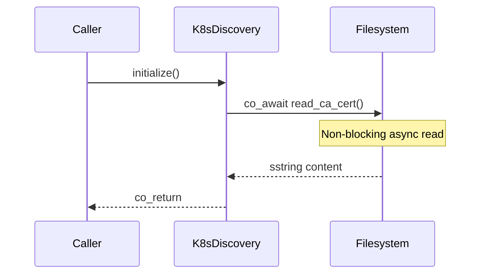

# Audit Fix 01: Async I/O (CRITICAL)

**Focus:** Issue #1 - Blocking `std::ifstream` in K8s CA cert loading

---

1. Ref docs/claude-context.md for the "No Locks/Async Only" rules.
2. Run /compact if the conversation exceeds 4 turns.

## Build Constraints
1. **Static Analysis Only:** Do not attempt to run cmake or build.
2. **API Verification:** Verify syntax against Seastar documentation.
3. **Manual Verification:** I will build in Docker and provide logs if it fails.

---

## THE ISSUE

| Field | Value |
|-------|-------|
| **Severity** | CRITICAL |
| **Rule Violated** | #1 (No blocking calls on reactor thread) |
| **Location** | `src/k8s_discovery_service.cpp` |
| **Impact** | Blocks entire Seastar reactor during file read |

### Problem Code
```cpp
// ANTI-PATTERN: Synchronous file I/O blocks the reactor
std::ifstream ca_file(ca_cert_path);
std::string ca_cert((std::istreambuf_iterator<char>(ca_file)),
                     std::istreambuf_iterator<char>());
```

### Why This Is Critical
- Seastar's reactor is single-threaded per core
- Any blocking call stalls ALL requests on that shard
- File I/O can take milliseconds (or longer on network filesystems)
- Under load, this causes cascading latency spikes

---

## REQUIRED FIX

Replace synchronous `std::ifstream` with Seastar async file I/O.

### Option A: Using `seastar::read_text_file` (simplest)
```cpp
#include <seastar/core/fstream.hh>

seastar::future<seastar::sstring> load_ca_cert(const std::string& ca_cert_path) {
    co_return co_await seastar::read_text_file(ca_cert_path);
}
```

### Option B: Using `open_file_dma` (more control)
```cpp
#include <seastar/core/file.hh>
#include <seastar/core/fstream.hh>

seastar::future<seastar::sstring> load_ca_cert(const std::string& ca_cert_path) {
    auto file = co_await seastar::open_file_dma(ca_cert_path, seastar::open_flags::ro);
    auto size = co_await file.size();

    seastar::temporary_buffer<char> buf = co_await file.dma_read_bulk<char>(0, size);
    co_await file.close();

    co_return seastar::sstring(buf.get(), buf.size());
}
```

### Option C: Using `with_file` for RAII (recommended)
```cpp
#include <seastar/core/file.hh>
#include <seastar/util/file_contents.hh>

seastar::future<seastar::sstring> load_ca_cert(const std::string& ca_cert_path) {
    co_return co_await seastar::util::read_entire_file_contiguous(
        std::filesystem::path(ca_cert_path)
    );
}
```

---

## STAGED EXECUTION

### Pass 0: Understand the Context
Before fixing, identify:
1. Where is this function called from?
2. Is the caller already async (returns `future<>`)?
3. Are there multiple call sites?



### Pass 1: Logic & Correctness
- Handle file not found error
- Handle permission denied error
- Handle empty file case
- Log errors at warn level with path context

```cpp
seastar::future<seastar::sstring> load_ca_cert(const std::string& ca_cert_path) {
    try {
        auto content = co_await seastar::util::read_entire_file_contiguous(
            std::filesystem::path(ca_cert_path)
        );
        if (content.empty()) {
            log_warn("CA cert file is empty: {}", ca_cert_path);
        }
        co_return content;
    } catch (const std::system_error& e) {
        log_warn("Failed to read CA cert file {}: {}", ca_cert_path, e.what());
        throw;
    }
}
```

### Pass 2: Refactor for Clarity
- If caller was synchronous, it must become async too
- Update function signature to return `seastar::future<>`
- Propagate async up the call chain

### Pass 3: Verify No New Issues
- [ ] No new `std::shared_ptr` introduced
- [ ] No new blocking calls
- [ ] Error handling logs at warn level
- [ ] Function signature is now async

---

## OUTPUT FORMAT

```
=== ISSUE #1: Blocking std::ifstream ===

Files Modified:
- src/k8s_discovery_service.cpp (lines X-Y)
- src/k8s_discovery_service.hpp (if signature changed)

Changes:
[Full code for modified functions]

Call Chain Impact:
[List any callers that needed to become async]

Verification:
- [ ] Compiles (static analysis)
- [ ] No std::ifstream remains
- [ ] Returns seastar::future<>
- [ ] Error paths log at warn level
```

---

## PROMPT GUARD (add to context.md)

"Never use std::ifstream, std::ofstream, or any synchronous file I/O in Seastar code—use seastar::util::read_entire_file_contiguous or seastar::open_file_dma with async operations."

---

## NEXT STEP

After this fix is verified:
→ Proceed to `audit-fix-02-bounded-containers.md`

