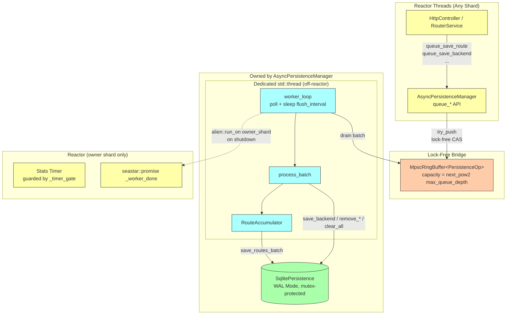
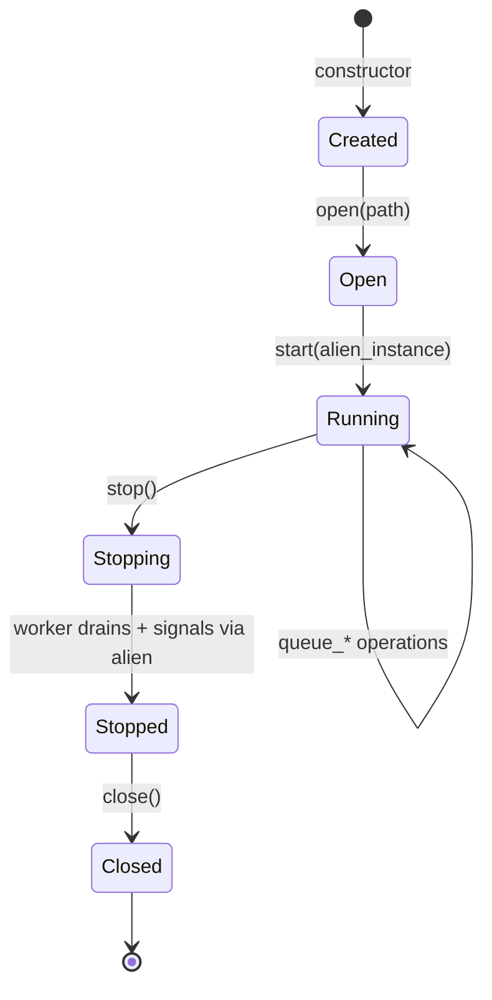
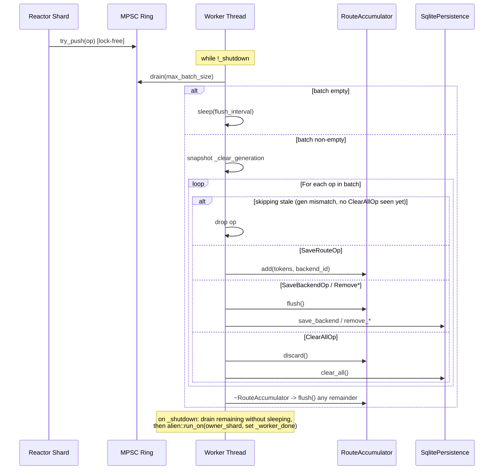

# Async Persistence Internals

The `AsyncPersistenceManager` decouples SQLite persistence from Seastar's reactor threads, preventing blocking I/O from stalling the event loop.

## Overview

SQLite operations (even in WAL mode) perform blocking I/O that can stall Seastar's reactor thread. The `AsyncPersistenceManager` solves this by:

- **Fire-and-forget API**: Queue operations return immediately without locking or blocking the reactor.
- **Lock-free MPSC queue**: Any reactor shard can enqueue concurrently via a Vyukov-style ring buffer.
- **Dedicated OS worker thread**: A single `std::thread` (NOT `seastar::async`) drains the ring buffer and runs blocking SQLite calls off the reactor entirely.
- **Backpressure**: Queue depth limits prevent unbounded memory growth.
- **Reactor signalling on shutdown**: The worker uses `seastar::alien::run_on()` to resolve a promise on the owning shard, so `stop()` never blocks the reactor on `std::thread::join`.

## Architecture

The `AsyncPersistenceManager` **owns** the underlying `PersistenceStore` (SQLite by default), providing complete encapsulation. `HttpController` and other reactor-side consumers interact only with `AsyncPersistenceManager`; they never touch SQLite directly.



### Why a `std::thread`, not `seastar::async`?

`seastar::async` is a stackful coroutine that runs **on the reactor**, not in a thread pool. Wrapping blocking SQLite calls in `seastar::async` would stall the shard for the duration of every flush — that was an earlier (broken) design and is explicitly called out in `async_persistence.hpp`. The current implementation uses a real OS thread so SQLite's blocking calls never touch the reactor.

### Ownership Model

`AsyncPersistenceManager` provides two constructors:

```cpp
// Production: creates SQLite store via factory (create_persistence_store)
explicit AsyncPersistenceManager(AsyncPersistenceConfig config = {});

// Testing: accepts a pre-configured (e.g. mock) store
AsyncPersistenceManager(AsyncPersistenceConfig config,
                        std::unique_ptr<PersistenceStore> store);
```

The class is non-copyable and non-movable — it owns a `std::thread`, an `MpscRingBuffer`, and reactor-side primitives whose addresses must be stable.

This design:
- **Encapsulates SQLite**: Consumers never see the underlying store.
- **Enables testing**: Mock stores can be injected for unit tests.
- **Simplifies lifecycle**: A single owner manages database open/close and worker-thread lifetime.

## Operation Types

| Operation | Description | Batched |
|-----------|-------------|---------|
| `SaveRouteOp` | Learn token→backend mapping | Yes (via `RouteAccumulator`) |
| `SaveBackendOp` | Register/update a backend | No (flushes pending routes first) |
| `RemoveBackendOp` | Unregister a backend | No (flushes pending routes first) |
| `RemoveRoutesForBackendOp` | Clear routes for a backend | No (flushes pending routes first) |
| `ClearAllOp` | Wipe all persistent state | No (and discards pending routes) |

`PersistenceOp` is a `std::variant` of these types.

### Route Batching

Multiple `SaveRouteOp` operations are accumulated by `RouteAccumulator` and written via a single `save_routes_batch()` call to amortise SQLite transaction overhead:

```cpp
class RouteAccumulator {
    void add(std::vector<TokenId>&& tokens, BackendId backend_id);
    void flush();    // Writes accumulated routes via _store->save_routes_batch
    void discard();  // Drops accumulated routes (used by ClearAllOp)
    // Destructor calls flush() to guarantee no routes are lost mid-batch.
};
```

Non-route operations call `routes.flush()` first to preserve queue ordering relative to route saves; `ClearAllOp` calls `routes.discard()` instead, since the routes would be wiped anyway.

### `ClearAllOp` and the Generation Counter

`queue_clear_all()` cannot drain the ring buffer from the producer side — only the worker (the sole consumer) may pop from a Vyukov MPSC ring. Instead:

1. `queue_clear_all()` increments an atomic `_clear_generation` counter and pushes a `ClearAllOp`. The push bypasses `try_enqueue`'s backpressure check because the ring's capacity is rounded up to the next power of two ≥ `max_queue_depth`, so a slot is always available.
2. At the start of `process_batch`, the worker snapshots `_clear_generation`. If it differs from `_last_processed_generation`, the worker **skips every op until it sees the `ClearAllOp` itself**, then processes the clear and everything queued after it.

This guarantees stale ops enqueued before the clear are dropped without requiring the producer to touch the queue's read end.

## Configuration

```cpp
struct AsyncPersistenceConfig {
    std::chrono::milliseconds flush_interval{100};  // Worker idle-sleep when queue is empty
    size_t max_batch_size = 1000;                   // Max ops per process_batch call
    size_t max_queue_depth = 100000;                // Backpressure threshold
    bool enable_stats_logging = true;               // Periodic stats logging
    std::chrono::seconds stats_interval{60};        // Stats logging period
};
```

`flush_interval` is **not** a reactor timer period — it is how long the worker thread sleeps when it finds the ring empty. Lower values reduce write latency at the cost of more wakeups; higher values let larger batches accumulate.

Defaults applied in `Application::build_persistence_config()` match the struct defaults (100 ms / 1000 / 100000 / 60 s).

## Thread Safety

The manager is designed for Seastar's shared-nothing architecture and the cross-thread boundary to a non-Seastar OS thread:

| Component | Protection | Access Pattern |
|-----------|------------|----------------|
| `_ring` | Lock-free MPSC ring (per-slot sequence numbers) | Any shard pushes; worker thread is the sole consumer |
| `_queue_size` | `std::atomic<size_t>` | Maintained alongside the ring for O(1) depth metric |
| `_clear_generation` | `std::atomic<uint64_t>` | Producer increments; worker reads with `acquire` |
| `_stopping` | `std::atomic<bool>` | Set by `stop()`; checked by `queue_*` to reject new enqueues |
| `_shutdown` | `std::atomic<bool>` | Set after timer-gate close; signals worker to drain and exit |
| `_timer_gate` | `seastar::gate` | Wraps the stats-timer callback only |
| `_worker_done` | `seastar::promise<>` | Resolved by worker via `alien::run_on` on the owner shard |
| `SqlitePersistence` | Internal `std::mutex` | Only the worker thread calls into it |

There is **no mutex on the reactor-side hot path**. The producer-side enqueue is fully lock-free.

## Lifecycle

The manager follows a strict, one-way lifecycle: **construct → open → start → [use] → stop → close**



`stop()` is one-way. After it resolves, `_started` is left `true` and a second `start()` call is ignored — restart is not supported because `seastar::gate` (used for the stats timer) cannot be reopened.

### Opening the Store

```cpp
auto manager = std::make_unique<AsyncPersistenceManager>(config);
if (!manager->open("/var/lib/ranvier/state.db")) {
    // Handle failure
}
```

### Starting the Worker

`start()` requires the application's `seastar::alien::instance` so the worker can later signal completion back to the reactor:

```cpp
seastar::future<> start(seastar::alien::instance& alien_instance);
```

`start()`:
1. Records the calling shard as `_owner_shard`.
2. Spawns the `std::thread` running `worker_loop()`.
3. Arms the optional reactor-side stats timer (if `enable_stats_logging`).

A second call after `_started` is set is logged and ignored.

### Shutdown

```cpp
seastar::future<> stop();
```

The shutdown sequence is:

1. **Reject new producers**: `_stopping` is set so `queue_*` methods return immediately.
2. **Stop the stats timer**: `_timer_gate.close()` waits for any in-flight callback, then `_stats_timer.cancel()` runs.
3. **Tell the worker to drain**: `_shutdown` is set. The worker finishes its current batch, drains the rest of the ring with no idle-sleep, and prepares to exit.
4. **Worker signals the reactor**: Just before exiting, the worker calls `seastar::alien::run_on(*_alien_instance, _owner_shard, …)` to resolve `_worker_done` on the owner shard.
5. **Bounded wait**: `stop()` awaits `_worker_done` via `seastar::with_timeout` (5 s). On timeout (e.g. alien dispatch failed because the reactor is being torn down) it logs and continues — the worker thread exits regardless of dispatch success.
6. **Join the thread**: The reactor calls `_worker_thread->join()`. Because the worker is already exiting, this is effectively instantaneous.

The destructor includes a best-effort fallback that joins the worker if `stop()` was never awaited, but this path is documented as a programmer error and may race with the worker's `alien::run_on` lambda — always call `stop()`.

### Closing the Store

```cpp
manager->close();  // Flushes WAL and closes file handles
```

Must be called after `stop()` resolves. It is safe to call multiple times.

## Backpressure

`try_enqueue()` reserves a slot atomically before pushing, avoiding TOCTOU between the depth check and the push:

```cpp
bool try_enqueue(PersistenceOp op) {
    const auto prev = _queue_size.fetch_add(1, std::memory_order_relaxed);
    if (prev >= _config.max_queue_depth) {
        _queue_size.fetch_sub(1, std::memory_order_relaxed);
        _ops_dropped++;
        return false;
    }
    if (!_ring->try_push(std::move(op))) {
        _queue_size.fetch_sub(1, std::memory_order_relaxed);
        _ops_dropped++;
        return false;
    }
    return true;
}
```

Multiple producers can race here without locking. `queue_clear_all()` deliberately bypasses the depth check for the `ClearAllOp` itself (the ring has spare capacity rounded up to the next power of two).

## Batch Processing Flow



## Monitoring

There are currently **no Prometheus metrics emitted directly by `AsyncPersistenceManager`**. Visibility comes from periodic info logs and from programmatic counters that other components (e.g. `HttpController` backpressure) read.

### Stats Logging

When `enable_stats_logging` is true, `log_stats()` runs every `stats_interval` and emits:

```
Stats: queue_depth=…, ops_processed=…, ops_dropped=…, batches_flushed=…
```

If any operations have been dropped it additionally logs a warning suggesting an increase in `max_queue_depth` or a reduction in request rate.

### Programmatic Access

```cpp
size_t  queue_depth() const;            // Current size, lock-free
size_t  max_queue_depth() const;        // Configured ceiling
uint64_t operations_processed() const;
uint64_t operations_dropped() const;
bool    is_backpressured() const;       // queue_depth() >= max_queue_depth()
```

`HttpController` consumes these to throttle clients before the queue saturates (see `backpressure.persistence_queue_threshold`, default 0.8 of `max_queue_depth`).

## Error Handling

Errors during batch processing are logged but do not crash the server:

```cpp
void process_batch(std::vector<PersistenceOp> batch) {
    if (!is_open() || batch.empty()) return;
    const auto gen_before = _clear_generation.load(std::memory_order_acquire);
    RouteAccumulator routes(*this, batch.size());

    for (auto& op : batch) {
        // … skip-stale-on-pending-clear logic …
        try {
            std::visit([this, &routes](auto&& arg) {
                execute(arg, routes);
            }, op);
        } catch (const std::exception& e) {
            log_async_persist.error(
                "Exception processing persistence operation: {}", e.what());
        }
    }
    // RouteAccumulator destructor flushes remaining routes (also try-catch'd internally).
    _batches_flushed++;
}
```

A single failing operation does not block the rest of the batch.

## Performance Characteristics

| Aspect | Sync Persistence | Async Persistence |
|--------|------------------|-------------------|
| Request latency | +5–50 ms (SQLite I/O) | ~0 (lock-free push) |
| Reactor stalls | Yes (blocking I/O on the reactor) | No (work runs on a dedicated OS thread) |
| Write throughput | Limited by per-op latency | Batched, higher throughput |
| Durability | Immediate | Eventual (≤ `flush_interval` after enqueue, plus drain time) |

### Trade-offs

1. **Durability window**: Operations queued in the last `flush_interval` may be lost on hard crash.
2. **Memory usage**: The ring buffer is sized to the next power of two ≥ `max_queue_depth`.
3. **Ordering**: Within a batch, ops execute in producer-enqueue order. Route saves are explicitly flushed before any non-route op in the same batch.

## Tuning Guidelines

These knobs live on `AsyncPersistenceConfig` and are populated from `Application::build_persistence_config()` (currently compile-time constants in `application.cpp`).

### High-Throughput Workloads

Increase batch size and queue depth so the worker amortises SQLite transaction cost over more ops, and let the queue absorb traffic bursts:

```
flush_interval     ≈ 200 ms  // larger batches, slightly higher latency
max_batch_size     ≈ 5000
max_queue_depth    ≈ 500000
```

### Low-Latency Durability

Shorter sleeps and smaller batches reduce time-to-disk at the cost of more wakeups and SQLite transactions:

```
flush_interval     ≈ 50 ms
max_batch_size     ≈ 100
```

## References

- [Architecture Overview](../architecture/system-design.md)
- [Request Flow](../request-flow.md)
- [SQLite WAL Mode](https://www.sqlite.org/wal.html)
- [Seastar Alien Threads](https://github.com/scylladb/seastar/blob/master/include/seastar/core/alien.hh)
- `src/async_persistence.hpp` / `src/async_persistence.cpp` — implementation
- `src/mpsc_ring_buffer.hpp` — lock-free queue
- `.dev-context/claude-context.md` Hard Rule #12 — no blocking on the reactor
