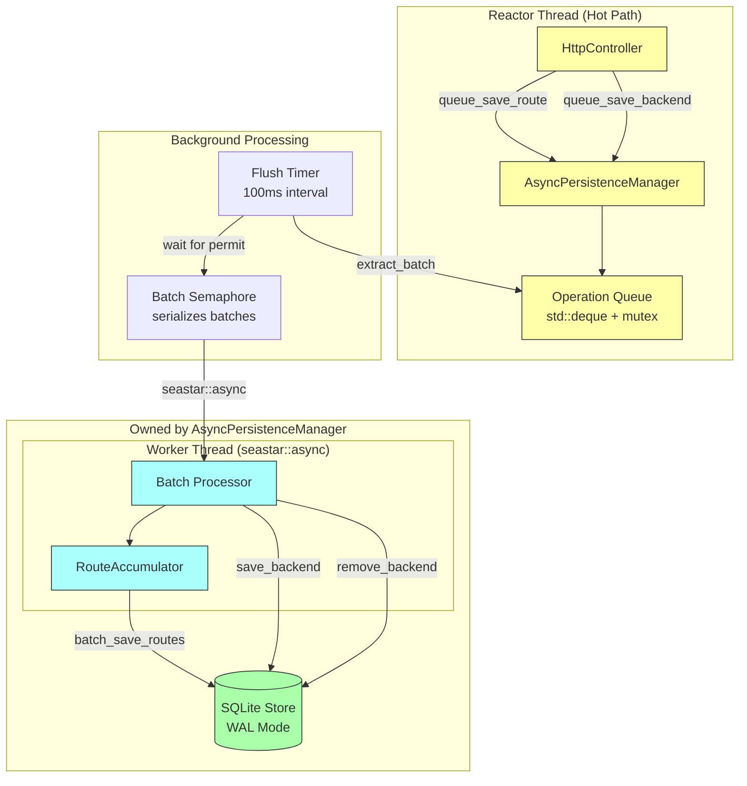
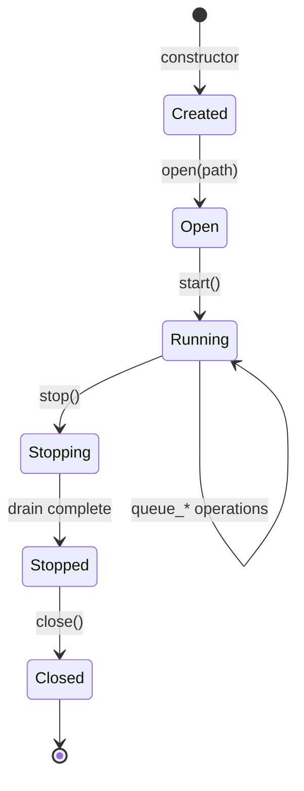
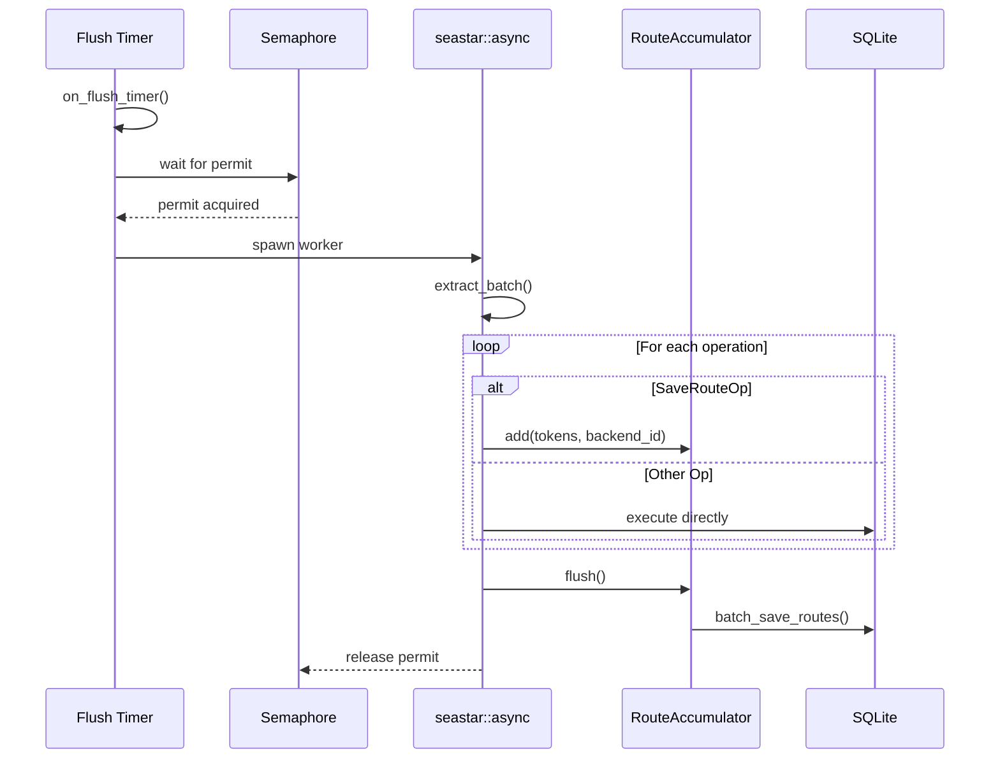

# Async Persistence Internals

The AsyncPersistenceManager decouples SQLite persistence from Seastar's reactor thread, preventing blocking I/O from stalling the event loop.

## Overview

SQLite operations (even in WAL mode) perform blocking I/O that can stall Seastar's reactor thread. The AsyncPersistenceManager solves this by:

- **Fire-and-forget API**: Queue operations return immediately without blocking
- **Background batching**: Timer-driven flushes write to SQLite in batches
- **Off-reactor execution**: SQLite operations run in `seastar::async` worker threads
- **Ordered processing**: Semaphore ensures batches complete in order
- **Backpressure**: Queue depth limits prevent unbounded memory growth

## Architecture

The AsyncPersistenceManager **owns** the underlying SQLite persistence store, providing complete encapsulation. HttpController interacts only with the AsyncPersistenceManager interface, with no direct access to SQLite.



### Ownership Model

The AsyncPersistenceManager provides two constructors:

```cpp
// Production: creates SQLite store via factory
explicit AsyncPersistenceManager(AsyncPersistenceConfig config = {});

// Testing: accepts pre-configured mock store
AsyncPersistenceManager(AsyncPersistenceConfig config, std::unique_ptr<PersistenceStore> store);
```

This design:
- **Encapsulates SQLite**: Consumers never see the underlying store
- **Enables testing**: Mock stores can be injected for unit tests
- **Simplifies lifecycle**: Single owner manages database open/close

## Operation Types

| Operation | Description | Batched |
|-----------|-------------|---------|
| `SaveRouteOp` | Learn token→backend mapping | Yes (RouteAccumulator) |
| `SaveBackendOp` | Register new backend | No |
| `RemoveBackendOp` | Unregister backend | No |
| `RemoveRoutesForBackendOp` | Clear routes for backend | No |
| `ClearAllOp` | Wipe all persistent state | No |

### Route Batching

Multiple `SaveRouteOp` operations are accumulated and written via a single `batch_save_routes()` call, reducing SQLite transaction overhead:

```cpp
// RouteAccumulator collects routes during batch processing
class RouteAccumulator {
    void add(std::vector<TokenId>&& tokens, BackendId backend_id);
    void flush();  // Writes all accumulated routes to SQLite
};
```

## Configuration

```cpp
struct AsyncPersistenceConfig {
    std::chrono::milliseconds flush_interval{100};  // Timer period
    size_t max_batch_size = 1000;                   // Max ops per batch
    size_t max_queue_depth = 100000;                // Backpressure threshold
    bool enable_stats_logging = true;               // Periodic stats
    std::chrono::seconds stats_interval{60};        // Stats period
};
```

### Environment Variables

| Variable | Default | Description |
|----------|---------|-------------|
| `RANVIER_PERSIST_FLUSH_MS` | `100` | Flush interval in milliseconds |
| `RANVIER_PERSIST_BATCH_SIZE` | `1000` | Maximum batch size |
| `RANVIER_PERSIST_QUEUE_DEPTH` | `100000` | Backpressure threshold |

## Thread Safety

The manager is designed for Seastar's shared-nothing architecture:

| Component | Protection | Access Pattern |
|-----------|------------|----------------|
| `_queue` | `std::mutex` | Any shard can enqueue |
| `_stopping` | `std::atomic<bool>` | Visibility across shards |
| `_batch_semaphore` | `seastar::semaphore` | Serializes batch processing |
| `_flush_gate` | `seastar::gate` | Tracks in-flight operations |
| SQLite | Single-writer | Only accessed from `seastar::async` |

### Queue Mutex Justification

While Seastar discourages mutexes, the queue mutex is safe because:

1. Lock duration is minimal (push/pop operations only)
2. No Seastar primitives are called while holding the lock
3. Cross-shard access is required for fire-and-forget semantics

## Lifecycle

The manager follows a strict lifecycle: **open → start → [use] → stop → close**



### Opening the Store

```cpp
// Create manager (factory creates underlying SQLite store)
auto manager = std::make_unique<AsyncPersistenceManager>(config);

// Open database at path (creates file if needed)
if (!manager->open("/var/lib/ranvier/state.db")) {
    // Handle failure
}
```

### Starting the Timer

```cpp
seastar::future<> start() {
    _flush_timer.set_callback([this] { on_flush_timer(); });
    _flush_timer.arm_periodic(_config.flush_interval);
    // Stats timer setup...
}
```

### Shutdown

```cpp
seastar::future<> stop() {
    _stopping.store(true, std::memory_order_relaxed);
    _flush_timer.cancel();
    _stats_timer.cancel();

    // Close gate to prevent new flushes
    co_await _flush_gate.close();

    // Drain remaining operations
    auto remaining = drain_queue();
    if (!remaining.empty() && is_open()) {
        co_await seastar::async([this, ops = std::move(remaining)]() mutable {
            process_batch(std::move(ops));
        });
    }
}
```

### Closing the Store

```cpp
// After stop() completes, close the database
manager->close();  // Flushes WAL, closes file handles
```

The shutdown sequence ensures:
1. No new timer callbacks fire
2. In-flight batches complete (gate close)
3. Remaining queued operations are flushed
4. Database is properly closed (WAL checkpoint)

## Backpressure

When the queue reaches `max_queue_depth`, new operations are dropped:

```cpp
bool try_enqueue(PersistenceOp op) {
    std::lock_guard lock(_queue_mutex);
    if (_queue.size() >= _config.max_queue_depth) {
        _ops_dropped.fetch_add(1, std::memory_order_relaxed);
        return false;
    }
    _queue.push_back(std::move(op));
    return true;
}
```

The check is performed inside the lock to avoid TOCTOU races.

## Batch Processing Flow



## Monitoring

### Prometheus Metrics

| Metric | Type | Description |
|--------|------|-------------|
| `ranvier_persistence_queue_depth` | Gauge | Current queue size |
| `ranvier_persistence_ops_processed` | Counter | Total operations written |
| `ranvier_persistence_ops_dropped` | Counter | Operations dropped (backpressure) |
| `ranvier_persistence_batches_flushed` | Counter | Batch flush count |

### Programmatic Access

```cpp
size_t queue_depth() const;
uint64_t operations_processed() const;
uint64_t operations_dropped() const;
bool is_backpressured() const;
```

## Error Handling

Errors during batch processing are logged but don't crash the server:

```cpp
void process_batch(std::vector<PersistenceOp> batch) {
    RouteAccumulator routes(*this, batch.size());

    for (auto& op : batch) {
        try {
            std::visit([&](auto& concrete_op) {
                execute(concrete_op, routes);
            }, op);
        } catch (const std::exception& e) {
            // Log and continue with next operation
        }
    }

    routes.flush();  // Also wrapped in try-catch
}
```

This ensures a single failing operation doesn't block the entire batch.

## Performance Characteristics

| Aspect | Sync Persistence | Async Persistence |
|--------|------------------|-------------------|
| Request latency | +5-50ms (SQLite I/O) | ~0ms (queue only) |
| Reactor stalls | Yes (blocking I/O) | No |
| Write throughput | Limited by latency | Batched, higher throughput |
| Durability | Immediate | Eventual (100ms default) |

### Trade-offs

1. **Durability window**: Routes learned in the last flush interval may be lost on crash
2. **Memory usage**: Queue can grow up to `max_queue_depth` operations
3. **Ordering**: Within a batch, operations execute in queue order

## Tuning Guidelines

### High-Throughput Workloads

```yaml
# More aggressive batching for high request rates
persistence:
  flush_interval_ms: 200      # Larger batches
  max_batch_size: 5000        # More ops per batch
  max_queue_depth: 500000     # Higher backpressure threshold
```

### Low-Latency Durability

```yaml
# Faster persistence at cost of more I/O
persistence:
  flush_interval_ms: 50       # Faster flushes
  max_batch_size: 100         # Smaller batches
```

## References

- [Architecture Overview](../architecture/system-design.md)
- [Request Flow](../request-flow.md)
- [SQLite WAL Mode](https://www.sqlite.org/wal.html)
- [Seastar Async](https://github.com/scylladb/seastar/blob/master/doc/tutorial.md#threads-and-blocking)
