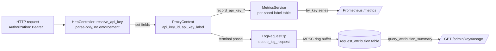

# Per-API-Key Attribution

Per-API-key attribution gives operators two observability and reporting
capabilities that aren't possible against the unlabelled metrics:

1. **Live observability** — answer "which key drove this latency p99
   spike?" from Prometheus without log scraping. Existing series
   (`ranvier_http_requests_total`, request-duration histogram, etc.) gain
   companion `*_by_key{api_key="..."}` series with bounded cardinality.
2. **Historical reporting** — answer "how much usage came from key X over
   the last 24 hours?" via a SQLite-backed per-request table queried
   through a new admin endpoint.

Scope is strictly attribution. Attribution does **not** authenticate
the data plane, does **not** enforce per-key rate limits or quotas, and
does **not** aggregate across cluster nodes. See `Out of scope` below.

For the original design memo (including alternatives considered and
trade-offs), see `docs/architecture/per-api-key-attribution.md`.

## Overview



End-to-end flow:

1. **Resolver** (`HttpController::resolve_api_key`) parses the
   `Authorization` header once at the top of `handle_proxy()`, before
   routing. Result is stored in `ProxyContext::api_key_id` and
   `ProxyContext::api_key_label`. Header missing → `_unauthenticated`
   sentinel. Header malformed or token unknown → `_invalid`. Header
   valid → operator-chosen `ApiKey::name` (sanitised for Prometheus).
2. **Metrics** wire calls record per-key counters and histograms via a
   bounded shard-local label table.
3. **Persistence** enqueues one `LogRequestOp` per request from the
   terminal phase of `handle_proxy()`. The dedicated SQLite worker
   thread drains the queue and inserts rows into a new
   `request_attribution` table.
4. **Admin endpoint** reads the table and aggregates per-key
   percentiles + sums for a bounded query window.

## Configuration

Per-API-key attribution is **enabled by default**. The defaults are
chosen to be safe in any deployment — bounded cardinality, bounded
queue depth, bounded query window.

### `ranvier.yaml`

```yaml
attribution:
  # Max distinct api_key label values per shard before new keys collapse
  # to the "_overflow" sentinel. Bounds Prometheus active-series count.
  max_label_cardinality: 256

  # Gate the request_attribution SQLite table and per-request enqueue.
  # When false, no per-request rows are persisted; metric labels are
  # still recorded.
  persistence_enabled: true

  # Row-count cap on the request_attribution table. Oldest rows pruned
  # by id once the count exceeds this cap.
  max_request_rows: 1000000

  # Bound on the GET /admin/keys/usage query window.
  admin_query_max_window_hours: 168  # 7 days

  # Bound on rows materialised for a single /admin/keys/usage query
  # (in-memory percentile computation budget).
  admin_query_max_rows: 100000
```

### Environment variables

| Variable | Purpose |
| --- | --- |
| `RANVIER_ATTRIBUTION_MAX_LABEL_CARDINALITY` | Override `attribution.max_label_cardinality` |
| `RANVIER_ATTRIBUTION_PERSISTENCE_ENABLED` | Override `attribution.persistence_enabled` |
| `RANVIER_ATTRIBUTION_MAX_REQUEST_ROWS` | Override `attribution.max_request_rows` |
| `RANVIER_ATTRIBUTION_ADMIN_QUERY_MAX_WINDOW_HOURS` | Override `attribution.admin_query_max_window_hours` |
| `RANVIER_ATTRIBUTION_ADMIN_QUERY_MAX_ROWS` | Override `attribution.admin_query_max_rows` |

## Resolver (`resolve_api_key`)

Implemented as a pure synchronous helper called once at the top of
`handle_proxy()`. No I/O, no futures.

| Authorization header | api_key_id | api_key_label |
| --- | --- | --- |
| Absent | `""` | `_unauthenticated` |
| Present, not `Bearer …` | `""` | `_invalid` |
| `Bearer <token>`, no `api_keys` configured | `""` | `_unauthenticated` |
| `Bearer <token>`, token unknown | `""` | `_invalid` |
| `Bearer <token>`, token valid | `ApiKey::name` | `sanitise(ApiKey::name)` |

**`resolve_api_key()` is parse-only.** A failed lookup does not reject
the request — the request still serves and attributes to a sentinel
label. To enforce auth on the data plane, configure your existing
ingress layer (the design memo §5 Option B sketches a future
`auth.require_data_plane_auth` flag; not implemented in this PR).

### Label sanitiser

`api_key_label` is fed directly into Prometheus as a label value, so the
operator-chosen `ApiKey::name` is sanitised once at resolution time:

* Lowercased
* `[^a-z0-9_]` → `_`
* Truncated to 64 characters
* Empty after sanitisation → `_unnamed`

This is defensive (operators pick safe names like `production-deploy`),
not a security boundary. Document operator-facing naming conventions
explicitly if you have multiple teams generating API key names.

## Metric labels

The following existing series gain a companion `_by_key` series with
the `api_key` label:

| Companion series | Type | Labels |
| --- | --- | --- |
| `ranvier_http_requests_total_by_key` | counter (gauge-backed) | `{api_key}` |
| `ranvier_http_requests_success_by_key` | counter (gauge-backed) | `{api_key}` |
| `ranvier_http_requests_failed_by_key` | counter (gauge-backed) | `{api_key}` |
| `ranvier_http_requests_timeout_by_key` | counter (gauge-backed) | `{api_key}` |
| `ranvier_http_requests_rate_limited_by_key` | counter (gauge-backed) | `{api_key}` |
| `ranvier_request_input_tokens_sum_by_key` | counter (gauge-backed) | `{api_key}` |
| `ranvier_request_output_tokens_sum_by_key` | counter (gauge-backed) | `{api_key}` |
| `ranvier_request_cost_units_sum_by_key` | counter (gauge-backed) | `{api_key}` |
| `ranvier_http_request_duration_seconds_by_key` | histogram | `{api_key}` |
| `ranvier_router_request_total_latency_seconds_by_key` | histogram | `{api_key}` |

Plus one unlabelled series:

| Series | Type | Purpose |
| --- | --- | --- |
| `ranvier_api_key_label_overflow_total` | counter | Requests attributed to `_overflow` due to cardinality bound |

> Note on type: per-key counters are registered as gauges in Seastar's
> metric framework because counter-with-labels in this codebase
> requires a lambda accumulator. Functionally they behave as monotonic
> counters — increment-only, lock-free per shard.

### Sentinel labels

Three labels are pre-registered at boot on every shard and never count
toward `max_label_cardinality`:

| Label | When |
| --- | --- |
| `_unauthenticated` | No `Authorization` header, or no `api_keys` configured |
| `_invalid` | Header present but malformed or token unknown |
| `_overflow` | Cardinality bound hit; further keys collapse here |

### Cardinality bound

The table of distinct `api_key` label values per shard is bounded by
`AttributionConfig::max_label_cardinality` (default 256). This protects
Prometheus from runaway active-series counts when a misconfigured
client generates many unique keys.

```
total active series ≈ max_label_cardinality
                    × (10 per-key series + 2 histograms × ~30 buckets)
                    × (number of shards × number of nodes)
```

At defaults (256 × 70 × 64 shards × 1 node), that's ~1.1M new active
series per node in the worst case. **For most deployments lower
`max_label_cardinality` to match your actual key count plus headroom**
— e.g. 16 keys → set to 32 or 64.

**Boot-time pre-fill.** At startup, every shard walks
`auth.api_keys` and pre-registers a slot for each (up to
`max_label_cardinality - 3` to leave room for the sentinels). If
`auth.api_keys.size()` exceeds the pre-fill budget, a warn is logged
once at boot:

```
metrics_service - attribution: configured api_keys (300) exceed
pre-fill budget (253); excess keys observed at runtime will fall to
the _overflow sentinel
```

**Runtime overflow.** If a request arrives with a configured key that
wasn't pre-registered (e.g. because pre-fill ran out of budget), or
with a label that maps to the sentinels, the first occurrence on each
shard logs a single warn:

```
metrics_service - attribution: api_key label cardinality bound (256)
reached on this shard; new label 'late-added-deploy' attributed to
_overflow (further overflows silently counted in
ranvier_api_key_label_overflow_total)
```

Subsequent overflows are silent (counted in
`ranvier_api_key_label_overflow_total`) to avoid log flooding.

**See also:** the telemetry sink (`src/telemetry_service.hpp`) mirrors this
bounded-cardinality + `_overflow` sentinel pattern for its per-shard
`(model_family, backend_type, hardware_label, workload_pattern)` bucket map.

### Hot-path cost

Each request adds two lookups in a per-shard
`absl::flat_hash_map<std::string, ApiKeyMetrics*>`:

1. Resolver: hash + compare on the header token (constant-time
   comparison against every configured key — O(N) in `auth.api_keys.size()`).
2. Recording: hash + compare on the sanitised label.

At default cardinality this is sub-microsecond per request, but the
resolver's O(N) token comparison is the larger cost when many keys are
configured. Measure with the Locust suite under your actual key
density before sizing.

## Persistence (`request_attribution` table)

### Schema

```sql
CREATE TABLE IF NOT EXISTS request_attribution (
    id            INTEGER PRIMARY KEY AUTOINCREMENT,
    request_id    TEXT    NOT NULL,
    api_key_id    TEXT    NOT NULL,   -- "" for unauthenticated/invalid
    timestamp_ms  INTEGER NOT NULL,   -- wall-clock ms at request_start
    endpoint      TEXT    NOT NULL,   -- e.g. "/v1/chat/completions"
    backend_id    INTEGER,            -- nullable: unset on early-fail
    status_code   INTEGER NOT NULL,
    latency_ms    INTEGER NOT NULL,
    input_tokens  INTEGER NOT NULL,
    output_tokens INTEGER NOT NULL,
    cost_units    REAL    NOT NULL,
    tokens_estimated INTEGER NOT NULL DEFAULT 1  -- 1 = pre-flight estimates, 0 = engine-reported usage
);
CREATE INDEX IF NOT EXISTS idx_request_attribution_key_ts
    ON request_attribution(api_key_id, timestamp_ms);
CREATE INDEX IF NOT EXISTS idx_request_attribution_ts
    ON request_attribution(timestamp_ms);
```

The migration is additive (`CREATE TABLE IF NOT EXISTS`) and runs on
every `SqlitePersistence::open()`. Older databases gain the table on
the next boot with no data loss; corrupted databases that the existing
recovery path rebuilds also get the new table. The
`tokens_estimated` column (added 2026-06-15) is carried by the CREATE for
fresh databases and back-filled onto existing tables by an idempotent
`ALTER TABLE ... ADD COLUMN` with `DEFAULT 1` — pre-existing rows were all
estimates, so the default is honest.

### Actual vs. estimated usage

`input_tokens` / `output_tokens` / `cost_units` are the engine's
authoritative response `usage` whenever it was available (snooped from the
response during streaming), and otherwise the pre-flight estimates the
attribution path computes (input from tokenized/char heuristics, output
from the request's `max_tokens` or a multiplier). `tokens_estimated` says
which: `0` means engine-reported, `1` means estimated. A streaming response
without `stream_options.include_usage` carries no usage block, so those
rows fall back to estimates — billing consumers should branch on
`tokens_estimated` rather than assume either. The preference is applied in
the terminal attribution block of `http_controller.cpp`, feeding this table
and the usage-ledger sink from one computed value set; the full design
rationale lives in `docs/architecture/response-usage-accounting.md`.

### Status code mapping

The `status_code` column is **synthesised from ProxyContext flags**, not
the actual HTTP status the client received. Mapping:

| ProxyContext outcome | status_code |
| --- | --- |
| Success | 200 |
| Client disconnected mid-stream | 499 (nginx convention) |
| Backend timeout | 504 |
| Connection error / connection failed | 502 |

Operators correlating attribution rows with access-log status will see
mismatches on the "failure during stale-retry" path. If exact
correlation is required, thread the real reply status through
`ProxyContext` (currently a follow-up).

### Row-count cap

Without bounding, the SQLite file grows linearly with request volume.
`AttributionConfig::max_request_rows` (default 1M) caps the row count.
Every 1000 inserts the worker probes the count and, if over the cap,
runs:

```sql
DELETE FROM request_attribution
WHERE id <= (SELECT MAX(id) - <cap> FROM request_attribution);
```

At 1M rows × ~150 bytes/row ≈ 150 MB of SQLite data. Time-based
retention (e.g. "keep last 7 days") is not implemented; the memo §7.3
flagged it as a follow-up if operators ask for it.

### Disabling persistence

Set `attribution.persistence_enabled: false` (or
`RANVIER_ATTRIBUTION_PERSISTENCE_ENABLED=false`) to skip the SQLite
write path entirely. Per-key Prometheus metrics still record; only the
row-per-request log is disabled. The table is still created (idempotent
`CREATE TABLE IF NOT EXISTS`) but stays empty.

## Admin endpoint: `GET /admin/keys/usage`

Read-only endpoint that aggregates the `request_attribution` table.
Uses the existing admin Bearer-token auth (any key passing
`check_admin_auth` can call it).

### Request

```
GET /admin/keys/usage?from=<unix_ms>&to=<unix_ms>&key=<id>&limit=<n>
Authorization: Bearer <admin_key>
```

| Parameter | Required | Meaning |
| --- | --- | --- |
| `from` | yes | Window start, unix milliseconds |
| `to` | yes | Window end, unix milliseconds. Must be > `from` |
| `key` | no | Scope the result to one `api_key_id` (exact match) |
| `limit` | no | Row materialisation cap; clamped to `admin_query_max_rows` |

The window `to - from` is bounded by
`AttributionConfig::admin_query_max_window_hours`; larger windows
return `400 Bad Request`.

### Response

```json
{
  "window": {"from_ms": 1714608000000, "to_ms": 1714694400000},
  "rows": [
    {
      "api_key_id": "production-deploy",
      "request_count": 12483,
      "success_count": 12410,
      "error_count": 73,
      "latency_ms_p50": 240,
      "latency_ms_p95": 870,
      "latency_ms_p99": 2104,
      "input_tokens_sum": 41209830,
      "output_tokens_sum": 8920104,
      "cost_units_sum": 51309.4
    }
  ],
  "truncated": false
}
```

`truncated: true` indicates the materialisation cap was hit and
percentiles are best-effort (computed from the row sample, not the
full window).

### Where percentiles come from

The endpoint runs a single bounded `SELECT … ORDER BY (api_key_id,
latency_ms) LIMIT <cap>` and computes percentiles in C++ from the
SQL-sorted latency array per key. SQLite's `percentile_cont` is
unavailable in vanilla builds, so this avoids the per-key per-percentile
extra query alternative.

### Hot-path note

The SELECT runs inline on the calling reactor shard (it's a low-frequency
operator query, but it does mutex-block the shard for the duration of
the query). A future change should route this through the dedicated
persistence worker thread + `alien::run_on` reply pattern to match the
write path; tracked as a TODO in `async_persistence.cpp`.

## Out of scope

Explicitly **not** part of this feature (memo §10):

* **Per-key rate limiting or quota enforcement.** The existing
  `rate_limit` config is IP-based and unchanged. Attribution gives you
  the data to build a rate limiter; it doesn't implement one.
* **Data-plane authentication enforcement.** Requests without a valid
  key still serve and attribute to `_unauthenticated` / `_invalid`. To
  reject unauthenticated requests at the data plane, terminate auth at
  an ingress layer in front of Ranvier.
* **Cross-node aggregation.** The `request_attribution` table is
  **single-node** — each Ranvier instance has its own SQLite file with
  rows only for the requests that node served. To produce a
  cluster-wide view of per-key usage, ingest from each node's
  `/admin/keys/usage` and aggregate externally (Grafana, custom
  collector, etc.). This is **by design**, not an oversight; cluster
  aggregation is a separate, larger problem (memo §10).
* **Role-based access control.** The `ApiKey::roles` field is currently
  advisory; the admin endpoint's auth is "admin or not", same as every
  other admin route. A future refinement could scope this endpoint to
  `roles: ["metrics-read"]`.
* **Time-based retention.** Row-count cap only. Time-based pruning is a
  follow-up if operators ask for it.

## Cluster-wide reporting (caveats)

Because the per-request log table is single-node, "how much usage did
key X drive across the cluster?" requires aggregation outside Ranvier:

1. Scrape `GET /admin/keys/usage` from every node in your cluster.
2. Aggregate `request_count`, `success_count`, `error_count`,
   `input_tokens_sum`, `output_tokens_sum`, `cost_units_sum` by addition
   across nodes.
3. **Latency percentiles cannot simply be added or averaged.** To get
   true cluster-wide percentiles, you need either:
   - Ingest the per-node percentiles into a time-series store that
     supports approximate aggregation (e.g. histogram quantile in
     Prometheus from `*_by_key` histogram series — recommended).
   - Or scrape raw rows and compute percentiles externally.

For real-time per-key observability, **prefer the Prometheus
`*_by_key` histograms** — Prometheus's `histogram_quantile` aggregates
across shards and nodes correctly. The admin endpoint's percentiles are
useful for historical reporting (last 24h, last week) but operate on a
single node.

## Verification

Confirm attribution is wired correctly after deployment:

```bash
# Per-shard label table initialised on every node?
curl -s http://<node>:9180/metrics | grep -c api_key_label_overflow_total
# expect: 1 per node (counter is unlabelled)

# Sentinels pre-registered?
curl -s http://<node>:9180/metrics | grep 'api_key="_unauthenticated"' | head
curl -s http://<node>:9180/metrics | grep 'api_key="_invalid"' | head
curl -s http://<node>:9180/metrics | grep 'api_key="_overflow"' | head

# request_attribution table exists?
docker exec <ranvier-container> sqlite3 /tmp/ranvier.db \
    "SELECT COUNT(*) FROM request_attribution;"

# Admin endpoint responds?
NOW_MS=$(($(date +%s) * 1000))
HOUR_AGO=$((NOW_MS - 3600000))
curl -s -H "Authorization: Bearer <admin_key>" \
    "http://<node>:8080/admin/keys/usage?from=${HOUR_AGO}&to=${NOW_MS}"
```

For integration tests covering each of these surfaces, see:

* `tests/integration/test_attribution_cardinality.py` — sentinels,
  overflow counter, label sanitisation
* `tests/integration/test_metrics.py` — per-key counters and
  histograms (tests 09–12)
* `tests/integration/test_persistence_recovery.py` — fresh-DB table
  creation, older-schema migration, corrupt-DB recovery (tests 06–08)

## Hard Rules touched

| Rule | How it applies |
| --- | --- |
| #1 (lock-free metrics) | Per-key slot map is shard-local; no atomics on the hot path. Prometheus scrape reads counters via Seastar's per-shard execution. |
| #4 (bounded containers) | Explicit `max_label_cardinality` bound; excess collapses to `_overflow`. Row-count cap on the SQLite table. |
| #6 (deregister metrics in `stop()`) | `_api_key_metrics` group cleared before `_api_key_slots` is destroyed. |
| #7 (no business logic in persistence) | `SqlitePersistence::log_request` only stores; all sanitisation lives in `resolve_api_key` / `record_api_key_completion`. |
| #14 (cross-shard heap memory) | `LogRequestOp` uses the same `std::string`-in-MPSC pattern as `SaveBackendOp`. Verified sound against the existing `do_foreign_free` behaviour; no FFI involvement. |
| #16 (lambda coroutine fiasco) | Admin handler is a coroutine top-to-bottom; no lambda coroutines passed to `.then()`. |
| #22 (exception-before-future) | Resolver runs synchronously inside `handle_proxy`'s coroutine; throws are auto-converted to failed futures. |

## References

* Design memo: `docs/architecture/per-api-key-attribution.md`
* Implementation: `src/http_controller.{hpp,cpp}` (resolver + admin handler), `src/metrics_service.hpp` (label table), `src/async_persistence.{hpp,cpp}` (`LogRequestOp` + worker insert), `src/sqlite_persistence.cpp` (table schema, query)
* Config: `src/config_schema.hpp::AttributionConfig`
