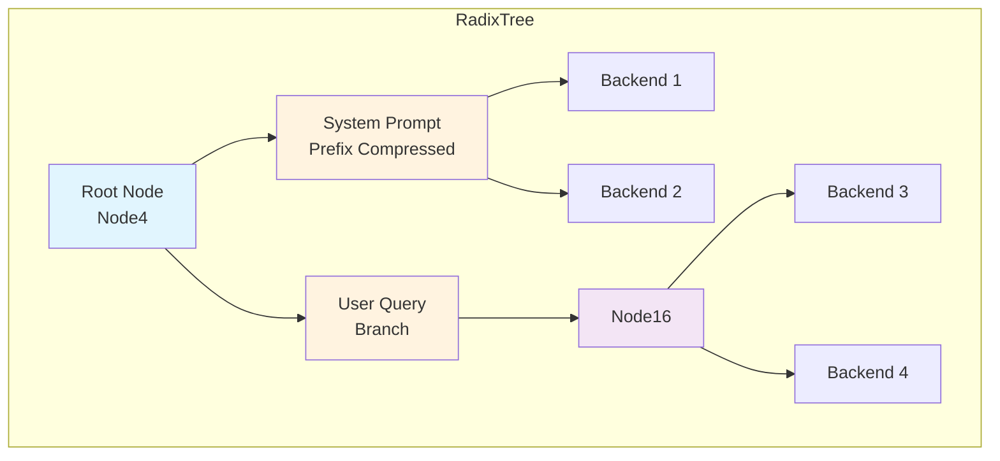
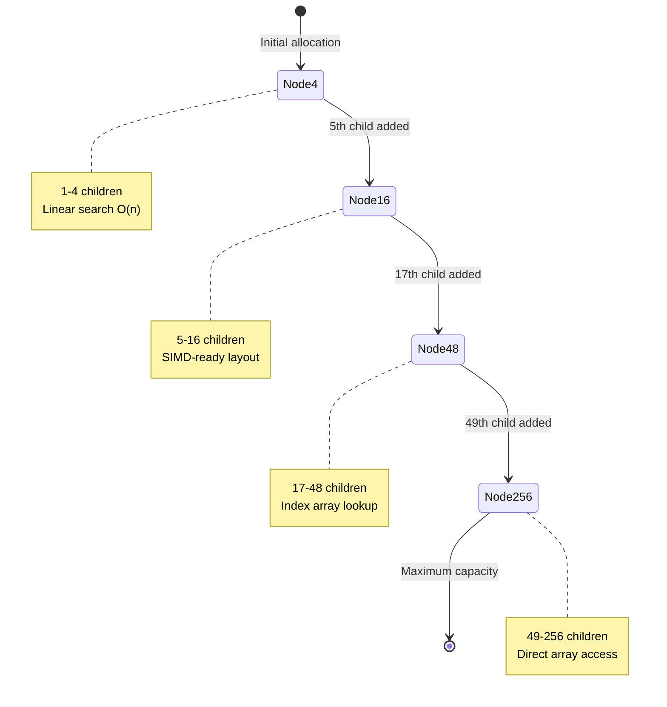
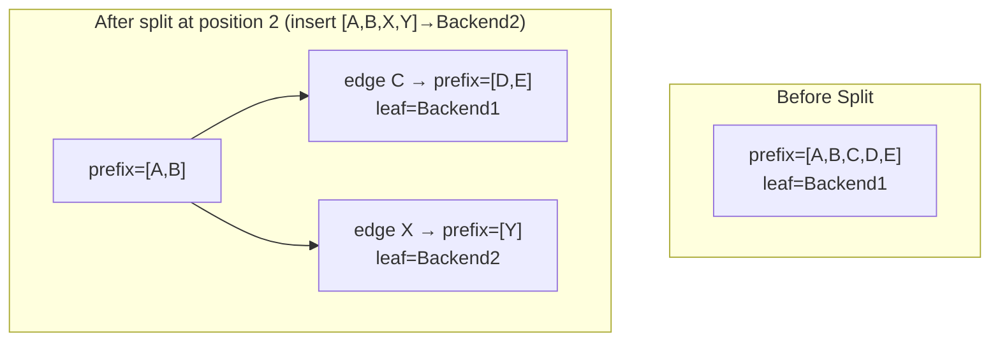
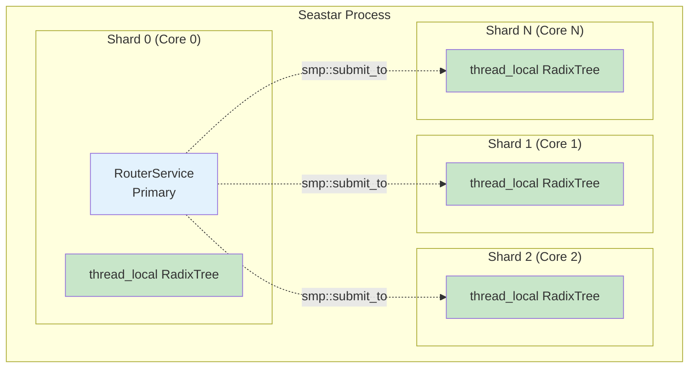
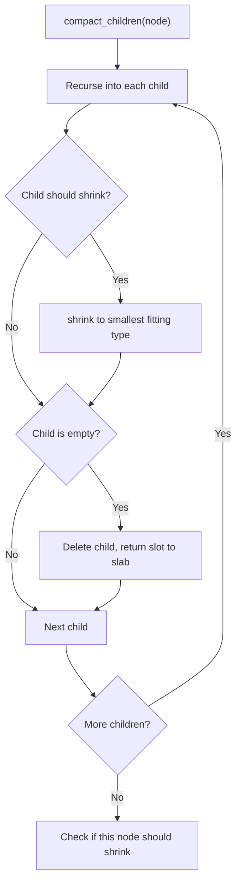
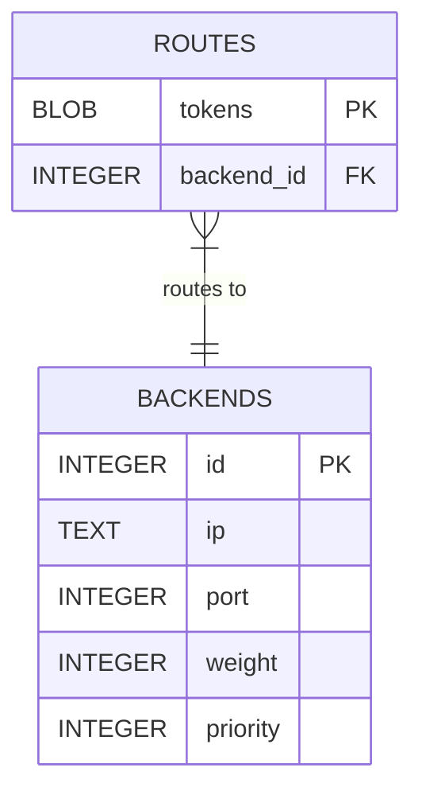
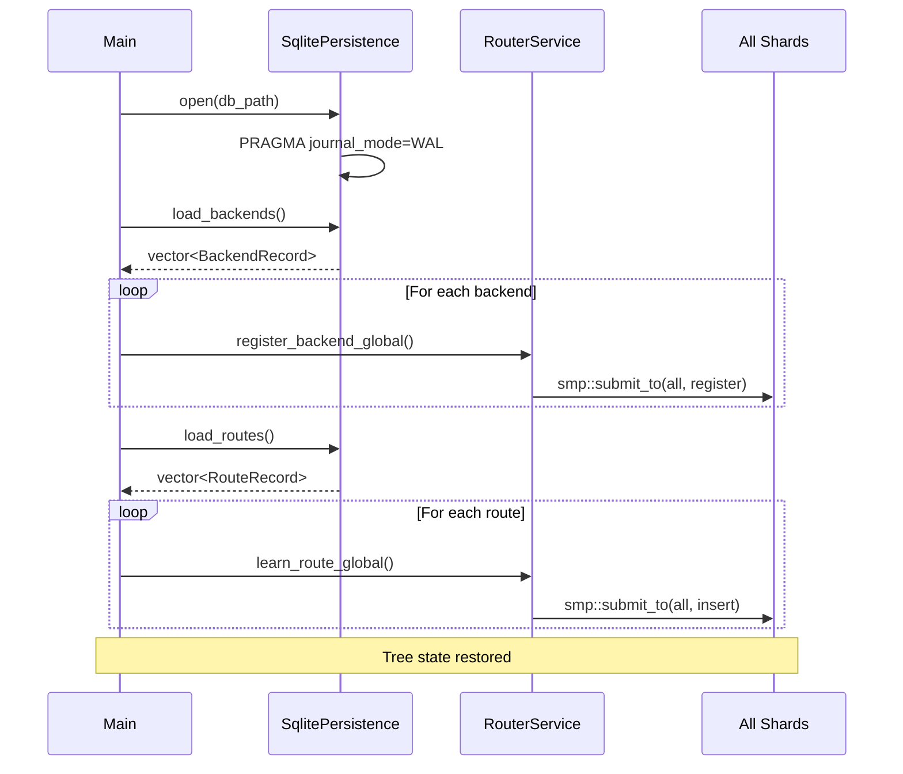

# Adaptive Radix Tree (ART) Implementation

> **Internal Technical Guide**
> Ranvier Core Routing Infrastructure

This document describes the design and rationale of the Adaptive Radix Tree used by Ranvier Core for prefix-based KV-cache routing. For implementation details, refer to the source files directly — this guide explains *why*, not *what*.

## Table of Contents

1. [Overview](#overview)
2. [Slab Allocator](#slab-allocator-o1-node-allocation)
3. [Adaptive Node Design](#adaptive-node-design)
4. [Path Compression & Lazy Expansion](#path-compression--lazy-expansion)
5. [SIMD Key Search (Roadmap)](#simd-key-search-roadmap)
6. [Concurrency Model](#concurrency-model)
7. [LRU Eviction](#lru-eviction)
8. [Tree Compaction (Memory Reclamation)](#tree-compaction-memory-reclamation)
9. [Persistence Interface](#persistence-interface)
10. [Performance Characteristics](#performance-characteristics)

---

## Overview

The Adaptive Radix Tree (ART) is the core data structure powering Ranvier's prefix-based routing. It enables O(k) lookup time where k is the number of tokens in the prefix, while maintaining memory efficiency through adaptive node sizing.



### Design Goals

| Goal | Approach |
|------|----------|
| **O(k) Lookups** | Tree depth equals token count, not vocabulary size |
| **Memory Efficiency** | Adaptive nodes grow only when needed |
| **Cache Locality** | Path compression reduces pointer chasing |
| **Lock-Free Reads** | Thread-local trees per Seastar shard |
| **O(1) Eviction** | Intrusive doubly-linked LRU list on leaf nodes |

### Source Files

| File | Role |
|------|------|
| `src/radix_tree.hpp` | Complete tree implementation (~1900 lines) |
| `src/node_slab.hpp` | Slab allocator interface, `NodePtr` type alias |
| `src/node_slab.cpp` | Slab allocator implementation |
| `src/router_service.cpp` | Integration with Seastar shards |

---

## Slab Allocator: O(1) Node Allocation

### Why a Custom Allocator?

On the hot path, `malloc`/`free` are too expensive and unpredictable. The slab allocator provides O(1) allocation and deallocation by maintaining per-type free lists within pre-allocated 2MB chunks. Since Seastar uses a shared-nothing model, each shard has its own `thread_local` slab — no synchronization is needed.

### Ownership Model: `NodePtr`

All child ownership uses `NodePtr` — a `std::unique_ptr<Node, SlabNodeDeleter>` defined in `node_slab.hpp`. The custom deleter returns memory to the slab's free list instead of calling `delete`.

| Aspect | `shared_ptr` | `NodePtr` (Current) |
|--------|-------------|---------------------|
| **Reference counting** | Atomic `lock xadd` per copy | None |
| **Memory overhead** | +16 bytes control block | +8 bytes SlabHeader |
| **Allocation cost** | `malloc()` per node | O(1) free-list pop |
| **Deallocation cost** | `free()` per node | O(1) free-list push |
| **Thread safety** | Required for cross-thread | Not needed (thread-local slab) |
| **Ownership model** | Shared, unclear lifetime | Exclusive, clear hierarchy |

This works because each Seastar shard has its own `RadixTree` and `NodeSlab` — nodes are never shared across threads. Parent nodes exclusively own their children; when a parent is destroyed, children are automatically cleaned up. Read-only traversal uses raw `Node*` pointers returned by `find_child()`, with ownership remaining in the parent's `NodePtr`.

### Memory Layout

Each 2MB chunk is divided into fixed-size slots. Each slot contains an 8-byte `SlabHeader` (for deallocation routing) followed by node storage.

```
┌─────────────────────────────────────────────────────────────────────────────┐
│                              2MB Chunk (one per node type)                  │
├────────┬────────┬────────┬────────┬────────┬────────┬────────┬─────────────┤
│ Header │  Node  │ Header │  Node  │ Header │  Node  │  ...   │   (free)    │
│ 8 bytes│        │ 8 bytes│        │ 8 bytes│        │        │             │
└────────┴────────┴────────┴────────┴────────┴────────┴────────┴─────────────┘
         └─────── fixed-size slot ──┘
```

### Slot Sizes

| Node Type | Slot Size | Slots per 2MB Chunk |
|-----------|-----------|---------------------|
| Node4 | 192 bytes | 10,922 |
| Node16 | 192 bytes | 10,922 |
| Node48 | 448 bytes | 4,681 |
| Node256 | 3,200 bytes | 655 |

Node256 slots are larger than a naive calculation (256 × 8 = 2,048 bytes) because each slot also holds the common `Node` header (LRU pointers, `InlinedVector` prefix, leaf metadata, vtable pointer) plus alignment padding. See [Node256](#node256-direct-mapped-array) for the structure.

---

## Adaptive Node Design

The ART uses four node types that automatically transition based on child count. This minimizes memory waste while maintaining consistent O(k) lookup time.

### Node Type Transitions



### Common Node Header

All node types inherit from `Node` (defined in `radix_tree.hpp`). The base struct carries:

| Field | Type | Purpose |
|-------|------|---------|
| `type` | `NodeType` | Discriminator for polymorphic dispatch |
| `prefix` | `absl::InlinedVector<uint8_t, 32>` | Byte-level path compression (inline for ≤32 bytes ≈ 8 tokens, heap beyond) |
| `leaf_value` | `std::optional<BackendId>` | Route destination if this node is terminal |
| `origin` | `RouteOrigin` | `LOCAL` (default) or `REMOTE` — controls eviction priority |
| `last_accessed` | `steady_clock::time_point` | Timestamp for TTL expiration |
| `lru_prev` / `lru_next` | `Node*` | Intrusive doubly-linked LRU list pointers |

The tree operates on raw bytes (big-endian `TokenId` encoding), so `prefix` is a byte vector, not a `TokenId` vector. The `InlinedVector` inline capacity of 32 bytes equals 8 logical tokens — enough to avoid heap allocation for the majority of nodes after path compression splits.

### Node Types

#### Node4: Compact Sparse Node

Stores up to 4 key-child pairs in parallel `std::vector`s (reserved to capacity 4). Lookup is a simple linear scan — O(4) = O(1) in practice.

**Use case:** Initial node type. Optimal for low-branching prefixes like system prompts where vocabulary divergence is minimal.

#### Node16: SIMD-Ready Medium Node

Same structure as Node4 but with capacity 16. The keys vector stores 16 bytes (one per distinct byte value), which fits comfortably in a single AVX2 register for future SIMD optimization.

**Use case:** Moderate branching, common for conversation turns where multiple user queries share a system prompt prefix.

#### Node48: Indexed Lookup Node

Uses a 256-byte `index[]` array that maps a byte key directly to a position in a compact children vector. The fast path is O(1): look up the index, dereference the child. Because the tree operates on raw bytes (not truncated TokenIds), each byte key maps to a unique slot — there is no collision handling.

An `EMPTY_MARKER` sentinel (255) in the index array indicates unused slots.

**Use case:** High-branching nodes where different byte values diverge significantly.

#### Node256: Direct-Mapped Array

A simple 256-element children array where the slot index *is* the byte key. Lookup, insert, and delete are all O(1) single-array-access operations. No separate keys array, no collision fallback, no "Node256 full" edge case — the byte alphabet is exactly 256, so the node can hold any child set by construction.

This is the textbook ART representation and it's only possible because the tree keys on bytes rather than on the wider `TokenId` type. The earlier implementation used `key_byte(TokenId) = TokenId & 0xFF` as a lossy hash, which forced the node into an open-addressed hash table with a silent-drop bug when more than 256 distinct tokens shared a parent. The multi-byte ART refactor eliminated both the hashing and the bug.

**Use case:** Maximum branching scenarios, rare in practice because most parent nodes see far fewer than 256 distinct byte values at any given depth.

### Growth and Shrinking

**Growth** occurs during insertion when a node reaches capacity. The `grow_to_node16()`, `grow_to_node48()`, and `grow_to_node256()` helpers allocate a new, larger node via the slab, then call `transfer_node_metadata()` to move the prefix, leaf value, origin, timestamps, *and* LRU list position to the new node. Existing children are moved via `std::move()` — zero-copy ownership transfer. The old node is automatically returned to the slab when its `NodePtr` goes out of scope.

**Shrinking** occurs during compaction. Unlike growth (which is always one step up), shrinking can skip intermediate types: a Node256 with ≤4 children shrinks directly to Node4, not through Node48 and Node16. See [Tree Compaction](#tree-compaction-memory-reclamation) and the `shrink_node()` helper in `radix_tree.hpp`.

### Memory Efficiency

| Node Type | Slab Slot | Keys Storage | Children Storage | Capacity |
|-----------|-----------|--------------|------------------|----------|
| Node4 | 192 B | 4 B (4 × 1B) | 32 B (4 × 8B) | 1-4 |
| Node16 | 192 B | 16 B (16 × 1B) | 128 B (16 × 8B) | 5-16 |
| Node48 | 448 B | 48 B keys + 256 B index | 384 B (48 × 8B) | 17-48 |
| Node256 | 3,200 B | none (slot index *is* the key) | 2,048 B (256 × 8B) | 49-256 |

Sparse trees (common in LLM routing) use primarily Node4/Node16. Dense branching automatically upgrades to indexed/direct access.

---

## Path Compression & Lazy Expansion

Path compression is critical for LLM routing where long common prefixes (system prompts, conversation history) would otherwise create deep, cache-inefficient chains of single-child nodes.

### The Problem

Without compression, a 1,000-token system prompt creates 1,000 nodes — 1,000 pointer dereferences per lookup with poor cache locality. With compression, a single node stores the entire non-branching prefix in its `prefix` vector, reducing that to 1 node lookup.

### How It Works

Each node's `prefix` field stores a sequence of bytes that don't branch. Prefixes are only split when a new route diverges ("lazy expansion"). The `split_node()` function in `radix_tree.hpp` handles this:

1. **Determine split point** — where the new route diverges from the existing prefix
2. **Create a child node** for the suffix, sized to hold all existing children (not always Node4 — a node with 30 children creates Node48)
3. **Transfer** the leaf value, children, and LRU list position to the new child via `move_children_to_new_node()` and `add_single_child_after_split()`
4. **Truncate** the parent's prefix to the common portion (parent retains its original node type)
5. **Enforce** the maximum prefix length invariant (see below)



### Maximum Prefix Length Invariant

Node prefixes are bounded by `MAX_PREFIX_LENGTH = 1024` bytes (defined in `radix_tree.hpp`), which corresponds to 256 logical tokens at 4 bytes per `TokenId`. The bound prevents unbounded memory growth in a single `InlinedVector` (Hard Rule #4). When `insert()` or `split_node()` would produce a prefix exceeding this bound, `split_long_prefix()` chains the excess into a linked sequence of nodes, each holding up to 1024 bytes of prefix. This is transparent to callers.

### Cache Efficiency Gains

| Metric | Without Compression | With Compression |
|--------|---------------------|------------------|
| Nodes for 1,000-token prefix | 1,000 | 1 |
| Pointer dereferences | 1,000 | 1 |
| Cache lines touched | ~250 | 1-2 |
| Memory overhead | ~48KB | ~4KB |

### Lookup with Path Compression

The `lookup_recursive()` function in `radix_tree.hpp` uses iterative traversal (the name is a holdover from the original recursive implementation) for hot-path performance. Key design decisions:

- **Best-match semantics:** Returns the deepest matching leaf, not just exact matches. A lookup for tokens `[A,B,C,D,E]` returns the leaf at `[A,B,C]` if no deeper match exists.
- **Early return on mismatch:** When the prefix comparison fails partway, the function immediately returns the best match found so far.
- **LRU touch at every exit:** All three exit points (prefix mismatch, input exhausted, traversal complete) update both `last_accessed` and the intrusive LRU list position via `lru_touch()`. This keeps the LRU list accurate without deferred maintenance.
- **`[[unlikely]]` hint:** The empty-tokens check uses a branch prediction hint since most lookups traverse multiple levels.

---

## SIMD Key Search (Roadmap)

> **Status:** Planned optimization for Node16 lookups

Node16 currently uses linear scan through the keys vector. The byte-keyed layout is naturally SIMD-friendly: 16 × 1-byte keys fit in a single 128-bit SSE register (`_mm_cmpeq_epi8` + `_mm_movemask_epi8`) or AVX2 register lane.

The planned optimization would broadcast the search byte to all SIMD lanes and compare all 16 keys in 2 instructions, reducing average lookup from ~12 cycles to ~4 cycles.

### Expected Performance Gains

| Scenario | Linear Search | SIMD Search | Speedup |
|----------|---------------|-------------|---------|
| Best case | ~3 cycles | ~4 cycles | 0.75x |
| Average case | ~12 cycles | ~4 cycles | 3x |
| Worst case | ~24 cycles | ~4 cycles | 6x |

### Implementation Considerations

1. **Alignment:** The keys vector must be 16-byte aligned for unaligned-load avoidance (likely requires `alignas(16)` or switching to `std::array<uint8_t, 16>`)
2. **Runtime detection:** Needs `__builtin_cpu_supports("sse4.2")` (and `"avx2"` if extended) with graceful fallback to scalar path
3. **Build integration:** Requires `-msse4.2` compiler flags (`-mavx2` for the wider variant)

---

## Concurrency Model

Ranvier uses Seastar's **shared-nothing architecture** where each CPU shard maintains its own `thread_local` RadixTree. This eliminates locks on the hot path while ensuring consistent state through controlled broadcasting.

### Thread-Local Tree Architecture



### Data Plane vs. Control Plane

| Plane | Operations | Synchronization | Latency |
|-------|-----------|-----------------|---------|
| **Data** (lookups) | `lookup()`, LRU touch | None — pure `thread_local` access | Predictable, no lock waits |
| **Control** (mutations) | `insert()`, `evict()`, backend registration | `seastar::smp::submit_to()` broadcast | Async, parallel across shards |

**Data plane** lookups execute entirely within a single shard. The router checks the thread-local tree, verifies the result against a thread-local dead-backend set (circuit breaker), and returns — zero mutex contention.

**Control plane** mutations (learning routes, removing backends) are broadcast to all shards via `seastar::parallel_for_each` + `smp::submit_to`. Each shard applies the mutation to its own thread-local tree. See `router_service.cpp` for the broadcast patterns.

### Cluster Gossip

When cluster mode is enabled, routes are also broadcast to peer nodes via UDP gossip. Routes received from peers are tagged with `RouteOrigin::REMOTE` (vs. `LOCAL` for directly-learned routes), which affects eviction priority — REMOTE routes are evicted first.

### Shard Initialization

Each shard initializes its own tree at startup, receiving configuration (block alignment, max routes, TTL) copied from shard 0 via `smp::submit_to`. Shard 0 initializes first, then broadcasts to shards 1..N in parallel.

---

## LRU Eviction

The RadixTree maintains an **intrusive doubly-linked list** of all leaf nodes, ordered by access time. This provides O(1) eviction without scanning the tree.

### Design Rationale

An external LRU structure (e.g., `std::list` + hash map) would add per-node heap allocations and cache misses. By embedding `lru_prev`/`lru_next` pointers directly in the `Node` struct, the LRU bookkeeping is free — no extra allocations, and the pointers are in the same cache line as the node's other hot fields.

### Operations

| Function | Complexity | Description |
|----------|------------|-------------|
| `lru_push_front(node)` | O(1) | Insert node at head (most recently accessed) |
| `lru_remove(node)` | O(1) | Unlink node from list (on eviction or deletion) |
| `lru_touch(node)` | O(1) | Move node to head (called on every lookup hit) |
| `evict_oldest()` | O(1) | Pop tail node, clear its `leaf_value` (tombstone) |
| `evict_oldest_remote()` | O(n) worst | Scan from tail for a `REMOTE` route; falls back to `evict_oldest()` if none found |

### Eviction Flow

`evict_oldest()` pops the tail of the intrusive list, clears the node's `leaf_value` (tombstoning it), and decrements the route count. The node structure remains in the tree until [compaction](#tree-compaction-memory-reclamation) removes it.

`evict_oldest_remote()` prefers evicting gossip-learned routes first. It scans backward from the tail looking for a node with `origin == RouteOrigin::REMOTE`. If none exists, it falls back to `evict_oldest()`. The scan makes this O(n) in the worst case, but in practice REMOTE routes cluster near the tail (they're accessed less frequently).

### LRU Touch on Lookup

Every `lookup_recursive()` exit path calls both `last_accessed = now()` and `lru_touch()` on the best-match node. The timestamp is used for TTL expiration (`remove_expired()`), while the list position is used for capacity-based eviction (`evict_oldest()`).

### Integration with RouterService

Before each `insert()`, the router checks whether the shard is at capacity (`route_count >= max_routes`). If so, it calls `evict_oldest()` in a loop until space is available. Tombstoned nodes are later reclaimed by [Tree Compaction](#tree-compaction-memory-reclamation).

---

## Tree Compaction (Memory Reclamation)

Route eviction and TTL expiration tombstone nodes (clear `leaf_value`) but leave the tree structure intact. Over time, this wastes slab slots and increases traversal depth. The `compact()` method reclaims this memory.

### What Compaction Does

1. **Removes empty nodes** — nodes with no `leaf_value` and no children are deleted, returning their slab slot to the free list
2. **Shrinks oversized nodes** — e.g., a Node256 with ≤4 remaining children becomes a Node4
3. **Preserves the root** — the root node is never deleted (only shrunk if oversized)

### Algorithm

Compaction uses **post-order traversal** — children are processed before parents, ensuring accurate emptiness checks. At each node:



**Shrinking skips intermediate types:** A Node256 with 3 children shrinks directly to Node4, not through Node48 → Node16 → Node4. This is handled by `shrink_node()` in `radix_tree.hpp`.

### Performance

| Metric | Value |
|--------|-------|
| Time Complexity | O(n) where n = total nodes |
| Space Complexity | O(d) where d = tree depth (recursion stack + small temp vector per level) |
| Memory Impact | Returns freed nodes to slab free list |
| Blocking | Synchronous within shard (no cross-shard coordination) |

Typical compaction completes in microseconds for trees with <100K nodes. It runs on a periodic timer (recommended: every 60 seconds) and can also be triggered after bulk eviction (e.g., removing all routes for a decommissioned backend).

### CompactionStats

`compact()` returns a `CompactionStats` struct with `nodes_removed`, `nodes_shrunk`, and `bytes_reclaimed` — suitable for Prometheus metrics export.

The `bytes_reclaimed` field uses estimated logical node sizes (defined as constants in `radix_tree.hpp`) which differ from the physical slab slot sizes:

| Node Type | Logical Size (metrics) | Physical Slot Size (slab) |
|-----------|----------------------|---------------------------|
| Node4 | 192 B | 192 B |
| Node16 | 384 B | 192 B |
| Node48 | 640 B | 448 B |
| Node256 | 2,240 B | 3,200 B |

---

## Persistence Interface

Routes and backend registrations are persisted to SQLite (WAL mode) for crash recovery. Persistence is handled by `SqlitePersistence` — a separate component from the RadixTree itself.

### Database Schema



Token vectors are serialized as raw binary BLOBs (`memcpy` of the `TokenId` array) for efficient storage and comparison.

### Key Design Decisions

| Decision | Rationale |
|----------|-----------|
| **WAL mode** | Readers don't block writers; crash recovery via WAL replay |
| **PRAGMA synchronous=NORMAL** | Balance safety and speed (WAL is fsync'd, but not every transaction) |
| **Mutex protection** | Acceptable because persistence is off the hot path — lookups use thread-local trees |
| **Batch transactions** | Bulk loading at startup wraps all inserts in a single transaction for atomicity and speed |

### Startup Recovery



---

## Performance Characteristics

### Complexity Analysis

| Operation | Time | Space | Notes |
|-----------|------|-------|-------|
| `lookup()` | O(k) | O(1) | k = tokens in prefix |
| `insert()` | O(k) | O(k) amortized | May trigger node growth or prefix split |
| `evict_oldest()` | O(1) | O(1) | Pops intrusive LRU tail |
| `evict_oldest_remote()` | O(n) worst | O(1) | Scans for REMOTE; falls back to `evict_oldest()` |
| `remove_expired()` | O(n) | O(1) | Scans all routes for TTL expiration |
| `compact()` | O(n) | O(d) | Post-order traversal; d = tree depth |

### Measured Performance

From production benchmarks (see `docs/performance.md`):

| Metric | Value |
|--------|-------|
| Cache Hit Latency (P50) | 18ms |
| Cache Hit Latency (P99) | 25ms |
| Cache Miss Latency | ~500ms (requires GPU prefill) |
| Speedup Factor | 28x with cache hits |
| Max Routes per Shard | 100,000 (configurable) |
| Memory per 100K Routes | ~50MB (varies with prefix length) |

### Block Alignment Truncation

`insert()` silently truncates token spans to the nearest multiple of `block_alignment` (default 16, matching vLLM PagedAttention block size). Tokens beyond that boundary are discarded. This ensures routes align with the backend's KV-cache block boundaries.

### Additional Public API

| Method | Description |
|--------|-------------|
| `lookup_instrumented(tokens)` | Returns `LookupResult` with `backend`, `prefix_bytes_skipped`, `nodes_traversed`. `prefix_bytes_skipped` is a byte count; `RouterService` divides by `sizeof(TokenId)` when recording the external `ranvier_radix_tree_average_prefix_skip_length` gauge so it retains its token-level semantic for dashboards. |
| `get_tree_stats()` | Returns `TreeStats` with per-node-type counts and prefix length statistics |
| `for_each_leaf(callback)` | Iterates all leaf nodes (used for persistence serialization) |
| `dump()` / `dump_with_prefix(prefix)` | Serializes tree (or subtree) to `DumpNode` for admin API inspection |
| `remove_routes_by_backend(id, origin)` | Removes all routes for a given backend + origin |
| `remove_expired(cutoff)` | Removes routes with `last_accessed` older than cutoff |

### Configuration

```yaml
routing:
  block_alignment: 16        # vLLM PagedAttention block size
  max_routes: 100000         # Per-shard capacity (triggers LRU eviction)
  ttl_seconds: 3600          # Route expiration (1 hour default)
```

---

## References

- [The Adaptive Radix Tree (Leis et al., 2013)](https://db.in.tum.de/~leis/papers/ART.pdf)
- [Seastar Framework](https://seastar.io/shared-nothing/)
- [Abseil Swiss Tables](https://abseil.io/docs/cpp/guides/container)
- [Intel Intrinsics Guide](https://www.intel.com/content/www/us/en/docs/intrinsics-guide/index.html)
