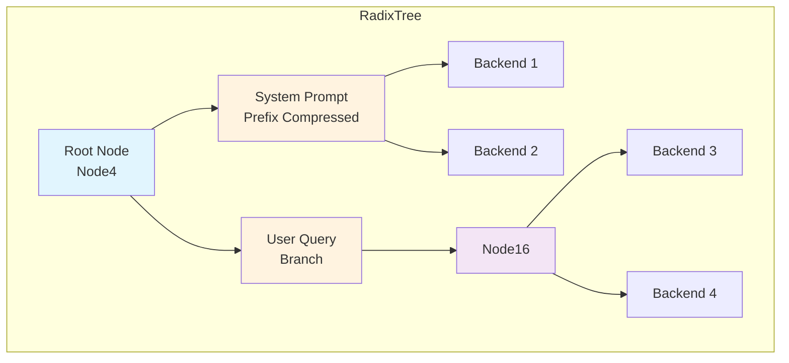
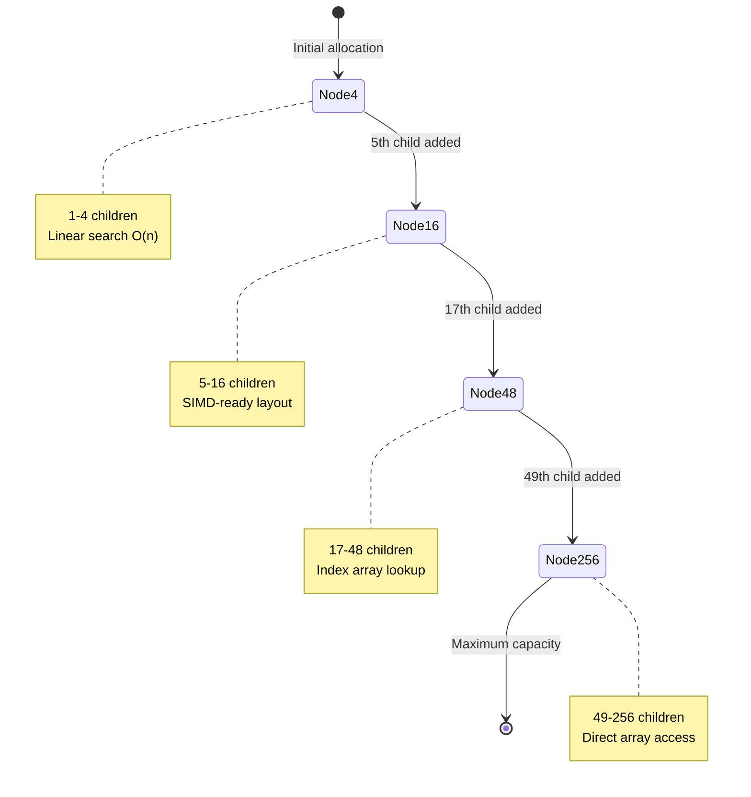
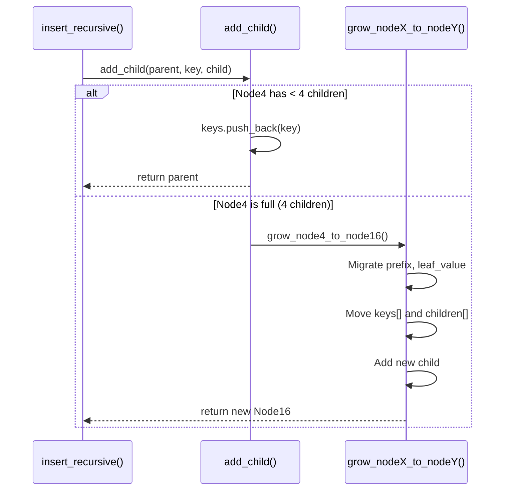
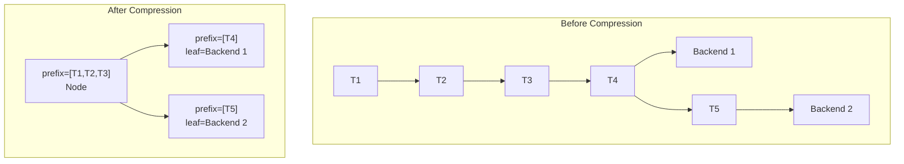
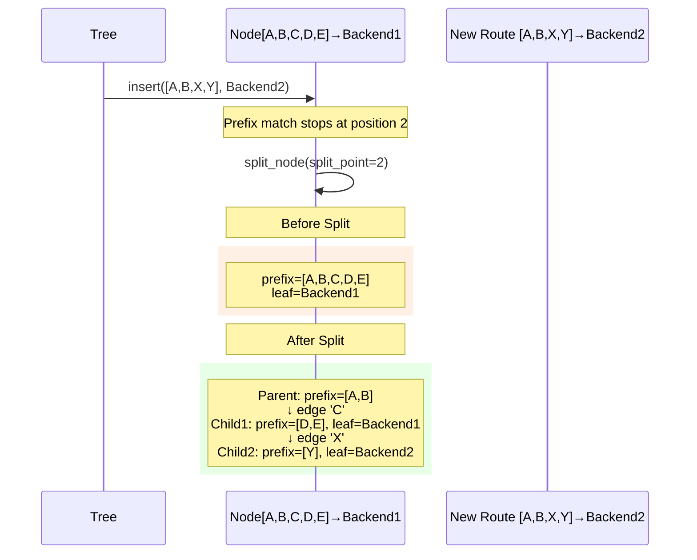
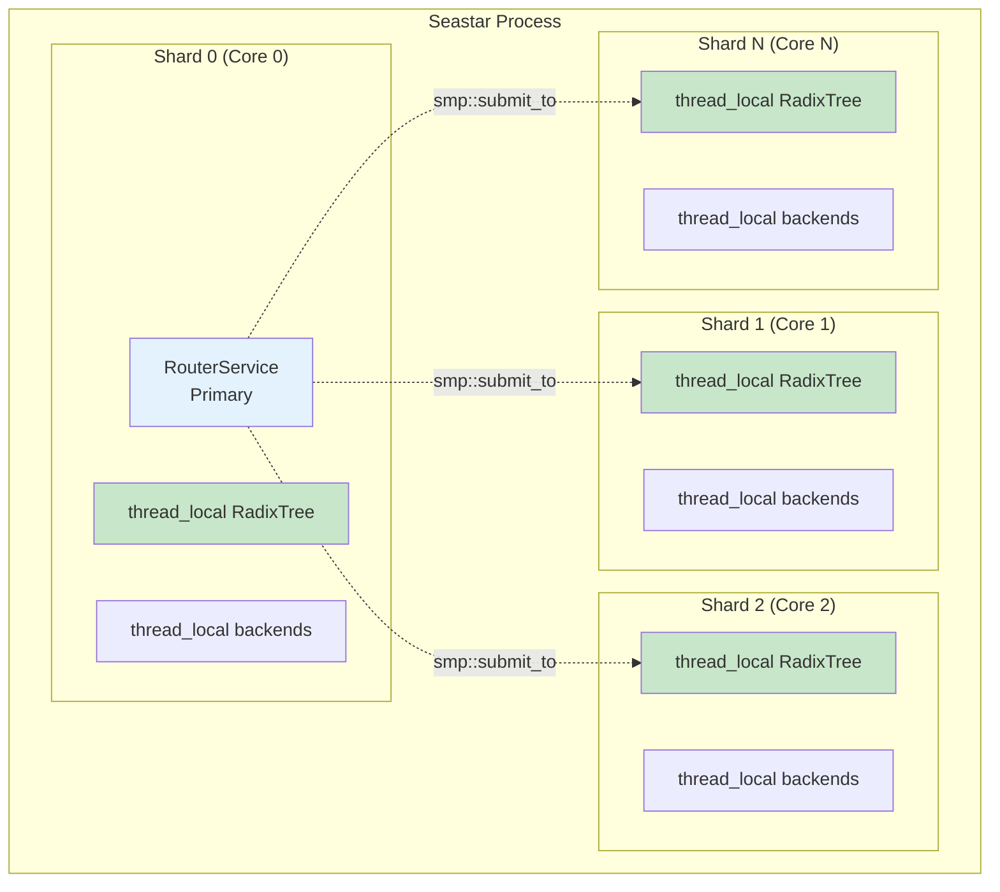
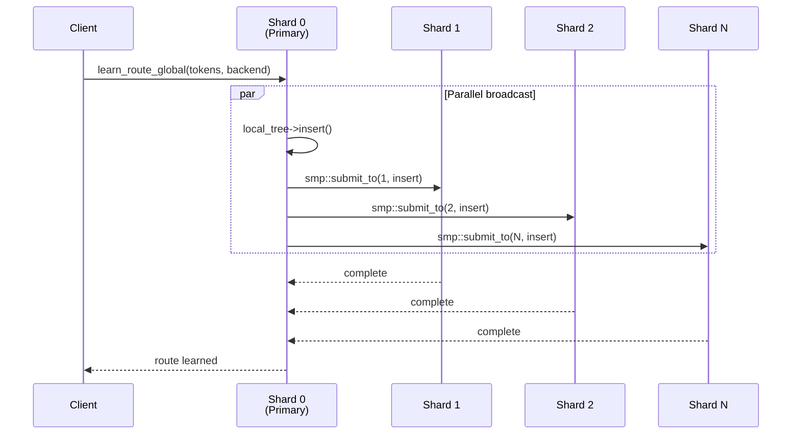
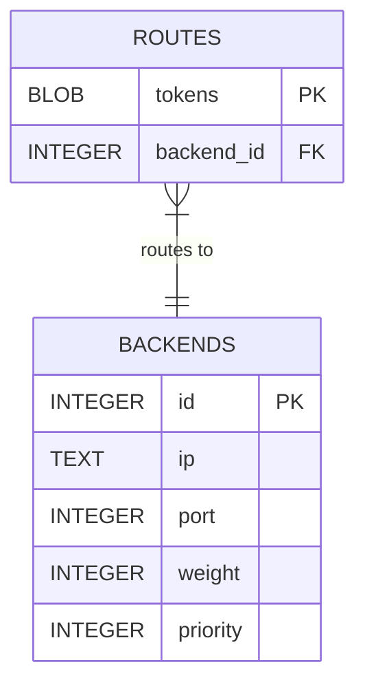
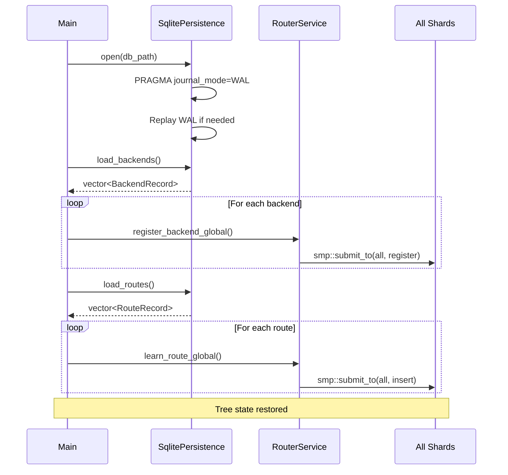

# Adaptive Radix Tree (ART) Implementation

> **Internal Technical Guide**
> Ranvier Core Routing Infrastructure

This document describes the Adaptive Radix Tree implementation used by Ranvier Core for prefix-based KV-cache routing across a shared-nothing Seastar cluster.

## Table of Contents

1. [Overview](#overview)
2. [Slab Allocator](#slab-allocator-o1-node-allocation)
3. [Adaptive Node Design](#adaptive-node-design)
4. [Path Compression & Lazy Expansion](#path-compression--lazy-expansion)
5. [SIMD Key Search (Roadmap)](#simd-key-search-roadmap)
6. [Concurrency Model](#concurrency-model)
7. [LRU Eviction](#lru-eviction)
8. [Tree Compaction (Memory Reclamation)](#tree-compaction-memory-reclamation)
9. [Persistence Interface](#persistence-interface)
10. [Performance Characteristics](#performance-characteristics)

---

## Overview

The Adaptive Radix Tree (ART) is the core data structure powering Ranvier's prefix-based routing. It enables O(k) lookup time where k is the number of tokens in the prefix, while maintaining memory efficiency through adaptive node sizing.



### Design Goals

| Goal | Implementation |
|------|----------------|
| **O(k) Lookups** | Tree depth equals token count, not vocabulary size |
| **Memory Efficiency** | Adaptive nodes grow only when needed |
| **Cache Locality** | Path compression reduces pointer chasing |
| **Lock-Free Reads** | Thread-local trees per Seastar shard |
| **LRU Eviction** | Intrusive doubly-linked list for O(1) eviction |

### Source Location

```
src/radix_tree.hpp    # Complete implementation (~1900 lines)
src/node_slab.hpp     # Slab allocator interface and NodePtr type alias
src/node_slab.cpp     # Slab allocator implementation
src/router_service.cpp # Integration with Seastar shards
```

### Ownership Model: `NodePtr` with Slab Allocator

The RadixTree uses `NodePtr` for all child ownership—a `std::unique_ptr` with a custom deleter that returns memory to the slab allocator:

```cpp
// Defined in node_slab.hpp
using NodePtr = std::unique_ptr<Node, SlabNodeDeleter>;
```

This design optimizes for Seastar's shared-nothing architecture while providing O(1) allocation/deallocation:

| Aspect | `shared_ptr` | `NodePtr` (Current) |
|--------|-------------|---------------------|
| **Reference counting** | Atomic `lock xadd` per copy | None |
| **Memory overhead** | +16 bytes control block | +8 bytes SlabHeader |
| **Allocation cost** | `malloc()` per node | O(1) free-list pop |
| **Deallocation cost** | `free()` per node | O(1) free-list push |
| **Thread safety** | Required for cross-thread | Not needed (thread-local slab) |
| **Ownership model** | Shared, unclear lifetime | Exclusive, clear hierarchy |

**Why `NodePtr` with custom deleter:**

1. **Thread-local trees**: Each Seastar shard has its own `RadixTree` instance and `NodeSlab`. Nodes are never shared across threads.

2. **O(1) memory operations**: The `SlabNodeDeleter` returns memory to the slab's intrusive free list instead of calling `delete`, eliminating heap operations on hot paths.

3. **No atomic overhead**: Unlike `shared_ptr`, ownership transfer is a simple pointer swap with no atomic reference counting.

4. **Clear ownership hierarchy**: Parent nodes exclusively own their children. When a parent is destroyed, children are automatically cleaned up via the custom deleter.

5. **Move semantics for mutations**: Node growth and splitting use `std::move()` to transfer ownership without copying:

```cpp
// Growth: move ownership to new parent (slab-allocated)
n16->children.push_back(std::move(child));

// Splitting: extract child ownership temporarily
auto extracted = extract_child(node, key);
add_child(new_parent, key, std::move(extracted));
```

**Raw pointers for traversal**: `find_child()` returns raw `Node*` for read-only traversal. The parent's `NodePtr` maintains ownership throughout.

### Slab Allocator: O(1) Node Allocation

The `NodeSlab` class provides a custom slab allocator for RadixTree nodes, eliminating malloc/free overhead on hot paths:

```
┌─────────────────────────────────────────────────────────────────────────────┐
│                              2MB Chunk (Node4 Pool)                        │
├────────┬────────┬────────┬────────┬────────┬────────┬────────┬─────────────┤
│ Header │ Node4  │ Header │ Node4  │ Header │ Node4  │  ...   │   (free)    │
│ 8 bytes│184 bytes│8 bytes│184 bytes│8 bytes│184 bytes│       │             │
└────────┴────────┴────────┴────────┴────────┴────────┴────────┴─────────────┘
        └── 192 byte slot ──┘
```

**Key Features:**

| Feature | Implementation |
|---------|----------------|
| **O(1) Allocation** | Intrusive free list (no heap operations) |
| **O(1) Deallocation** | Push to intrusive list head |
| **Cache Locality** | Nodes of same type are physically adjacent |
| **Per-Shard Isolation** | `thread_local` storage, no synchronization |
| **Four Size Classes** | One pool per node type (Node4→Node256) |

**Slot Sizes (from `node_slab.hpp`):**

| Node Type | Slot Size | Slots per 2MB Chunk |
|-----------|-----------|---------------------|
| Node4 | 192 bytes | 10,922 |
| Node16 | 192 bytes | 10,922 |
| Node48 | 448 bytes | 4,681 |
| Node256 | 3,200 bytes | 655 |

> **Note:** Node256 slot size is larger than a naive calculation (256 × 8 = 2048 bytes) because it includes an additional `std::array<TokenId, 256> keys` array for hash collision handling.

**Memory Layout:**

Each allocation slot contains:
1. **SlabHeader (8 bytes)**: Pool index for deallocation routing
2. **Node storage**: Sized per node type (up to 3,192 bytes for Node256)

**Custom Deleter:**

The `NodePtr` type alias uses a custom deleter (`SlabNodeDeleter`) that returns memory to the slab instead of calling `delete`:

```cpp
// Defined in node_slab.hpp
using NodePtr = std::unique_ptr<Node, SlabNodeDeleter>;

// Implementation in node_slab.cpp - O(1) deallocation
void SlabNodeDeleter::operator()(Node* ptr) const noexcept {
    if (!ptr) return;

    // Invoke destructor manually (correct destructor via virtual dispatch)
    ptr->~Node();

    // Return memory to slab's free list
    NodeSlab* slab = get_node_slab();
    if (slab) {
        slab->deallocate(ptr);  // O(1) push to intrusive list
    }
}
```

**Source Location:**

```
src/node_slab.hpp  # Class definition, NodePtr alias, pool configuration
src/node_slab.cpp  # Implementation with intrusive free list
```

---

## Adaptive Node Design

The ART uses four node types that automatically transition based on child count. This minimizes memory fragmentation while maintaining consistent O(k) lookup time.

### Node Type Hierarchy



### Node Structures

All nodes share a common header defined in the base `Node` struct:

```cpp
struct Node {
    NodeType type;                              // Discriminator for polymorphism
    absl::InlinedVector<TokenId, 8> prefix;     // Path compression (inline for ≤8 tokens)
    std::optional<BackendId> leaf_value;        // Route destination if terminal
    RouteOrigin origin = RouteOrigin::LOCAL;    // LOCAL or REMOTE (for eviction priority)
    std::chrono::steady_clock::time_point last_accessed;  // LRU tracking

    // Intrusive LRU list pointers (only meaningful for leaf nodes).
    // Maintained by RadixTree — do not modify directly.
    Node* lru_prev = nullptr;  // Toward head (more recent)
    Node* lru_next = nullptr;  // Toward tail (older)
};
```

#### Node4: Compact Sparse Node

```cpp
struct Node4 : public Node {
    std::vector<TokenId> keys;      // Up to 4 keys
    std::vector<NodePtr> children;  // Corresponding children (slab-allocated)

    Node4() : Node(NodeType::Node4) {
        keys.reserve(4);
        children.reserve(4);
    }
};
```

**Memory Layout:**

```
┌─────────────────────────────────────────────────────────┐
│ Node Header (type, prefix, leaf_value, origin, time)    │
├─────────────────────────────────────────────────────────┤
│ keys[0]    │ keys[1]    │ keys[2]    │ keys[3]          │
│ (TokenId)  │ (TokenId)  │ (TokenId)  │ (TokenId)        │
├─────────────────────────────────────────────────────────┤
│ children[0]│ children[1]│ children[2]│ children[3]      │
│ (ptr)      │ (ptr)      │ (ptr)      │ (ptr)            │
└─────────────────────────────────────────────────────────┘
```

**Lookup Complexity:** O(4) = O(1) linear scan through keys vector.

**Use Case:** Initial node type, optimal for low-branching prefixes like system prompts where vocabulary divergence is minimal.

#### Node16: SIMD-Ready Medium Node

```cpp
struct Node16 : public Node {
    std::vector<TokenId> keys;      // Up to 16 keys
    std::vector<NodePtr> children;  // Slab-allocated

    Node16() : Node(NodeType::Node16) {
        keys.reserve(16);
        children.reserve(16);
    }
};
```

**Memory Layout:**

```
┌─────────────────────────────────────────────────────────┐
│ Node Header                                              │
├─────────────────────────────────────────────────────────┤
│ keys[0..15]  (16 × TokenId = 64 bytes)                  │
│ ████████████████████████████████████████████████████    │
│              ↑ SIMD-aligned for AVX2 comparison         │
├─────────────────────────────────────────────────────────┤
│ children[0..15] (16 × NodePtr)                          │
└─────────────────────────────────────────────────────────┘
```

**Lookup Complexity:** O(16) linear scan, but memory layout enables future SIMD optimization (see [SIMD Key Search](#simd-key-search-roadmap)).

**Use Case:** Moderate branching, common for conversation turns where multiple user queries share a system prompt prefix.

#### Node48: Indexed Lookup Node

```cpp
struct Node48 : public Node {
    static constexpr uint8_t EMPTY_MARKER = 255;

    std::array<uint8_t, 256> index;  // Maps key byte → child position
    std::vector<NodePtr> children;   // Up to 48 children (slab-allocated)
    std::vector<TokenId> keys;       // Original keys for iteration

    Node48() : Node(NodeType::Node48) {
        index.fill(EMPTY_MARKER);
        children.reserve(48);
        keys.reserve(48);
    }
};
```

**Memory Layout:**

```
┌─────────────────────────────────────────────────────────┐
│ Node Header                                              │
├─────────────────────────────────────────────────────────┤
│ index[0..255] (256 bytes)                               │
│ ┌───┬───┬───┬───┬───┬───┬───┬───┬─────┬───┬───┬───┐    │
│ │255│255│ 0 │255│ 1 │255│...│255│ ... │ 2 │255│...│    │
│ └───┴───┴───┴───┴───┴───┴───┴───┴─────┴───┴───┴───┘    │
│       ↑ EMPTY_MARKER        ↑ position in children      │
├─────────────────────────────────────────────────────────┤
│ children[0..47] (up to 48 pointers)                     │
├─────────────────────────────────────────────────────────┤
│ keys[0..47] (original TokenIds for traversal)           │
└─────────────────────────────────────────────────────────┘
```

**Lookup Algorithm (with collision handling):**

```cpp
Node* find_child(TokenId key) const {
    uint8_t idx = index[key_byte(key)];  // O(1) array access

    // Fast path: index valid AND key matches
    if (idx != EMPTY_MARKER && keys[idx] == key) [[likely]] {
        return children[idx].get();
    }

    // Collision case: index points to different key, or was overwritten
    // Fall back to linear search through keys
    for (size_t i = 0; i < keys.size(); i++) {
        if (keys[i] == key) {
            return children[i].get();
        }
    }
    return nullptr;
}
```

**Lookup Complexity:** O(1) in the common case (index hit), O(n) fallback for collisions.

**Use Case:** High-branching nodes where different token sequences diverge significantly.

#### Node256: Direct Access Node with Collision Handling

```cpp
struct Node256 : public Node {
    // CRITICAL: Must store full token IDs because key_byte() only uses lower 8 bits.
    // Token IDs like 0, 256, 512 all map to index 0 - we need to verify the actual key.
    static constexpr TokenId EMPTY_KEY = -1;  // Sentinel value for empty slots

    std::array<NodePtr, 256> children;     // Direct mapping (slab-allocated)
    std::array<TokenId, 256> keys;         // Full token IDs at each slot

    Node256() : Node(NodeType::Node256) {
        keys.fill(EMPTY_KEY);
    }
};
```

> **Why the `keys` array?** The `key_byte()` function extracts only the lower 8 bits of a `TokenId` for array indexing. This means token IDs `0`, `256`, `512`, `768`, etc. all hash to index `0`. The `keys` array stores the full token ID to detect and handle these collisions.

**Memory Layout:**

```
┌─────────────────────────────────────────────────────────┐
│ Node Header                                              │
├─────────────────────────────────────────────────────────┤
│ children[0..255] (256 × NodePtr = 2KB on 64-bit)        │
│ ┌────┬────┬────┬────┬─────────────────────┬────┬────┐   │
│ │ p0 │ p1 │null│ p3 │ ...                 │p254│p255│   │
│ └────┴────┴────┴────┴─────────────────────┴────┴────┘   │
├─────────────────────────────────────────────────────────┤
│ keys[0..255] (256 × TokenId = 1KB on 32-bit TokenId)    │
│ ┌────┬────┬────┬────┬─────────────────────┬────┬────┐   │
│ │ k0 │ k1 │ -1 │ k3 │ ...                 │k254│k255│   │
│ └────┴────┴────┴────┴─────────────────────┴────┴────┘   │
│   ↑ Full token ID (or EMPTY_KEY=-1 for empty slots)     │
└─────────────────────────────────────────────────────────┘
```

**Lookup Algorithm (with collision handling):**

```cpp
Node* find_child(TokenId key) const {
    uint8_t idx = key_byte(key);

    // Fast path: preferred slot matches
    if (keys[idx] == key) [[likely]] {
        return children[idx].get();
    }

    // Always linear scan — the entry may be displaced to any slot
    // (the preferred slot could be empty if the original occupant
    // was evicted, but displaced entries from collisions still exist).
    for (int i = 0; i < 256; i++) {
        if (keys[i] == key) {
            return children[i].get();
        }
    }
    return nullptr;
}
```

**Lookup Complexity:** O(1) in the common case (no collisions), O(n) worst case with collisions.

**Use Case:** Maximum branching scenarios, rare in practice due to path compression.

> **Note on Pointer Types:** The `find_child()` functions return raw `Node*` pointers for traversal efficiency. Ownership remains with the parent node's `NodePtr`. This is safe because traversal operations don't transfer ownership.

### Node Growth Transitions

Growth occurs during insertion when a node reaches capacity:



**Growth Implementation (Node4 → Node16):**

```cpp
NodePtr grow_to_node16(NodePtr parent, TokenId key, NodePtr child) {
    auto* n4 = static_cast<Node4*>(parent.get());
    auto n16_ptr = make_node<Node16>();  // Slab-allocated
    auto* n16 = static_cast<Node16*>(n16_ptr.get());

    // Transfer metadata and LRU list position (src is cleared after)
    transfer_node_metadata(n16, n4);

    // Migrate existing children (zero-copy move of NodePtrs)
    n16->keys = std::move(n4->keys);
    n16->children = std::move(n4->children);

    // Add the new child that triggered growth
    n16->keys.push_back(key);
    n16->children.push_back(std::move(child));  // Transfer ownership

    return n16_ptr;
}
```

> **Ownership Transfer:** When growing nodes, `std::move()` transfers ownership of child `NodePtr`s to the new parent. The old node's children vector becomes empty after the move. The old node itself is automatically returned to the slab when its `NodePtr` goes out of scope.

### Memory Efficiency Analysis

| Node Type | Slab Slot Size | Keys Storage | Children Storage | Density |
|-----------|----------------|--------------|------------------|---------|
| Node4 | 192 bytes | 16 bytes (4 × 4B) | 32 bytes (4 × 8B) | 1-4 children |
| Node16 | 192 bytes | 64 bytes (16 × 4B) | 128 bytes (16 × 8B) | 5-16 children |
| Node48 | 448 bytes | 192 bytes + 256B index | 384 bytes (48 × 8B) | 17-48 children |
| Node256 | 3,200 bytes | 1,024 bytes (256 × 4B) | 2,048 bytes (256 × 8B) | 49-256 children |

The adaptive design ensures that:
- **Sparse trees** (common in LLM routing) use primarily Node4/Node16
- **Dense branching** automatically upgrades to indexed/direct access
- **Memory fragmentation** is minimized by right-sizing node allocations

---

## Path Compression & Lazy Expansion

Path compression is critical for LLM routing where long common prefixes (system prompts, conversation history) would otherwise create deep, cache-inefficient trees.

### The Problem: Deep Trees

Without compression, a 1000-token system prompt creates 1000 nodes:

```
Token_0 → Token_1 → Token_2 → ... → Token_999 → [Backend]
   ↓         ↓         ↓              ↓
 Node      Node      Node           Node
```

This causes:
- **1000 pointer dereferences** per lookup
- **Poor cache locality** (nodes scattered in memory)
- **Memory waste** (each node has header overhead)

### The Solution: Prefix Vectors

Each node stores a `prefix` vector containing tokens that don't branch:

```cpp
struct Node {
    absl::InlinedVector<TokenId, 8> prefix;  // Compressed path segment (inline for ≤8 tokens)
    // ...
};
```

**Compressed Structure:**

```
┌─────────────────────────────────────────────┐
│ Node with prefix = [Token_0..Token_999]     │
│                    ↓                        │
│              [Backend]                      │
└─────────────────────────────────────────────┘
```

Now: **1 node lookup** instead of 1000.

### Compression in Practice



### Lazy Expansion (Split on Divergence)

Prefix compression uses **lazy expansion**: prefixes are only split when a new route diverges. The `split_node()` function handles this:

```cpp
void split_node(Node* node, size_t split_point) {
    // Original: prefix = [A, B, C, D, E]
    // Split at position 2: [A, B] | C | [D, E]

    // Count existing children to select appropriate node type
    size_t num_children = child_count(node);

    // Create node with capacity for existing children (not always Node4!)
    auto new_child = create_node_for_capacity(num_children);
    TokenId split_edge_key = node->prefix[split_point];  // 'C'

    // Move suffix [D, E] to new child
    new_child->prefix.assign(
        node->prefix.begin() + split_point + 1,
        node->prefix.end()
    );

    // Transfer leaf value and all children to new_child
    new_child->leaf_value = node->leaf_value;
    node->leaf_value = std::nullopt;
    move_children_to_new_node(node, new_child.get());  // Moves unique_ptrs

    // Truncate parent prefix to [A, B]
    node->prefix.resize(split_point);

    // Parent retains its type; add new_child under edge 'C'
    add_single_child_after_split(node, edge_key, std::move(new_child));
}
```

> **Dynamic Node Type Selection:** When splitting, `create_node_for_capacity()` selects the appropriate node type based on how many children need to be moved. A node with 30 children creates a Node48, not a Node4. This prevents data loss and maintains tree invariants.

### Maximum Prefix Length Invariant

Node prefixes are bounded to prevent unbounded memory consumption in a single node:

```cpp
static constexpr size_t MAX_PREFIX_LENGTH = 256;
```

When `insert()` or `split_node()` would produce a prefix longer than 256 tokens, `split_long_prefix()` chains the excess into a linked sequence of nodes:

```cpp
void split_long_prefix(Node* node) {
    while (node->prefix.size() > MAX_PREFIX_LENGTH) {
        TokenId edge_key = node->prefix[MAX_PREFIX_LENGTH];
        auto new_child = make_node<Node4>();

        // Move excess suffix to child prefix
        new_child->prefix.assign(
            node->prefix.begin() + MAX_PREFIX_LENGTH + 1,
            node->prefix.end()
        );

        // Transfer leaf data, LRU position, and children to child
        // ... (ownership transfer, LRU splice)

        // Truncate parent and add single child
        node->prefix.resize(MAX_PREFIX_LENGTH);
        add_single_child_after_split(node, edge_key, std::move(new_child));
    }
}
```

This ensures no single node's `InlinedVector` grows without bound (Hard Rule #4).

**Split Visualization:**



### Lookup with Path Compression

The `lookup_recursive()` function uses **iterative traversal** for optimal performance on the hot path:

```cpp
std::optional<BackendId> lookup_recursive(Node* node, std::span<const TokenId> tokens) {
    std::optional<BackendId> best_match = std::nullopt;
    Node* best_match_node = nullptr;

    // Iterative traversal eliminates function call overhead per tree level
    while (node != nullptr) {
        const auto& prefix = node->prefix;
        size_t prefix_len = prefix.size();
        size_t tokens_len = tokens.size();
        size_t match_len = 0;

        // Element-by-element prefix comparison with early return on mismatch
        while (match_len < prefix_len && match_len < tokens_len) {
            if (prefix[match_len] != tokens[match_len]) {
                // Prefix mismatch — return best match so far
                if (best_match_node) {
                    best_match_node->last_accessed = std::chrono::steady_clock::now();
                    lru_touch(best_match_node);
                }
                return best_match;
            }
            match_len++;
        }

        // Input shorter than prefix — return best match
        if (match_len < prefix_len) {
            if (best_match_node) {
                best_match_node->last_accessed = std::chrono::steady_clock::now();
                lru_touch(best_match_node);
            }
            return best_match;
        }

        // Update best match if this node has a leaf value
        if (node->leaf_value.has_value()) {
            best_match = node->leaf_value;
            best_match_node = node;
        }

        // Advance past matched prefix
        tokens = tokens.subspan(match_len);
        if (tokens.empty()) [[unlikely]] {
            break;
        }

        node = find_child(node, tokens[0]);
        tokens = tokens.subspan(1);
    }

    // LRU update at normal exit
    if (best_match_node) {
        best_match_node->last_accessed = std::chrono::steady_clock::now();
        lru_touch(best_match_node);
    }
    return best_match;
}
```

> **Performance Optimization:** The iterative implementation eliminates recursive function call overhead, which saves ~5-10 cycles per tree level. LRU updates (`last_accessed` + `lru_touch()`) occur at every exit point so the intrusive LRU list stays accurate. The `[[unlikely]]` on the empty-tokens check helps branch prediction since most lookups traverse multiple levels.

### Cache Efficiency Gains

| Metric | Without Compression | With Compression |
|--------|---------------------|------------------|
| Nodes for 1000-token prefix | 1000 | 1 |
| Pointer dereferences | 1000 | 1 |
| Cache lines touched | ~250 (4 nodes/line) | 1-2 |
| Memory overhead | ~48KB | ~4KB |

---

## SIMD Key Search (Roadmap)

> **Status:** Planned optimization for Node16 lookups

### Current Implementation

Node16 uses linear search through the keys vector:

```cpp
// Current O(16) linear search
for (size_t i = 0; i < n->keys.size(); i++) {
    if (n->keys[i] == key) return n->children[i];
}
```

### Planned AVX2/SSE4.2 Optimization

The Node16 layout is designed to be SIMD-friendly. With 16 × 4-byte TokenIds, the keys fit in two AVX2 registers (256 bits each) or four SSE4.2 registers (128 bits each).

**Proposed Implementation:**

```cpp
#include <immintrin.h>

Node* find_child_simd(Node16* node, TokenId key) {
    // Broadcast search key to all lanes
    __m256i search_key = _mm256_set1_epi32(key);

    // Load first 8 keys (256 bits = 8 × 32-bit integers)
    __m256i keys_lo = _mm256_loadu_si256(
        reinterpret_cast<const __m256i*>(node->keys.data())
    );

    // Load second 8 keys
    __m256i keys_hi = _mm256_loadu_si256(
        reinterpret_cast<const __m256i*>(node->keys.data() + 8)
    );

    // Compare all 16 keys in parallel (2 instructions)
    __m256i cmp_lo = _mm256_cmpeq_epi32(keys_lo, search_key);
    __m256i cmp_hi = _mm256_cmpeq_epi32(keys_hi, search_key);

    // Extract match masks
    int mask_lo = _mm256_movemask_ps(_mm256_castsi256_ps(cmp_lo));
    int mask_hi = _mm256_movemask_ps(_mm256_castsi256_ps(cmp_hi));

    // Find first match position
    if (mask_lo) {
        return node->children[__builtin_ctz(mask_lo)].get();
    }
    if (mask_hi) {
        return node->children[8 + __builtin_ctz(mask_hi)].get();
    }

    return nullptr;
}
```

### Expected Performance Gains

```mermaid
gantt
    title Node16 Key Search Latency
    dateFormat X
    axisFormat %s cycles

    section Linear Search
    Best case (first key)    :0, 3
    Average case (8th key)   :0, 12
    Worst case (16th key)    :0, 24

    section SIMD Search
    All cases (parallel)     :0, 4
```



| Scenario | Linear Search | SIMD Search | Speedup |
|----------|---------------|-------------|---------|
| Best case | ~3 cycles | ~4 cycles | 0.75x |
| Average case | ~12 cycles | ~4 cycles | 3x |
| Worst case | ~24 cycles | ~4 cycles | 6x |

### Implementation Considerations

1. **Alignment Requirements**
   - Keys vector must be 32-byte aligned for optimal AVX2 performance
   - Consider using `alignas(32)` or custom allocator

2. **Fallback Path**
   - Runtime detection via `__builtin_cpu_supports("avx2")`
   - Graceful degradation to SSE4.2 or scalar path

3. **Memory Layout Changes**
   ```cpp
   struct Node16 : public Node {
       alignas(32) std::array<TokenId, 16> keys;  // Fixed-size, aligned
       std::array<NodePtr, 16> children;           // Slab-allocated
       uint8_t count;  // Actual number of keys
   };
   ```

4. **Build System Integration**
   ```cmake
   if(CMAKE_CXX_COMPILER_ID MATCHES "GNU|Clang")
       target_compile_options(ranvier PRIVATE
           -mavx2 -msse4.2
       )
   endif()
   ```

---

## Concurrency Model

Ranvier uses Seastar's **shared-nothing architecture** where each CPU shard maintains its own thread-local RadixTree. This eliminates locks on the hot path while ensuring consistent state through controlled broadcasting.

### Thread-Local Tree Architecture



### Thread-Local State Declaration

```cpp
// router_service.cpp - Per-shard state (no mutexes needed)

thread_local std::unique_ptr<RadixTree> local_tree;

// Abseil containers for SIMD-accelerated lookups
thread_local absl::flat_hash_map<BackendId, BackendInfo> local_backends;
thread_local std::vector<BackendId> local_backend_ids;
thread_local absl::flat_hash_set<BackendId> local_dead_backends;

// Per-shard metrics (aggregated by Seastar runtime)
thread_local uint64_t stats_cache_hits = 0;
thread_local uint64_t stats_cache_misses = 0;
thread_local uint64_t stats_routes_evicted = 0;
```

### Data Plane: Lock-Free Lookups

Lookup operations execute entirely within a single shard with zero synchronization:

```cpp
std::optional<BackendId> RouterService::lookup(
    const std::vector<int32_t>& tokens,
    const std::string& request_id)
{
    if (!local_tree) return std::nullopt;

    // Pure thread-local access - no locks
    auto result = local_tree->lookup(tokens);

    // Circuit breaker check (also thread-local)
    if (result.has_value() && local_dead_backends.contains(result.value())) {
        stats_cache_misses++;
        return std::nullopt;
    }

    if (result.has_value()) {
        stats_cache_hits++;
    } else {
        stats_cache_misses++;
    }

    return result;
}
```

**Performance Characteristics:**
- Zero mutex contention
- Single cache line for hot path
- Predictable latency (no lock waits)

### Control Plane: Shard Broadcasting

State mutations are broadcast to all shards using Seastar's async message passing:



**Implementation:**

```cpp
seastar::future<> RouterService::learn_route_global(
    std::vector<int32_t> tokens,
    BackendId backend,
    const std::string& request_id)
{
    // Capture tokens for cross-shard sharing
    return seastar::do_with(std::move(tokens),
        [backend](std::vector<int32_t>& shared_tokens) {

            // Parallel broadcast to all shards
            return seastar::parallel_for_each(
                boost::irange(0u, seastar::smp::count),
                [backend, &shared_tokens](unsigned shard_id) {

                    return seastar::smp::submit_to(shard_id,
                        [backend, tokens = shared_tokens] {

                            if (!local_tree) return seastar::make_ready_future<>();

                            // LRU eviction if at capacity
                            while (local_tree->route_count() >= local_max_routes) {
                                if (!local_tree->evict_oldest()) break;
                                stats_routes_evicted++;
                            }

                            // Thread-local insert (no locks)
                            local_tree->insert(tokens, backend, RouteOrigin::LOCAL);
                            return seastar::make_ready_future<>();
                        });
                });
        });
}
```

### Shard Initialization

Each shard initializes its own tree with configuration copied from shard 0:

```cpp
seastar::future<> RouterService::initialize_shards() {
    uint32_t block_alignment = _config.block_alignment;
    size_t max_routes = _config.max_routes;
    auto ttl_seconds = _config.ttl_seconds;

    return seastar::parallel_for_each(
        boost::irange(1u, seastar::smp::count),  // Skip shard 0 (already initialized)
        [block_alignment, max_routes, ttl_seconds](unsigned shard_id) {
            return seastar::smp::submit_to(shard_id,
                [block_alignment, max_routes, ttl_seconds] {
                    local_tree = std::make_unique<RadixTree>(block_alignment);
                    local_max_routes = max_routes;
                    local_ttl_seconds = ttl_seconds;
                    return seastar::make_ready_future<>();
                });
        });
}
```

### Cluster Gossip Integration

When cluster mode is enabled, routes are also broadcast to peer nodes via UDP gossip:

```cpp
seastar::future<> RouterService::learn_route_global(...) {
    // Gossip to cluster peers (runs on shard 0)
    seastar::future<> gossip_future = seastar::make_ready_future<>();
    if (_gossip && _gossip->is_enabled()) {
        gossip_future = _gossip->broadcast_route(tokens, backend);
    }

    // Local shard broadcast
    auto shard_future = /* ... parallel_for_each ... */;

    // Wait for both
    return seastar::when_all_succeed(
        std::move(gossip_future),
        std::move(shard_future)
    ).discard_result();
}
```

**Route Origin Tracking:**

```cpp
enum class RouteOrigin : uint8_t {
    LOCAL = 0,   // Learned from direct request on this node
    REMOTE = 1   // Learned from cluster gossip
};
```

REMOTE routes can be evicted more aggressively than LOCAL routes via `evict_oldest_remote()`.

---

## LRU Eviction

The RadixTree maintains an intrusive doubly-linked list of all leaf nodes, ordered by access time. This enables O(1) eviction without scanning the tree.

### Data Structures

```cpp
// Private members of RadixTree
Node* lru_head_ = nullptr;  // Most recently accessed leaf
Node* lru_tail_ = nullptr;  // Oldest leaf (eviction target)
```

Each `Node` carries intrusive list pointers (see [Node Structures](#node-structures)):

```cpp
Node* lru_prev = nullptr;  // Toward head (more recent)
Node* lru_next = nullptr;  // Toward tail (older)
```

### Operations

| Function | Complexity | Description |
|----------|------------|-------------|
| `lru_push_front(node)` | O(1) | Insert node at head (most recent) |
| `lru_remove(node)` | O(1) | Unlink node from list |
| `lru_touch(node)` | O(1) | Move node to head (called on lookup hit) |
| `evict_oldest()` | O(1) | Remove tail node's leaf value |
| `evict_oldest_remote()` | O(n) worst | Scan from tail for REMOTE route; falls back to `evict_oldest()` |

### Eviction Flow

```cpp
// evict_oldest() — O(1) via intrusive list tail
bool evict_oldest() {
    if (!lru_tail_) return false;
    Node* oldest = lru_tail_;
    lru_remove(oldest);
    oldest->leaf_value = std::nullopt;  // Tombstone
    if (route_count_ > 0) route_count_--;
    return true;
}

// evict_oldest_remote() — prefers REMOTE routes for eviction
bool evict_oldest_remote() {
    for (Node* n = lru_tail_; n != nullptr; n = n->lru_prev) {
        if (n->origin == RouteOrigin::REMOTE) {
            lru_remove(n);
            n->leaf_value = std::nullopt;
            if (route_count_ > 0) route_count_--;
            return true;
        }
    }
    return evict_oldest();  // No REMOTE routes; evict any
}
```

### LRU Touch on Lookup

Every `lookup_recursive()` exit path calls both `last_accessed = now()` and `lru_touch()` on the matched node. This ensures the intrusive list stays sorted by access time without any deferred maintenance.

### Integration with RouterService

```cpp
// Called before insert() when at capacity
while (local_tree->route_count() >= local_max_routes) {
    if (!local_tree->evict_oldest()) break;
    stats_routes_evicted++;
}
```

Tombstoned nodes (leaf cleared, structure intact) are later reclaimed by [Tree Compaction](#tree-compaction-memory-reclamation).

---

## Tree Compaction (Memory Reclamation)

> **Added in:** v1.0 (PR #155)

Route eviction and TTL expiration clear `leaf_value` fields but leave the tree structure intact. Over time, this creates "tombstoned" nodes that waste memory and fragment the slab allocator's free lists. The `compact()` method reclaims this memory.

### The Problem: Memory Leaks from Tombstones

When routes are evicted, the tree structure remains:

```
┌─────────────────────────────────────────────────────────────────┐
│ Before Eviction                 │ After Eviction                │
├─────────────────────────────────┼───────────────────────────────┤
│ Node[prefix=A,B]                │ Node[prefix=A,B]              │
│   └─ leaf=Backend1              │   └─ leaf=∅ (tombstoned)      │
│   └─ child C → Node             │   └─ child C → Node           │
│        └─ leaf=Backend2         │        └─ leaf=∅              │
└─────────────────────────────────┴───────────────────────────────┘
```

Tombstoned nodes:
- Consume slab allocator slots (not returned to free list)
- Increase traversal time for remaining routes
- Prevent node shrinking (Node256 with 2 children stays Node256)

### The Solution: Periodic Compaction

Call `compact()` periodically (e.g., every 60 seconds via timer) to:

1. **Remove empty nodes**: Nodes with no `leaf_value` and no children are deleted
2. **Shrink oversized nodes**: Node256 with ≤48 children shrinks to Node48, etc.
3. **Return memory to slab**: Deleted nodes go back to the intrusive free list

```cpp
// In RouterService timer callback (runs on each shard)
void RouterService::on_compaction_timer() {
    if (local_tree) {
        auto stats = local_tree->compact();
        if (stats.nodes_removed > 0 || stats.nodes_shrunk > 0) {
            log_info("Compaction: removed={} shrunk={} reclaimed={}B",
                     stats.nodes_removed, stats.nodes_shrunk, stats.bytes_reclaimed);
        }
    }
}
```

### Compaction Algorithm

The algorithm uses post-order traversal to process children before parents:

```mermaid
flowchart TB
    subgraph "Compaction Flow"
        START[compact()] --> CHILDREN[compact_children(root)]
        CHILDREN --> RECURSE[For each child: recurse]
        RECURSE --> CHECK_SHRINK{Should shrink?}
        CHECK_SHRINK -->|Yes| SHRINK[shrink_node()]
        CHECK_SHRINK -->|No| CHECK_EMPTY
        SHRINK --> CHECK_EMPTY{Is empty?}
        CHECK_EMPTY -->|Yes| REMOVE[Remove child]
        CHECK_EMPTY -->|No| NEXT[Next child]
        REMOVE --> NEXT
        NEXT --> DONE{More children?}
        DONE -->|Yes| RECURSE
        DONE -->|No| ROOT_CHECK[Check if root should shrink]
        ROOT_CHECK --> END[Return CompactionStats]
    end
```

**Key Implementation Details:**

1. **Post-order traversal**: Children are compacted before parents to ensure accurate emptiness checks
2. **Shrinking thresholds**: Shrink to the smallest type that fits, skipping intermediates:
   - Node256 → Node4 when children ≤ 4, Node16 when ≤ 16, Node48 when ≤ 48
   - Node48 → Node4 when children ≤ 4, Node16 when ≤ 16
   - Node16 → Node4 when children ≤ 4
3. **Root protection**: Root node is never deleted (only shrunk if oversized)
4. **Bounded allocation**: `keys_to_remove` vector uses `reserve(8)` per Rule #4

### CompactionStats Structure

```cpp
struct CompactionStats {
    size_t nodes_removed = 0;     // Empty nodes deleted
    size_t nodes_shrunk = 0;      // Nodes downsized (e.g., Node256 → Node48)
    size_t bytes_reclaimed = 0;   // Estimated bytes returned to free list
};
```

**Bytes Reclaimed Calculation:**

> **Note:** These metric constants differ from the slab slot sizes in `node_slab.hpp` (192, 192, 448, 3200). The values below are the estimated *logical* node sizes used for metrics reporting, while slab slot sizes include alignment padding and header overhead.

```cpp
// Estimated byte sizes per node type (in radix_tree.hpp, for metrics)
static constexpr size_t NODE4_SIZE = 192;
static constexpr size_t NODE16_SIZE = 384;
static constexpr size_t NODE48_SIZE = 640;
static constexpr size_t NODE256_SIZE = 2240;

// On removal: add full node size
stats.bytes_reclaimed += node_byte_size(removed_type);

// On shrink: add size difference
stats.bytes_reclaimed += NODE256_SIZE - NODE48_SIZE;  // Example
```

### Usage Patterns

**Periodic Background Compaction:**

```cpp
// Recommended: Every 60 seconds
seastar::timer<> _compaction_timer;

void start_compaction_timer() {
    _compaction_timer.set_callback([this] {
        return seastar::smp::invoke_on_all([this] {
            if (local_tree) {
                local_tree->compact();
            }
        });
    });
    _compaction_timer.arm_periodic(std::chrono::seconds(60));
}
```

**After Bulk Eviction:**

```cpp
// After removing all routes for a backend
void on_backend_removed(BackendId id) {
    auto removed = local_tree->remove_routes_by_backend(id, RouteOrigin::LOCAL);
    if (removed > 100) {  // Threshold for immediate compaction
        local_tree->compact();
    }
}
```

### Performance Characteristics

| Metric | Value |
|--------|-------|
| Time Complexity | O(n) where n = total nodes |
| Space Complexity | O(d) where d = tree depth (stack) |
| Memory Impact | Returns nodes to slab free list |
| Blocking | Yes (synchronous within shard) |

**Compaction is synchronous** because:
1. It operates on thread-local state only (no cross-shard coordination)
2. Slab allocator operations are O(1)
3. Typical compaction completes in microseconds for trees with <100K nodes

### Metrics Integration

Expose compaction metrics via Prometheus:

```cpp
// Register metrics
_metrics.add_group("radix_tree", {
    sm::make_counter("compaction_nodes_removed_total",
        [this] { return _compaction_nodes_removed; },
        sm::description("Total nodes removed by compaction")),
    sm::make_counter("compaction_nodes_shrunk_total",
        [this] { return _compaction_nodes_shrunk; },
        sm::description("Total nodes shrunk by compaction")),
    sm::make_counter("compaction_bytes_reclaimed_total",
        [this] { return _compaction_bytes_reclaimed; },
        sm::description("Total bytes reclaimed by compaction")),
});
```

---

## Persistence Interface

Routes and backend registrations are persisted to SQLite with WAL mode enabled for durability and concurrent read performance.

### Database Schema



**Table Definitions:**

```sql
-- Backend servers (GPU nodes)
CREATE TABLE IF NOT EXISTS backends (
    id INTEGER PRIMARY KEY,
    ip TEXT NOT NULL,
    port INTEGER NOT NULL,
    weight INTEGER NOT NULL DEFAULT 100,
    priority INTEGER NOT NULL DEFAULT 0
);

-- Token prefix routes
CREATE TABLE IF NOT EXISTS routes (
    tokens BLOB PRIMARY KEY,      -- Serialized token vector
    backend_id INTEGER NOT NULL
);

-- Index for cascade deletion
CREATE INDEX IF NOT EXISTS idx_routes_backend
    ON routes(backend_id);
```

### WAL Mode Configuration

SQLite is configured for optimal concurrent performance:

```cpp
bool SqlitePersistence::open(const std::string& path) {
    int rc = sqlite3_open(path.c_str(), &_db);
    if (rc != SQLITE_OK) return false;

    // Write-Ahead Logging for concurrent reads during writes
    exec_sql("PRAGMA journal_mode=WAL");

    // NORMAL sync: balance between safety and speed
    // (WAL is fsync'd, but not every transaction)
    exec_sql("PRAGMA synchronous=NORMAL");

    return create_tables();
}
```

**WAL Benefits:**
- Readers don't block writers
- Writers don't block readers
- Crash recovery via WAL replay
- Checkpoint control for space management

### Token Serialization

Token vectors are serialized as raw binary BLOBs for efficient storage and comparison:

```cpp
std::vector<uint8_t> SqlitePersistence::serialize_tokens(
    std::span<const TokenId> tokens)
{
    std::vector<uint8_t> blob(tokens.size() * sizeof(TokenId));
    std::memcpy(blob.data(), tokens.data(), blob.size());
    return blob;
}

std::vector<TokenId> SqlitePersistence::deserialize_tokens(
    const void* data, size_t size)
{
    size_t count = size / sizeof(TokenId);
    std::vector<TokenId> tokens(count);
    std::memcpy(tokens.data(), data, size);
    return tokens;
}
```

### Thread Safety

SQLite operations are protected by a mutex (separate from the lock-free RadixTree):

```cpp
class SqlitePersistence {
    mutable std::mutex _mutex;  // Guards all SQLite operations
    sqlite3* _db = nullptr;

    bool save_route(std::span<const TokenId> tokens, BackendId backend_id) {
        std::lock_guard<std::mutex> lock(_mutex);
        // ... SQLite operations ...
    }
};
```

This is acceptable because:
1. Persistence is **not on the hot path** (routes are learned async)
2. Lookups use thread-local RadixTree (no SQLite access)
3. Writes are batched where possible

### Batch Operations

For efficient bulk loading at startup:

```cpp
bool SqlitePersistence::save_routes_batch(const std::vector<RouteRecord>& routes) {
    std::lock_guard<std::mutex> lock(_mutex);

    // Transaction for atomicity and performance
    if (!exec_sql("BEGIN TRANSACTION")) return false;

    const char* sql = "INSERT OR REPLACE INTO routes (tokens, backend_id) VALUES (?, ?)";
    sqlite3_stmt* stmt = nullptr;
    sqlite3_prepare_v2(_db, sql, -1, &stmt, nullptr);

    for (const auto& route : routes) {
        sqlite3_reset(stmt);
        sqlite3_clear_bindings(stmt);

        auto blob = serialize_tokens(route.tokens);
        sqlite3_bind_blob(stmt, 1, blob.data(), blob.size(), SQLITE_TRANSIENT);
        sqlite3_bind_int(stmt, 2, route.backend_id);

        if (sqlite3_step(stmt) != SQLITE_DONE) {
            sqlite3_finalize(stmt);
            exec_sql("ROLLBACK");
            return false;
        }
    }

    sqlite3_finalize(stmt);
    return exec_sql("COMMIT");
}
```

### Startup Recovery Flow



---

## Performance Characteristics

### Complexity Analysis

| Operation | Time Complexity | Space Complexity |
|-----------|-----------------|------------------|
| `lookup()` | O(k) | O(1) |
| `insert()` | O(k) | O(k) amortized |
| `evict_oldest()` | O(1) | O(1) |
| `remove_expired()` | O(n) | O(1) |

Where:
- k = number of tokens in prefix
- n = total number of routes in tree

### Measured Performance

From production benchmarks (see `docs/performance.md`):

| Metric | Value |
|--------|-------|
| Cache Hit Latency (P50) | 18ms |
| Cache Hit Latency (P99) | 25ms |
| Cache Miss Latency | ~500ms (requires GPU prefill) |
| Speedup Factor | 28x with cache hits |
| Max Routes per Shard | 100,000 (configurable) |
| Memory per 100K Routes | ~50MB (varies with prefix length) |

### Additional Public API

| Method | Description |
|--------|-------------|
| `lookup_instrumented(tokens)` | Returns `LookupResult` with `backend`, `prefix_tokens_skipped`, `nodes_traversed` |
| `get_tree_stats()` | Returns `TreeStats` with per-node-type counts and prefix length statistics |
| `for_each_leaf(callback)` | Iterates all leaf nodes (used for persistence serialization) |
| `dump()` | Serializes entire tree to `DumpNode` for admin API inspection |
| `dump_with_prefix(prefix)` | Serializes subtree matching a prefix filter |
| `remove_routes_by_backend(id, origin)` | Removes all routes for a given backend + origin |
| `remove_expired(cutoff)` | Removes routes with `last_accessed` older than cutoff |

### Block Alignment Truncation

`insert()` silently truncates token spans to the nearest multiple of `block_alignment` (default 16, matching vLLM PagedAttention block size). Tokens beyond that boundary are discarded:

```cpp
size_t aligned_len = (tokens.size() / block_alignment_) * block_alignment_;
if (aligned_len == 0) return;  // Too few tokens — skip
```

This ensures routes align with the backend's KV-cache block boundaries.

### Configuration Tuning

```yaml
routing:
  block_alignment: 16        # vLLM PagedAttention block size
  max_routes: 100000         # Per-shard capacity (triggers LRU eviction)
  ttl_seconds: 3600          # Route expiration (1 hour default)
```

---

## References

- [The Adaptive Radix Tree (Leis et al., 2013)](https://db.in.tum.de/~leis/papers/ART.pdf)
- [Seastar Framework](https://seastar.io/shared-nothing/)
- [Abseil Swiss Tables](https://abseil.io/docs/cpp/guides/container)
- [Intel Intrinsics Guide](https://www.intel.com/content/www/us/en/docs/intrinsics-guide/index.html)
