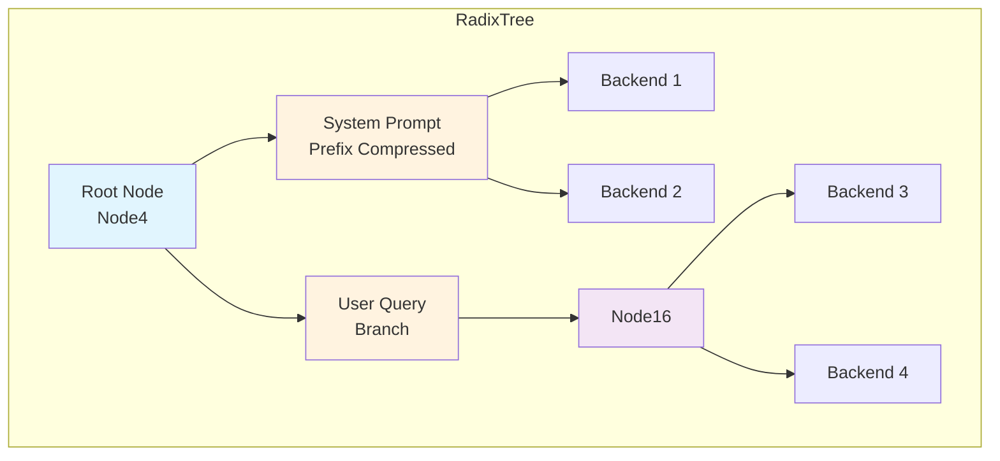
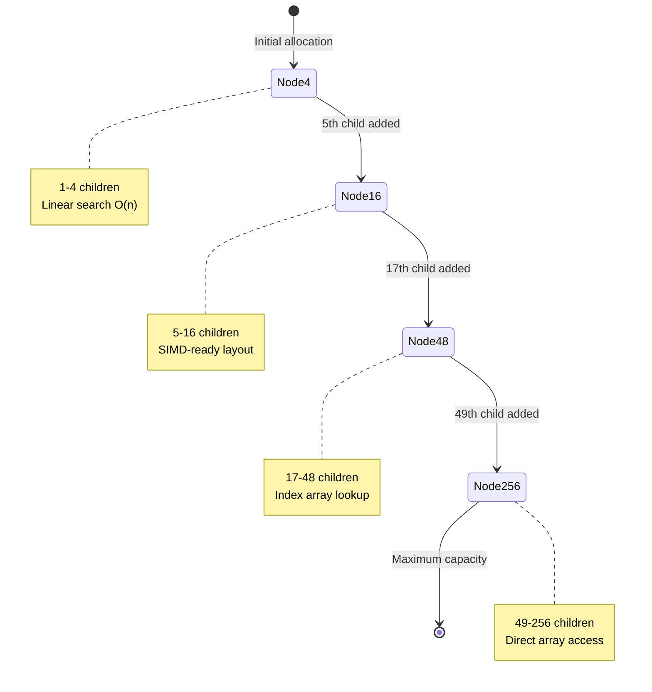
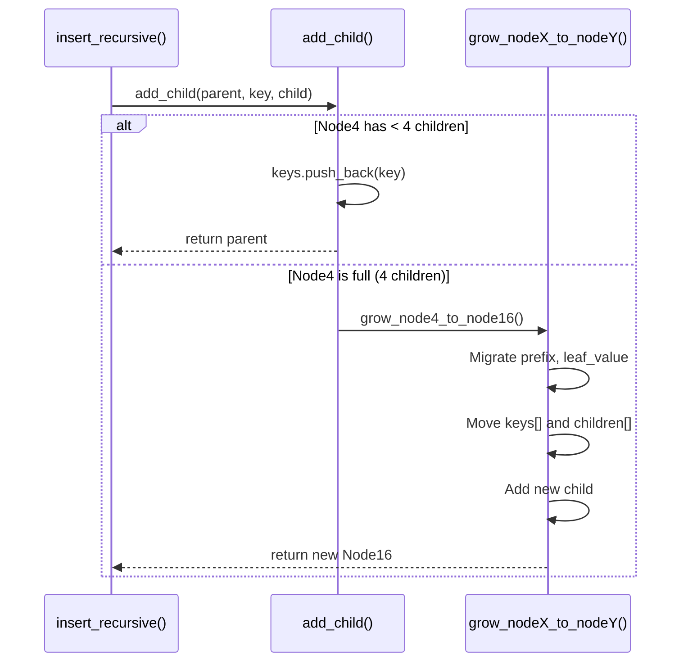
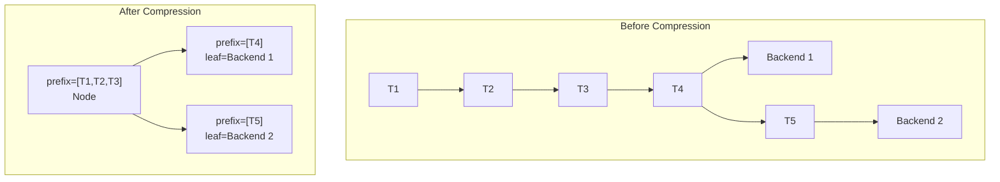
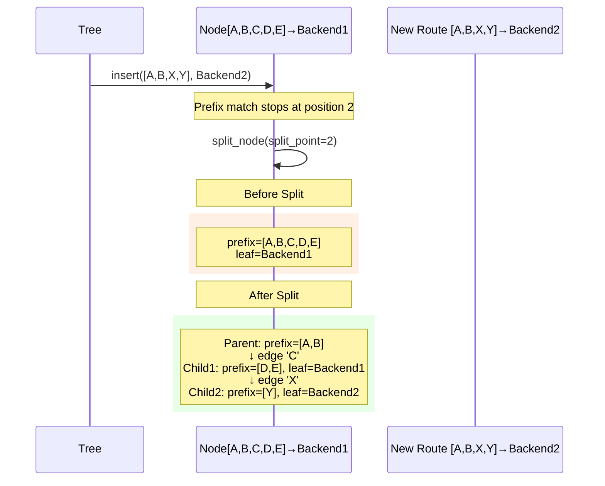
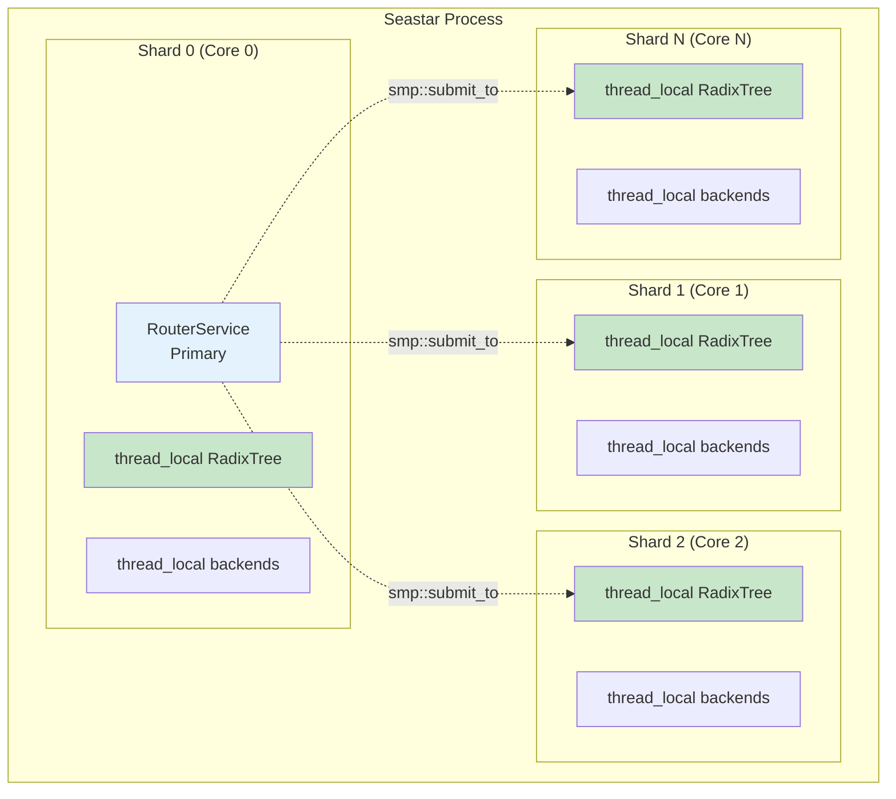
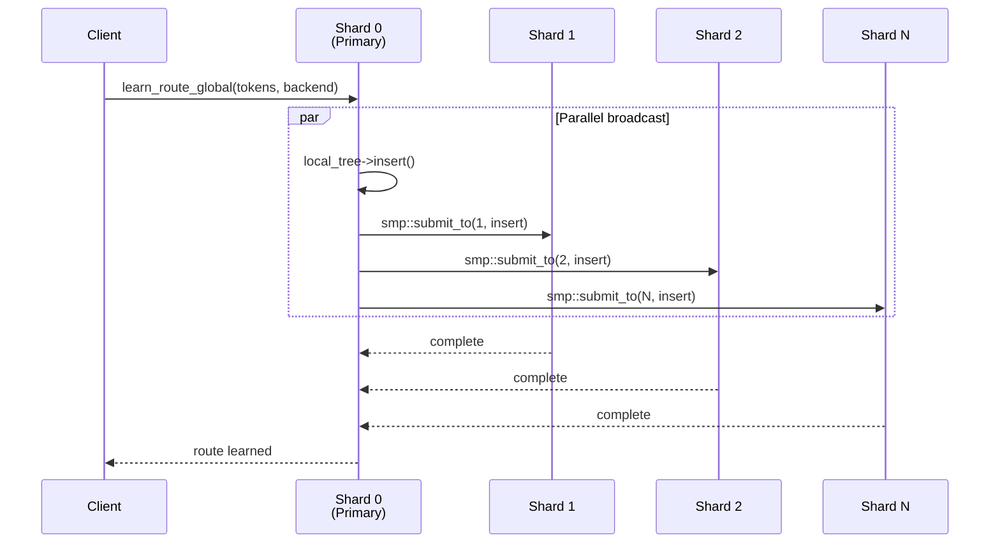
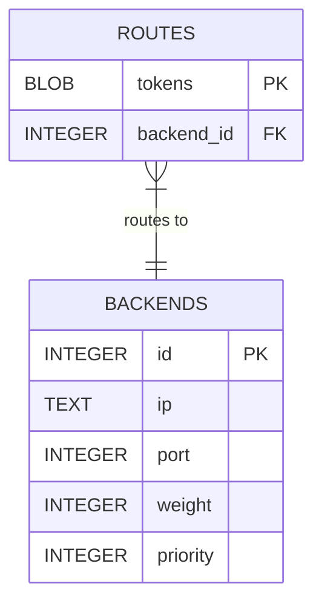
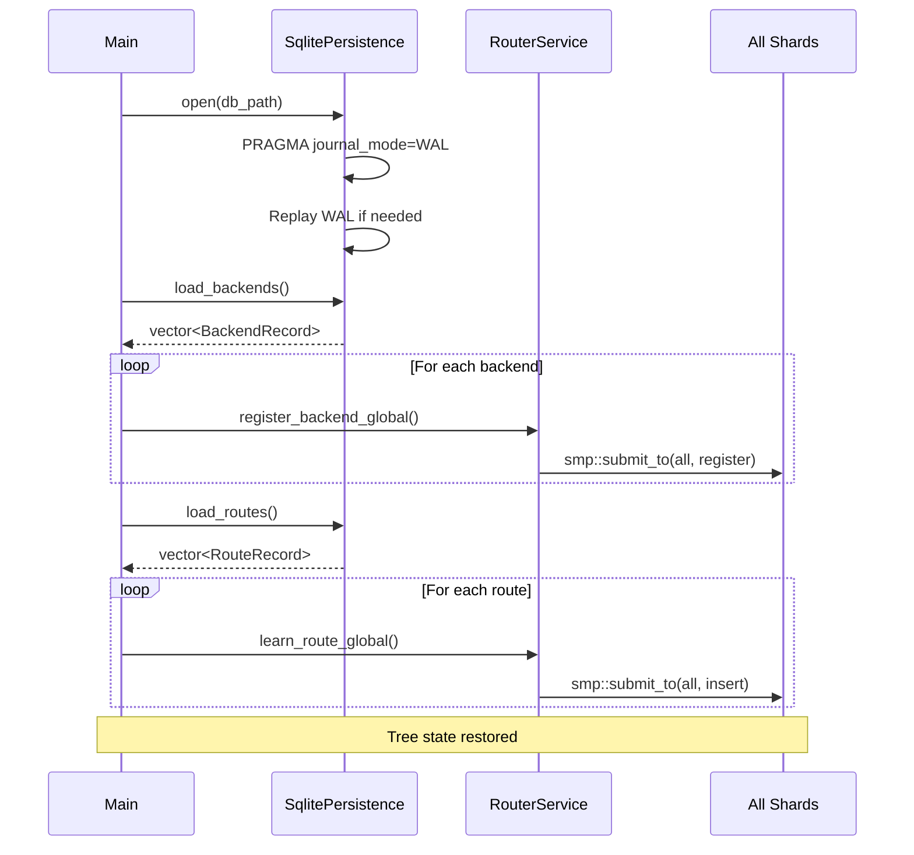

# Adaptive Radix Tree (ART) Implementation

> **Internal Technical Guide**
> Ranvier Core Routing Infrastructure

This document describes the Adaptive Radix Tree implementation used by Ranvier Core for prefix-based KV-cache routing across a shared-nothing Seastar cluster.

## Table of Contents

1. [Overview](#overview)
2. [Adaptive Node Design](#adaptive-node-design)
3. [Path Compression & Lazy Expansion](#path-compression--lazy-expansion)
4. [SIMD Key Search (Roadmap)](#simd-key-search-roadmap)
5. [Concurrency Model](#concurrency-model)
6. [Persistence Interface](#persistence-interface)
7. [Performance Characteristics](#performance-characteristics)

---

## Overview

The Adaptive Radix Tree (ART) is the core data structure powering Ranvier's prefix-based routing. It enables O(k) lookup time where k is the number of tokens in the prefix, while maintaining memory efficiency through adaptive node sizing.



### Design Goals

| Goal | Implementation |
|------|----------------|
| **O(k) Lookups** | Tree depth equals token count, not vocabulary size |
| **Memory Efficiency** | Adaptive nodes grow only when needed |
| **Cache Locality** | Path compression reduces pointer chasing |
| **Lock-Free Reads** | Thread-local trees per Seastar shard |
| **LRU Eviction** | Timestamp tracking for capacity management |

### Source Location

```
src/radix_tree.hpp    # Complete implementation (863 lines)
src/router_service.cpp # Integration with Seastar shards
```

---

## Adaptive Node Design

The ART uses four node types that automatically transition based on child count. This minimizes memory fragmentation while maintaining consistent O(k) lookup time.

### Node Type Hierarchy



### Node Structures

All nodes share a common header defined in the base `Node` struct:

```cpp
struct Node {
    NodeType type;                              // Discriminator for polymorphism
    std::vector<TokenId> prefix;                // Path compression (see next section)
    std::optional<BackendId> leaf_value;        // Route destination if terminal
    RouteOrigin origin;                         // LOCAL or REMOTE (for eviction priority)
    std::chrono::steady_clock::time_point last_accessed;  // LRU tracking
};
```

#### Node4: Compact Sparse Node

```cpp
struct Node4 : public Node {
    std::vector<TokenId> keys;                  // Up to 4 keys
    std::vector<std::shared_ptr<Node>> children; // Corresponding children
};
```

**Memory Layout:**

```
┌─────────────────────────────────────────────────────────┐
│ Node Header (type, prefix, leaf_value, origin, time)    │
├─────────────────────────────────────────────────────────┤
│ keys[0]    │ keys[1]    │ keys[2]    │ keys[3]          │
│ (TokenId)  │ (TokenId)  │ (TokenId)  │ (TokenId)        │
├─────────────────────────────────────────────────────────┤
│ children[0]│ children[1]│ children[2]│ children[3]      │
│ (ptr)      │ (ptr)      │ (ptr)      │ (ptr)            │
└─────────────────────────────────────────────────────────┘
```

**Lookup Complexity:** O(4) = O(1) linear scan through keys vector.

**Use Case:** Initial node type, optimal for low-branching prefixes like system prompts where vocabulary divergence is minimal.

#### Node16: SIMD-Ready Medium Node

```cpp
struct Node16 : public Node {
    std::vector<TokenId> keys;                  // Up to 16 keys
    std::vector<std::shared_ptr<Node>> children;
};
```

**Memory Layout:**

```
┌─────────────────────────────────────────────────────────┐
│ Node Header                                              │
├─────────────────────────────────────────────────────────┤
│ keys[0..15]  (16 × TokenId = 64 bytes)                  │
│ ████████████████████████████████████████████████████    │
│              ↑ SIMD-aligned for AVX2 comparison         │
├─────────────────────────────────────────────────────────┤
│ children[0..15] (16 × shared_ptr)                       │
└─────────────────────────────────────────────────────────┘
```

**Lookup Complexity:** O(16) linear scan, but memory layout enables future SIMD optimization (see [SIMD Key Search](#simd-key-search-roadmap)).

**Use Case:** Moderate branching, common for conversation turns where multiple user queries share a system prompt prefix.

#### Node48: Indexed Lookup Node

```cpp
struct Node48 : public Node {
    static constexpr uint8_t EMPTY_MARKER = 255;

    std::array<uint8_t, 256> index;             // Maps key byte → child position
    std::vector<std::shared_ptr<Node>> children; // Up to 48 children
    std::vector<TokenId> keys;                   // Original keys for iteration
};
```

**Memory Layout:**

```
┌─────────────────────────────────────────────────────────┐
│ Node Header                                              │
├─────────────────────────────────────────────────────────┤
│ index[0..255] (256 bytes)                               │
│ ┌───┬───┬───┬───┬───┬───┬───┬───┬─────┬───┬───┬───┐    │
│ │255│255│ 0 │255│ 1 │255│...│255│ ... │ 2 │255│...│    │
│ └───┴───┴───┴───┴───┴───┴───┴───┴─────┴───┴───┴───┘    │
│       ↑ EMPTY_MARKER        ↑ position in children      │
├─────────────────────────────────────────────────────────┤
│ children[0..47] (up to 48 pointers)                     │
├─────────────────────────────────────────────────────────┤
│ keys[0..47] (original TokenIds for traversal)           │
└─────────────────────────────────────────────────────────┘
```

**Lookup Algorithm:**

```cpp
std::shared_ptr<Node> find_child(TokenId key) {
    uint8_t idx = index[key_byte(key)];  // O(1) array access
    if (idx != EMPTY_MARKER) {
        return children[idx];             // O(1) pointer lookup
    }
    return nullptr;
}
```

**Lookup Complexity:** O(1) via index indirection.

**Use Case:** High-branching nodes where different token sequences diverge significantly.

#### Node256: Direct Access Node

```cpp
struct Node256 : public Node {
    std::array<std::shared_ptr<Node>, 256> children;  // Direct mapping
};
```

**Memory Layout:**

```
┌─────────────────────────────────────────────────────────┐
│ Node Header                                              │
├─────────────────────────────────────────────────────────┤
│ children[0..255] (256 × shared_ptr = 2KB on 64-bit)     │
│ ┌────┬────┬────┬────┬─────────────────────┬────┬────┐   │
│ │ p0 │ p1 │null│ p3 │ ...                 │p254│p255│   │
│ └────┴────┴────┴────┴─────────────────────┴────┴────┘   │
│   ↑ Direct index by key_byte(token)                     │
└─────────────────────────────────────────────────────────┘
```

**Lookup Algorithm:**

```cpp
std::shared_ptr<Node> find_child(TokenId key) {
    return children[key_byte(key)];  // Single array access
}
```

**Lookup Complexity:** O(1) direct array indexing.

**Use Case:** Maximum branching scenarios, rare in practice due to path compression.

### Node Growth Transitions

Growth occurs during insertion when a node reaches capacity:



**Growth Implementation (Node4 → Node16):**

```cpp
std::shared_ptr<Node> grow_node4_to_node16(
    std::shared_ptr<Node> parent, TokenId key, std::shared_ptr<Node> child)
{
    auto* n4 = static_cast<Node4*>(parent.get());
    auto n16 = std::make_shared<Node16>();

    // Migrate metadata (preserves path compression)
    n16->prefix = std::move(n4->prefix);
    n16->leaf_value = n4->leaf_value;

    // Migrate existing children (zero-copy move)
    n16->keys = std::move(n4->keys);
    n16->children = std::move(n4->children);

    // Add the new child that triggered growth
    n16->keys.push_back(key);
    n16->children.push_back(child);

    return n16;
}
```

### Memory Efficiency Analysis

| Node Type | Keys Storage | Children Storage | Overhead | Density |
|-----------|--------------|------------------|----------|---------|
| Node4 | 16 bytes | 32 bytes | Low | 1-4 children |
| Node16 | 64 bytes | 128 bytes | Medium | 5-16 children |
| Node48 | 256 bytes + 192 bytes | 384 bytes | Medium | 17-48 children |
| Node256 | Implicit | 2048 bytes | High | 49-256 children |

The adaptive design ensures that:
- **Sparse trees** (common in LLM routing) use primarily Node4/Node16
- **Dense branching** automatically upgrades to indexed/direct access
- **Memory fragmentation** is minimized by right-sizing node allocations

---

## Path Compression & Lazy Expansion

Path compression is critical for LLM routing where long common prefixes (system prompts, conversation history) would otherwise create deep, cache-inefficient trees.

### The Problem: Deep Trees

Without compression, a 1000-token system prompt creates 1000 nodes:

```
Token_0 → Token_1 → Token_2 → ... → Token_999 → [Backend]
   ↓         ↓         ↓              ↓
 Node      Node      Node           Node
```

This causes:
- **1000 pointer dereferences** per lookup
- **Poor cache locality** (nodes scattered in memory)
- **Memory waste** (each node has header overhead)

### The Solution: Prefix Vectors

Each node stores a `prefix` vector containing tokens that don't branch:

```cpp
struct Node {
    std::vector<TokenId> prefix;  // Compressed path segment
    // ...
};
```

**Compressed Structure:**

```
┌─────────────────────────────────────────────┐
│ Node with prefix = [Token_0..Token_999]     │
│                    ↓                        │
│              [Backend]                      │
└─────────────────────────────────────────────┘
```

Now: **1 node lookup** instead of 1000.

### Compression in Practice



### Lazy Expansion (Split on Divergence)

Prefix compression uses **lazy expansion**: prefixes are only split when a new route diverges. The `split_node()` function handles this:

```cpp
void split_node(std::shared_ptr<Node> node, size_t split_point) {
    // Original: prefix = [A, B, C, D, E]
    // Split at position 2: [A, B] | C | [D, E]

    auto new_child = std::make_shared<Node4>();
    TokenId split_edge_key = node->prefix[split_point];  // 'C'

    // Move suffix [D, E] to new child
    new_child->prefix.assign(
        node->prefix.begin() + split_point + 1,
        node->prefix.end()
    );

    // Transfer leaf value and children to new_child
    new_child->leaf_value = node->leaf_value;
    node->leaf_value = std::nullopt;
    // ... move children ...

    // Truncate parent prefix to [A, B]
    node->prefix.resize(split_point);

    // Add new_child under edge 'C'
    add_child(node, split_edge_key, new_child);
}
```

**Split Visualization:**



### Lookup with Path Compression

The `lookup_recursive()` function handles compressed prefixes:

```cpp
std::optional<BackendId> lookup_recursive(
    std::shared_ptr<Node> node,
    std::span<const TokenId> tokens)
{
    // Step 1: Match prefix tokens
    size_t match_len = 0;
    while (match_len < node->prefix.size() && match_len < tokens.size()) {
        if (node->prefix[match_len] != tokens[match_len]) {
            return std::nullopt;  // Prefix mismatch = no route
        }
        match_len++;
    }

    // Step 2: Check for partial prefix match (input shorter than prefix)
    if (match_len < node->prefix.size()) {
        return std::nullopt;
    }

    // Step 3: Continue to children with remaining tokens
    auto remaining = tokens.subspan(match_len);
    if (!remaining.empty()) {
        auto child = find_child(node, remaining[0]);
        if (child) {
            auto result = lookup_recursive(child, remaining.subspan(1));
            if (result.has_value()) {
                child->last_accessed = now();  // LRU update
                return result;
            }
        }
    }

    // Step 4: Return this node's value (longest prefix match)
    return node->leaf_value;
}
```

### Cache Efficiency Gains

| Metric | Without Compression | With Compression |
|--------|---------------------|------------------|
| Nodes for 1000-token prefix | 1000 | 1 |
| Pointer dereferences | 1000 | 1 |
| Cache lines touched | ~250 (4 nodes/line) | 1-2 |
| Memory overhead | ~48KB | ~4KB |

---

## SIMD Key Search (Roadmap)

> **Status:** Planned optimization for Node16 lookups

### Current Implementation

Node16 uses linear search through the keys vector:

```cpp
// Current O(16) linear search
for (size_t i = 0; i < n->keys.size(); i++) {
    if (n->keys[i] == key) return n->children[i];
}
```

### Planned AVX2/SSE4.2 Optimization

The Node16 layout is designed to be SIMD-friendly. With 16 × 4-byte TokenIds, the keys fit in two AVX2 registers (256 bits each) or four SSE4.2 registers (128 bits each).

**Proposed Implementation:**

```cpp
#include <immintrin.h>

std::shared_ptr<Node> find_child_simd(Node16* node, TokenId key) {
    // Broadcast search key to all lanes
    __m256i search_key = _mm256_set1_epi32(key);

    // Load first 8 keys (256 bits = 8 × 32-bit integers)
    __m256i keys_lo = _mm256_loadu_si256(
        reinterpret_cast<const __m256i*>(node->keys.data())
    );

    // Load second 8 keys
    __m256i keys_hi = _mm256_loadu_si256(
        reinterpret_cast<const __m256i*>(node->keys.data() + 8)
    );

    // Compare all 16 keys in parallel (2 instructions)
    __m256i cmp_lo = _mm256_cmpeq_epi32(keys_lo, search_key);
    __m256i cmp_hi = _mm256_cmpeq_epi32(keys_hi, search_key);

    // Extract match masks
    int mask_lo = _mm256_movemask_ps(_mm256_castsi256_ps(cmp_lo));
    int mask_hi = _mm256_movemask_ps(_mm256_castsi256_ps(cmp_hi));

    // Find first match position
    if (mask_lo) {
        return node->children[__builtin_ctz(mask_lo)];
    }
    if (mask_hi) {
        return node->children[8 + __builtin_ctz(mask_hi)];
    }

    return nullptr;
}
```

### Expected Performance Gains

```mermaid
gantt
    title Node16 Key Search Latency
    dateFormat X
    axisFormat %s cycles

    section Linear Search
    Best case (first key)    :0, 3
    Average case (8th key)   :0, 12
    Worst case (16th key)    :0, 24

    section SIMD Search
    All cases (parallel)     :0, 4
```



| Scenario | Linear Search | SIMD Search | Speedup |
|----------|---------------|-------------|---------|
| Best case | ~3 cycles | ~4 cycles | 0.75x |
| Average case | ~12 cycles | ~4 cycles | 3x |
| Worst case | ~24 cycles | ~4 cycles | 6x |

### Implementation Considerations

1. **Alignment Requirements**
   - Keys vector must be 32-byte aligned for optimal AVX2 performance
   - Consider using `alignas(32)` or custom allocator

2. **Fallback Path**
   - Runtime detection via `__builtin_cpu_supports("avx2")`
   - Graceful degradation to SSE4.2 or scalar path

3. **Memory Layout Changes**
   ```cpp
   struct Node16 : public Node {
       alignas(32) std::array<TokenId, 16> keys;  // Fixed-size, aligned
       std::array<std::shared_ptr<Node>, 16> children;
       uint8_t count;  // Actual number of keys
   };
   ```

4. **Build System Integration**
   ```cmake
   if(CMAKE_CXX_COMPILER_ID MATCHES "GNU|Clang")
       target_compile_options(ranvier PRIVATE
           -mavx2 -msse4.2
       )
   endif()
   ```

---

## Concurrency Model

Ranvier uses Seastar's **shared-nothing architecture** where each CPU shard maintains its own thread-local RadixTree. This eliminates locks on the hot path while ensuring consistent state through controlled broadcasting.

### Thread-Local Tree Architecture



### Thread-Local State Declaration

```cpp
// router_service.cpp - Per-shard state (no mutexes needed)

thread_local std::unique_ptr<RadixTree> local_tree;

// Abseil containers for SIMD-accelerated lookups
thread_local absl::flat_hash_map<BackendId, BackendInfo> local_backends;
thread_local std::vector<BackendId> local_backend_ids;
thread_local absl::flat_hash_set<BackendId> local_dead_backends;

// Per-shard metrics (aggregated by Seastar runtime)
thread_local uint64_t stats_cache_hits = 0;
thread_local uint64_t stats_cache_misses = 0;
thread_local uint64_t stats_routes_evicted = 0;
```

### Data Plane: Lock-Free Lookups

Lookup operations execute entirely within a single shard with zero synchronization:

```cpp
std::optional<BackendId> RouterService::lookup(
    const std::vector<int32_t>& tokens,
    const std::string& request_id)
{
    if (!local_tree) return std::nullopt;

    // Pure thread-local access - no locks
    auto result = local_tree->lookup(tokens);

    // Circuit breaker check (also thread-local)
    if (result.has_value() && local_dead_backends.contains(result.value())) {
        stats_cache_misses++;
        return std::nullopt;
    }

    if (result.has_value()) {
        stats_cache_hits++;
    } else {
        stats_cache_misses++;
    }

    return result;
}
```

**Performance Characteristics:**
- Zero mutex contention
- Single cache line for hot path
- Predictable latency (no lock waits)

### Control Plane: Shard Broadcasting

State mutations are broadcast to all shards using Seastar's async message passing:



**Implementation:**

```cpp
seastar::future<> RouterService::learn_route_global(
    std::vector<int32_t> tokens,
    BackendId backend,
    const std::string& request_id)
{
    // Capture tokens for cross-shard sharing
    return seastar::do_with(std::move(tokens),
        [backend](std::vector<int32_t>& shared_tokens) {

            // Parallel broadcast to all shards
            return seastar::parallel_for_each(
                boost::irange(0u, seastar::smp::count),
                [backend, &shared_tokens](unsigned shard_id) {

                    return seastar::smp::submit_to(shard_id,
                        [backend, tokens = shared_tokens] {

                            if (!local_tree) return seastar::make_ready_future<>();

                            // LRU eviction if at capacity
                            while (local_tree->route_count() >= local_max_routes) {
                                if (!local_tree->evict_oldest()) break;
                                stats_routes_evicted++;
                            }

                            // Thread-local insert (no locks)
                            local_tree->insert(tokens, backend, RouteOrigin::LOCAL);
                            return seastar::make_ready_future<>();
                        });
                });
        });
}
```

### Shard Initialization

Each shard initializes its own tree with configuration copied from shard 0:

```cpp
seastar::future<> RouterService::initialize_shards() {
    uint32_t block_alignment = _config.block_alignment;
    size_t max_routes = _config.max_routes;
    auto ttl_seconds = _config.ttl_seconds;

    return seastar::parallel_for_each(
        boost::irange(1u, seastar::smp::count),  // Skip shard 0 (already initialized)
        [block_alignment, max_routes, ttl_seconds](unsigned shard_id) {
            return seastar::smp::submit_to(shard_id,
                [block_alignment, max_routes, ttl_seconds] {
                    local_tree = std::make_unique<RadixTree>(block_alignment);
                    local_max_routes = max_routes;
                    local_ttl_seconds = ttl_seconds;
                    return seastar::make_ready_future<>();
                });
        });
}
```

### Cluster Gossip Integration

When cluster mode is enabled, routes are also broadcast to peer nodes via UDP gossip:

```cpp
seastar::future<> RouterService::learn_route_global(...) {
    // Gossip to cluster peers (runs on shard 0)
    seastar::future<> gossip_future = seastar::make_ready_future<>();
    if (_gossip && _gossip->is_enabled()) {
        gossip_future = _gossip->broadcast_route(tokens, backend);
    }

    // Local shard broadcast
    auto shard_future = /* ... parallel_for_each ... */;

    // Wait for both
    return seastar::when_all_succeed(
        std::move(gossip_future),
        std::move(shard_future)
    ).discard_result();
}
```

**Route Origin Tracking:**

```cpp
enum class RouteOrigin : uint8_t {
    LOCAL = 0,   // Learned from direct request on this node
    REMOTE = 1   // Learned from cluster gossip
};
```

REMOTE routes can be evicted more aggressively than LOCAL routes via `evict_oldest_remote()`.

---

## Persistence Interface

Routes and backend registrations are persisted to SQLite with WAL mode enabled for durability and concurrent read performance.

### Database Schema



**Table Definitions:**

```sql
-- Backend servers (GPU nodes)
CREATE TABLE IF NOT EXISTS backends (
    id INTEGER PRIMARY KEY,
    ip TEXT NOT NULL,
    port INTEGER NOT NULL,
    weight INTEGER NOT NULL DEFAULT 100,
    priority INTEGER NOT NULL DEFAULT 0
);

-- Token prefix routes
CREATE TABLE IF NOT EXISTS routes (
    tokens BLOB PRIMARY KEY,      -- Serialized token vector
    backend_id INTEGER NOT NULL
);

-- Index for cascade deletion
CREATE INDEX IF NOT EXISTS idx_routes_backend
    ON routes(backend_id);
```

### WAL Mode Configuration

SQLite is configured for optimal concurrent performance:

```cpp
bool SqlitePersistence::open(const std::string& path) {
    int rc = sqlite3_open(path.c_str(), &_db);
    if (rc != SQLITE_OK) return false;

    // Write-Ahead Logging for concurrent reads during writes
    exec_sql("PRAGMA journal_mode=WAL");

    // NORMAL sync: balance between safety and speed
    // (WAL is fsync'd, but not every transaction)
    exec_sql("PRAGMA synchronous=NORMAL");

    return create_tables();
}
```

**WAL Benefits:**
- Readers don't block writers
- Writers don't block readers
- Crash recovery via WAL replay
- Checkpoint control for space management

### Token Serialization

Token vectors are serialized as raw binary BLOBs for efficient storage and comparison:

```cpp
std::vector<uint8_t> SqlitePersistence::serialize_tokens(
    std::span<const TokenId> tokens)
{
    std::vector<uint8_t> blob(tokens.size() * sizeof(TokenId));
    std::memcpy(blob.data(), tokens.data(), blob.size());
    return blob;
}

std::vector<TokenId> SqlitePersistence::deserialize_tokens(
    const void* data, size_t size)
{
    size_t count = size / sizeof(TokenId);
    std::vector<TokenId> tokens(count);
    std::memcpy(tokens.data(), data, size);
    return tokens;
}
```

### Thread Safety

SQLite operations are protected by a mutex (separate from the lock-free RadixTree):

```cpp
class SqlitePersistence {
    mutable std::mutex _mutex;  // Guards all SQLite operations
    sqlite3* _db = nullptr;

    bool save_route(std::span<const TokenId> tokens, BackendId backend_id) {
        std::lock_guard<std::mutex> lock(_mutex);
        // ... SQLite operations ...
    }
};
```

This is acceptable because:
1. Persistence is **not on the hot path** (routes are learned async)
2. Lookups use thread-local RadixTree (no SQLite access)
3. Writes are batched where possible

### Batch Operations

For efficient bulk loading at startup:

```cpp
bool SqlitePersistence::save_routes_batch(const std::vector<RouteRecord>& routes) {
    std::lock_guard<std::mutex> lock(_mutex);

    // Transaction for atomicity and performance
    if (!exec_sql("BEGIN TRANSACTION")) return false;

    const char* sql = "INSERT OR REPLACE INTO routes (tokens, backend_id) VALUES (?, ?)";
    sqlite3_stmt* stmt = nullptr;
    sqlite3_prepare_v2(_db, sql, -1, &stmt, nullptr);

    for (const auto& route : routes) {
        sqlite3_reset(stmt);
        sqlite3_clear_bindings(stmt);

        auto blob = serialize_tokens(route.tokens);
        sqlite3_bind_blob(stmt, 1, blob.data(), blob.size(), SQLITE_TRANSIENT);
        sqlite3_bind_int(stmt, 2, route.backend_id);

        if (sqlite3_step(stmt) != SQLITE_DONE) {
            sqlite3_finalize(stmt);
            exec_sql("ROLLBACK");
            return false;
        }
    }

    sqlite3_finalize(stmt);
    return exec_sql("COMMIT");
}
```

### Startup Recovery Flow



---

## Performance Characteristics

### Complexity Analysis

| Operation | Time Complexity | Space Complexity |
|-----------|-----------------|------------------|
| `lookup()` | O(k) | O(1) |
| `insert()` | O(k) | O(k) amortized |
| `evict_oldest()` | O(n) | O(1) |
| `remove_expired()` | O(n) | O(1) |

Where:
- k = number of tokens in prefix
- n = total number of routes in tree

### Measured Performance

From production benchmarks (see `docs/performance.md`):

| Metric | Value |
|--------|-------|
| Cache Hit Latency (P50) | 18ms |
| Cache Hit Latency (P99) | 25ms |
| Cache Miss Latency | ~500ms (requires GPU prefill) |
| Speedup Factor | 28x with cache hits |
| Max Routes per Shard | 100,000 (configurable) |
| Memory per 100K Routes | ~50MB (varies with prefix length) |

### Configuration Tuning

```yaml
routing:
  block_alignment: 16        # vLLM PagedAttention block size
  max_routes: 100000         # Per-shard capacity (triggers LRU eviction)
  ttl_seconds: 3600          # Route expiration (1 hour default)
```

---

## References

- [The Adaptive Radix Tree (Leis et al., 2013)](https://db.in.tum.de/~leis/papers/ART.pdf)
- [Seastar Framework](https://seastar.io/shared-nothing/)
- [Abseil Swiss Tables](https://abseil.io/docs/cpp/guides/container)
- [Intel Intrinsics Guide](https://www.intel.com/content/www/us/en/docs/intrinsics-guide/)
