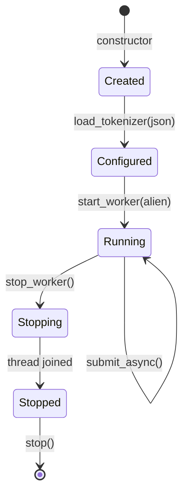

# Tokenization Internals

The TokenizerService provides BPE tokenization for prefix-affinity routing, with multiple optimization layers to minimize reactor stalls during FFI calls to the Rust tokenizers library.

## Overview

The tokenizers-cpp library (Rust FFI) blocks the Seastar reactor for ~5-13ms per `Encode()` call. This is problematic for a high-throughput router where reactor stalls directly impact tail latency. The TokenizerService addresses this through three optimization layers:

1. **LRU Cache**: Eliminates redundant tokenization (80-90% hit rate for system messages)
2. **Cross-Shard Dispatch**: Offloads cache misses to other shards, freeing the calling reactor
3. **Dedicated Thread Pool**: Runs tokenization in OS threads outside Seastar's event loop entirely

## Architecture

```mermaid
flowchart TB
    subgraph "Per-Shard (Reactor Thread)"
        REQ[Request Handler]
        TS[TokenizerService]
        CACHE[LRU Cache<br/>O(1) lookup]
        TTP[TokenizerThreadPool]
    end

    subgraph "Cross-Shard (Other Reactor)"
        TS2[TokenizerService<br/>Target Shard]
        CACHE2[LRU Cache]
    end

    subgraph "Worker Thread (OS Thread)"
        WORKER[TokenizerWorker]
        TOK2[Dedicated Tokenizer<br/>Instance]
        QUEUE[SPSC Queue<br/>Lock-free]
    end

    REQ -->|encode_threaded_async| TS
    TS -->|1. lookup| CACHE
    CACHE -->|hit| TS
    TS -->|2. submit_async| TTP
    TTP --> QUEUE
    QUEUE --> WORKER
    WORKER --> TOK2
    WORKER -->|alien::run_on| TS

    TS -->|3. smp::submit_to| TS2
    TS2 --> CACHE2

    TS -->|4. local fallback| TOK[Local Tokenizer]

    classDef cache fill:#afa,stroke:#333
    classDef thread fill:#aff,stroke:#333
    classDef shard fill:#ffa,stroke:#333
    class CACHE,CACHE2 cache
    class WORKER,TOK2,QUEUE thread
    class TS2 shard
```

### Priority Order

`encode_threaded_async()` tries methods in order of reactor impact:

| Priority | Method | Reactor Blocked | Latency Overhead |
|----------|--------|-----------------|------------------|
| 1 | Cache hit | No | ~0 |
| 2 | Thread pool | No | ~10-50μs (queue + signal) |
| 3 | Cross-shard dispatch | Target shard only | ~1-10μs + copy |
| 4 | Local tokenization | Yes (5-13ms) | None |

## Layer 1: LRU Cache

The cache provides O(1) lookup for repeated texts, which is common for system messages and role tags.

### Configuration

```cpp
struct TokenizationCacheConfig {
    bool enabled = true;            // Enable/disable caching
    size_t max_entries = 1000;      // Maximum cache entries (Rule #4)
    size_t max_text_length = 65536; // Don't cache texts longer than this
};
```

The 64 KB `max_text_length` is intentionally aligned with the thread-pool
`max_text_length`. An older default of 8 KB caused boundary detection to skip
caching for large system prefixes (2K–8K tokens), forcing a blocking FFI call
on every request. Worst-case memory: 1000 entries × 64 KB ≈ 64 MB/shard.

### Expected Hit Rates

| Content Type | Hit Rate | Reason |
|--------------|----------|--------|
| System messages | 80-90% | Highly repetitive across requests |
| Role tags | 95%+ | e.g., `<|system|>\n` tokenized repeatedly |
| User queries | 10-30% | Depends on traffic patterns |

### Implementation

- **Data structure**: `absl::flat_hash_map` + `std::list` (LRU ordering)
- **Eviction**: Least-recently-used when at capacity
- **Thread safety**: Shard-local, no locks needed

## Layer 2: Cross-Shard Dispatch

On cache miss, dispatch tokenization to another shard's reactor. The calling shard's reactor is freed while waiting for the future.

### Configuration

```cpp
struct CrossShardTokenizationConfig {
    bool enabled = true;           // Enabled by default
    size_t min_text_length = 64;   // Skip for short texts (overhead > benefit)
    size_t max_text_length = 32768; // Skip for very long texts (copy overhead)
};
```

### Trade-offs

| Aspect | Impact |
|--------|--------|
| Calling reactor | **Freed** during tokenization |
| Target reactor | **Blocked** during FFI call |
| Latency | +1-10μs cross-shard overhead |
| Memory | String copied for transfer (Rule #14) |

### Shard Selection

Currently uses simple round-robin to the next shard:

```cpp
uint32_t select_tokenization_shard() const {
    uint32_t local = seastar::this_shard_id();
    uint32_t shard_count = seastar::smp::count;
    if (shard_count <= 1) {
        return local;
    }
    return (local + 1) % shard_count;
}
```

Earlier versions of this file referenced "P2C" shard selection — that label
survives in a few in-source comments but the implementation has always been
plain round-robin. P2C-based selection via `ShardLoadBalancer` is wired up
through `set_cross_shard_refs()` for future use, but `select_tokenization_shard()`
ignores load and just rotates to the next shard.

## Layer 3: Thread Pool

For true non-blocking tokenization, dedicated OS threads run FFI calls outside Seastar's event loop entirely.

### Architecture

```
Reactor Thread (shard N)           Worker Thread N
─────────────────────────          ─────────────────
1. Create promise<Result>
2. Enqueue (job_id, text) ──────► 3. Dequeue job
3. Return future to caller        4. Tokenize (BLOCKING FFI)
   ↓                              5. alien::run_on(shard_N, complete)
[suspended]                          │
   ↓                                 │
6. complete(job_id, tokens) ◄────────┘
7. promise.set_value(tokens)
8. Future resolves
```

### Configuration

```cpp
struct ThreadPoolTokenizationConfig {
    bool enabled = false;           // Struct default; application overrides to true
    size_t max_queue_size = 256;    // Bounded queue (Rule #4)
    size_t min_text_length = 64;    // Skip for short texts
    size_t max_text_length = 65536; // Skip for very long texts
};
```

> The `ThreadPoolTokenizationConfig` struct itself defaults `enabled` to
> `false`, but the application's `AssetsConfig` (`tokenizer_thread_pool_enabled`)
> defaults to **`true`**, so the thread pool is on by default in normal
> deployments. Disable explicitly via env var or YAML if you need the old
> behavior.

### Environment Variables

| Variable | Default | Description |
|----------|---------|-------------|
| `RANVIER_TOKENIZER_THREAD_POOL_ENABLED` | `true` | Enable thread pool (`1`/`true`/`yes`) |
| `RANVIER_TOKENIZER_THREAD_POOL_QUEUE_SIZE` | `256` | SPSC queue capacity |
| `RANVIER_TOKENIZER_THREAD_POOL_MIN_TEXT` | `64` | Minimum text length |
| `RANVIER_TOKENIZER_THREAD_POOL_MAX_TEXT` | `65536` | Maximum text length |
| `RANVIER_TOKENIZATION_CACHE_ENABLED` | `true` | Enable LRU tokenization cache |
| `RANVIER_TOKENIZATION_CACHE_SIZE` | `1000` | Maximum cache entries |
| `RANVIER_TOKENIZATION_CACHE_MAX_TEXT` | `65536` | Skip cache for texts longer than this |
| `RANVIER_TOKENIZER_LOCAL_FALLBACK_MAX_CONCURRENT` | `1` | Concurrent reactor-blocking tokenizations per shard |

### YAML Configuration

```yaml
assets:
  tokenization_cache_enabled: true
  tokenization_cache_size: 1000
  tokenization_cache_max_text: 65536

  tokenizer_thread_pool_enabled: true
  tokenizer_thread_pool_queue_size: 256
  tokenizer_thread_pool_min_text: 64
  tokenizer_thread_pool_max_text: 65536

  tokenizer_local_fallback_max_concurrent: 1
```

### Key Components

| Component | Responsibility |
|-----------|----------------|
| `TokenizerWorker` | Owns worker thread + dedicated tokenizer instance |
| `TokenizerThreadPool` | Per-shard service managing lifecycle and promises |
| `TokenizationJob` | Job struct with owned text copy (Rule #14) |
| Thread-local callback | Completion signaling from worker to reactor |

### Thread Safety

| Component | Protection | Access Pattern |
|-----------|------------|----------------|
| Job queue | `boost::lockfree::spsc_queue` | Single producer, single consumer |
| Shutdown flag | `std::atomic<bool>` | Cross-thread visibility (Rule #11) |
| Statistics | `std::atomic<uint64_t>` | Lock-free increments |
| Pending jobs map | None (shard-local) | Reactor thread only |

### Backpressure

When the SPSC queue is full, `submit_async()` returns `std::nullopt` and the caller falls back to cross-shard dispatch or local tokenization:

```cpp
if (!_worker->submit(std::move(job))) {
    ++_jobs_fallback;
    return std::nullopt;  // Caller should try other methods
}
```

### Lifecycle



**Shutdown sequence** (in `application.cpp`):

1. `invoke_on_all([](pool) { pool.stop_worker(); })` — joins all worker threads
2. `_tokenizer_thread_pool.stop()` — resolves pending promises, clears metrics

## Monitoring

### Prometheus Metrics

Metric registration is split across two services:

- `MetricsService` (`ranvier_*`) — request-level counters recorded by the HTTP
  controller on every tokenization, including cache hit/miss accounting.
- `TokenizerService` (`ranvier_tokenizer_*`) — service-internal counters tied
  directly to the local-fallback path.
- `TokenizerThreadPool` (`ranvier_tokenizer_thread_pool_*`) — thread-pool
  lifecycle and submission counters.

#### Cache & Routing Counters (MetricsService)

| Metric | Type | Description |
|--------|------|-------------|
| `ranvier_tokenization_cache_hits` | Counter | Cache hits recorded by the proxy hot path |
| `ranvier_tokenization_cache_misses` | Counter | Cache misses recorded by the proxy hot path |
| `ranvier_tokenization_cross_shard` | Counter | Cache misses dispatched to another shard |
| `ranvier_tokenizer_errors` | Counter | Encode exceptions thrown during tokenization |
| `ranvier_tokenization_skipped` | Counter | Requests routed without tokenization (random mode) |

> The shard-local cache size and per-shard hit/miss counters in
> `TokenizationCache` are accessible programmatically (`cache_hits()`,
> `cache_misses()`, `cache_size()`) but are **not** registered as Prometheus
> metrics today. Operators should rely on the `ranvier_tokenization_cache_*`
> counters above for cache-effectiveness dashboards.

#### Local Fallback Metrics (TokenizerService)

| Metric | Type | Description |
|--------|------|-------------|
| `ranvier_tokenizer_local_fallbacks` | Counter | Tokenizations completed on the reactor (blocking path) |
| `ranvier_tokenizer_local_fallback_rejected` | Counter | Local fallback denied because the per-shard semaphore was already in use |

#### Thread Pool Metrics (TokenizerThreadPool)

| Metric | Type | Description |
|--------|------|-------------|
| `ranvier_tokenizer_thread_pool_jobs_submitted` | Counter | Jobs submitted to worker |
| `ranvier_tokenizer_thread_pool_jobs_completed` | Counter | Jobs completed by worker |
| `ranvier_tokenizer_thread_pool_jobs_fallback` | Counter | Fallback due to queue full |
| `ranvier_tokenizer_thread_pool_pending_jobs` | Gauge | Currently pending jobs |
| `ranvier_tokenizer_thread_pool_worker_running` | Gauge | Worker thread status (1=yes) |
| `ranvier_tokenizer_thread_pool_enabled` | Gauge | Configuration status |

#### Latency Histograms (MetricsService)

| Metric | Buckets | Description |
|--------|---------|-------------|
| `ranvier_router_tokenization_latency_seconds` | 100μs–100ms | Total tokenization latency (end-to-end) |
| `ranvier_router_primary_tokenization_latency_seconds` | 100μs–100ms | Primary prompt tokenization (excludes boundary detection) |
| `ranvier_router_boundary_detection_latency_seconds` | 100μs–100ms | Prefix boundary detection (message tokenization for boundaries) |
| `ranvier_router_routing_latency_seconds` | 100μs–100ms | Routing decision latency (ART lookup + backend selection) |
| `ranvier_router_art_lookup_latency_seconds` | 100μs–100ms | ART radix tree lookup only |

The primary + boundary split allows operators to identify whether tokenization time is spent on the main prompt encode or on the boundary-detection pass that tokenizes individual messages to find prefix split points.

### Grafana Query Examples

```promql
# Cache hit ratio
sum(rate(ranvier_tokenization_cache_hits[5m])) /
(sum(rate(ranvier_tokenization_cache_hits[5m])) + sum(rate(ranvier_tokenization_cache_misses[5m])))

# Thread pool utilization (fraction of cache misses that hit the worker pool)
sum(rate(ranvier_tokenizer_thread_pool_jobs_submitted[5m])) /
sum(rate(ranvier_tokenization_cache_misses[5m]))

# Queue full fallback rate
sum(rate(ranvier_tokenizer_thread_pool_jobs_fallback[5m])) /
sum(rate(ranvier_tokenizer_thread_pool_jobs_submitted[5m]))

# Local-fallback rejection rate (semaphore already held)
sum(rate(ranvier_tokenizer_local_fallback_rejected[5m])) /
sum(rate(ranvier_tokenizer_local_fallbacks[5m]))

# Boundary detection fraction of total tokenization time
sum(rate(ranvier_router_boundary_detection_latency_seconds_sum[5m])) /
sum(rate(ranvier_router_tokenization_latency_seconds_sum[5m]))

# Average primary tokenization latency (p50 approximation)
sum(rate(ranvier_router_primary_tokenization_latency_seconds_sum[5m])) /
sum(rate(ranvier_router_primary_tokenization_latency_seconds_count[5m]))
```

## Performance Characteristics

| Method | Reactor Blocked | Per-Request Latency | Throughput Impact |
|--------|-----------------|---------------------|-------------------|
| Cache hit | No | ~0 | None |
| Thread pool | No | +10-50μs | None |
| Cross-shard | Target only | +1-10μs | Target shard reduced |
| Local | Yes (5-13ms) | +5-13ms | All traffic affected |

### Thread Pool Default

The thread pool is **enabled by default** (`tokenizer_thread_pool_enabled = true`
in `AssetsConfig`). Benchmarks showed ~60% P99 TTFT reduction and ~20%
throughput improvement vs. the cross-shard-only path, which justified
flipping the default. The legacy `false` default still lives on
`ThreadPoolTokenizationConfig` itself, but `Application` always overlays the
`AssetsConfig` value when constructing the sharded service.

### When to Disable

Set `tokenizer_thread_pool_enabled: false` when:

1. **Memory constrained**: Each shard's worker holds its own tokenizer instance
2. **Diagnosing thread-pool issues**: Falls back to the cross-shard + local path
3. **Single-shard deployment with very high cache hit rate**: Minimal benefit

## Tuning Guidelines

### High Cache Hit Scenarios

```yaml
# Maximize cache, skip thread pool overhead
assets:
  tokenization_cache_size: 5000
  tokenizer_thread_pool_enabled: false
```

### Low Cache Hit / Single Shard

```yaml
# Enable thread pool for non-blocking tokenization
assets:
  tokenizer_thread_pool_enabled: true
  tokenizer_thread_pool_queue_size: 512
  tokenizer_thread_pool_min_text: 32   # Lower threshold for small prompts
```

### High Throughput

```yaml
# Larger queue, aggressive caching
assets:
  tokenization_cache_size: 10000
  tokenizer_thread_pool_enabled: true
  tokenizer_thread_pool_queue_size: 1024
```

## Thread Pool Implementation Details

### SPSC Queue

Uses `boost::lockfree::spsc_queue` for lock-free, single-producer (reactor) single-consumer (worker) communication:

```cpp
boost::lockfree::spsc_queue<TokenizationJob> _job_queue;
```

### Worker Loop

The worker uses a spin-wait pattern to balance latency and CPU usage:

```cpp
constexpr auto SPIN_ITERATIONS = 1000;
constexpr auto SLEEP_DURATION = std::chrono::microseconds(100);

while (!_shutdown.load(std::memory_order_acquire)) {
    TokenizationJob job;
    bool got_job = false;

    // Spin briefly for low latency on bursty workloads
    for (int i = 0; i < SPIN_ITERATIONS &&
                    !_shutdown.load(std::memory_order_acquire); ++i) {
        if (_job_queue.pop(job)) { got_job = true; break; }
    }

    if (!got_job) {
        std::this_thread::sleep_for(SLEEP_DURATION);
        continue;
    }

    process_job(job, alien_instance);
}
```

### Completion Signaling

Worker signals completion back to reactor via `seastar::alien::run_on()`:

```cpp
seastar::alien::run_on(alien_instance, target_shard,
    [job_id, tokens = std::move(tokens), success]() noexcept {
        if (auto* callback = get_thread_pool_completion_callback()) {
            (*callback)(job_id, std::move(tokens), success);
        }
    });
```

The callback is set per-shard via `static thread_local` to ensure lifetime (Rule #13).

## Memory Safety Across Thread Boundaries

Seastar replaces `malloc` globally with a per-shard allocator. Every allocation — even on worker threads — goes through this allocator and is tracked against a specific shard. This creates two hazards when data crosses the reactor/worker boundary:

1. **Foreign memory pinning**: Memory allocated on the reactor (shard N) that is held by the worker thread pins shard N's allocator resources on a foreign thread, preventing normal shard-local reclamation.
2. **`foreign_malloc` / `do_foreign_free` overhead**: Memory allocated on the worker thread is tracked as a `foreign_malloc`. When the reactor later frees it, Seastar must use `do_foreign_free`, which is slower and, when combined with Rust FFI, can cause memory corruption under stress (SIGSEGV with corrupted pointers).

### Bidirectional Reallocation Pattern

The thread pool avoids both hazards by copying data at each thread boundary crossing:

**Input: reactor → worker** (in `TokenizerWorker::process_job`, `src/tokenizer_thread_pool.cpp`)

```cpp
// Reallocate the string on the worker thread so the reactor shard's
// per-shard memory isn't held across the FFI call. Rust itself uses
// jemalloc (patched at build time) and is allocator-safe, but keeping
// the copy avoids pinning shard-local memory on a foreign thread.
std::string local_text(job.text.data(), job.text.size());
```

The job already contains an owned `std::string` copy (Rule #14), but that copy was allocated on the reactor's shard. Re-copying on the worker thread ensures the FFI call operates on worker-allocated memory, freeing the reactor's allocation for immediate reclaim.

**Output: worker → reactor** (inside the `alien::run_on()` lambda)

```cpp
// Copy tokens into shard-local memory. The captured vector was
// allocated on the worker thread (foreign_malloc). Copying here
// keeps the hot path on the shard's own allocator and avoids
// do_foreign_free overhead on the reactor.
std::vector<int32_t> local_tokens(tokens.begin(), tokens.end());
(*callback)(job_id, std::move(local_tokens), success);
```

The result vector from `Encode()` was allocated on the worker thread. The `alien::run_on()` lambda captures it by move, then immediately copies it into a shard-local vector before passing to the completion callback. This ensures the reactor only ever owns shard-local memory.

The same defense applies on the cross-shard path: in `encode_cached_async`, both the input string passed to `submit_to` and the result vector returned from the target shard are reallocated on the receiving shard before use.

### Rust-Side Allocator Isolation (jemalloc)

Even with bidirectional reallocation on the C++ side, the Rust tokenizer library makes its own internal allocations during `Encode()`. Without intervention, these would go through Seastar's global malloc replacement, creating `foreign_malloc` tracking on worker threads and risking corruption when Rust's internal allocator interacts with `do_foreign_free`.

The solution is a build-time patch that gives Rust its own allocator entirely. In `CMakeLists.txt` (lines 173-228) and `Dockerfile.base` (lines 63-83), the build injects `tikv-jemallocator` into the tokenizers-cpp Rust crate:

```toml
# Cargo.toml (patched)
[dependencies]
tikv-jemallocator = "0.6"
```

```rust
// lib.rs (patched)
use tikv_jemallocator::Jemalloc;

#[global_allocator]
static GLOBAL: Jemalloc = Jemalloc;
```

This gives Rust a completely independent jemalloc instance. All Rust-internal allocations (`Vec`, `String`, `HashMap`, etc.) bypass Seastar's allocator entirely, eliminating any interaction between the two memory systems.

**Trade-offs:**

| Aspect | Impact |
|--------|--------|
| Binary size | +~300KB for jemalloc |
| Memory overhead | Two allocators in process (potential fragmentation) |
| Maintenance | Inline patching (no fork to maintain) |
| Safety | Complete memory isolation — no `foreign_malloc` corruption risk from Rust |

> With jemalloc patching in place, the C++ bidirectional reallocation is still maintained as defense-in-depth: it avoids pinning reactor memory on the worker thread and keeps the reactor's hot path on its own shard allocator.

## Local Fallback Semaphore

When both the thread pool and cross-shard dispatch are unavailable (queue full, text out of range, etc.), `encode_threaded_async()` falls through to its last priority: local tokenization. This calls `tokenize_locally()`, which blocks the reactor for 5-13ms.

> Numbering note: the in-source code labels this fall-through as **Priority
> 3** because cache hits short-circuit before the priority chain begins (so
> the chain is thread-pool → cross-shard → local). The earlier "Priority Order"
> table in this doc treats the cache hit as Priority 1, making the same
> fall-through Priority 4. Both numberings appear in the codebase and refer
> to the same code path.

Without concurrency control, multiple concurrent requests hitting the local fallback on the same shard would compound the stall — each blocking call adds another 5-13ms during which the reactor cannot process events. On a busy shard, this can cascade into hundreds of milliseconds of reactor stall.

### Semaphore Gating

A `seastar::semaphore` limits concurrent local tokenizations per shard (declared in `tokenizer_service.hpp`, configured via `configure_local_fallback()`):

```cpp
// Configure the shard-local semaphore that gates Priority 3 (local fallback)
// in encode_threaded_async(). Default is 1 concurrent local tokenization.
// Setting to 0 effectively disables the local fallback entirely.
void configure_local_fallback(size_t max_concurrent);
```

`encode_threaded_async()` is a coroutine; the implementation uses `try_wait()` for non-blocking acquisition and a `seastar::defer` RAII guard to release on every exit path:

```cpp
// Priority 3: Local tokenization (blocks reactor) — gated by semaphore
if (!_local_tokenize_sem.try_wait(1)) {
    ++_local_fallback_rejected;
    co_return TokenizationResult{};
}
// RAII guard: signal semaphore when scope exits (exception-safe, Rule #19)
auto sem_guard = seastar::defer([this] { _local_tokenize_sem.signal(1); });
co_return tokenize_locally(text);
```

If the semaphore is already exhausted, the request gets an empty `TokenizationResult` and the caller falls back to hash or random routing (no prefix-affinity, but no reactor stall either).

### Configuration

| Setting | Default | Description |
|---------|---------|-------------|
| `tokenizer_local_fallback_max_concurrent` | `1` | Max concurrent reactor-blocking tokenizations per shard |
| `RANVIER_TOKENIZER_LOCAL_FALLBACK_MAX_CONCURRENT` | — | Environment variable override |

```yaml
assets:
  tokenizer_local_fallback_max_concurrent: 1  # At most one blocking tokenization per shard
```

### Tuning Guidance

- **Default (1)**: Allows one blocking tokenization at a time. If a second request arrives while the first is blocking, it gets empty tokens and routes via hash/random. This is the safest setting — at most 5-13ms of reactor stall per event.
- **0**: Disables local fallback entirely. Every cache miss that can't use the thread pool or cross-shard dispatch returns empty tokens. Use this when reactor responsiveness is paramount.
- **2-3**: Allows limited compounding. Only appropriate if your workload has very low cache miss rates and you want to maximize prefix-affinity coverage at the cost of occasional 10-26ms stalls.

## References

- [Architecture Overview](../architecture/system-design.md)
- [Request Flow](../request-flow.md)
- [Performance Benchmarks](../deployment/performance.md)
- [Prefix Affinity Routing](./prefix-affinity-routing.md)
- [Seastar Alien API](https://docs.seastar.io/master/namespaceseastar_1_1alien.html)
- [Boost Lockfree SPSC Queue](https://www.boost.org/doc/libs/release/doc/html/lockfree/examples.html)
