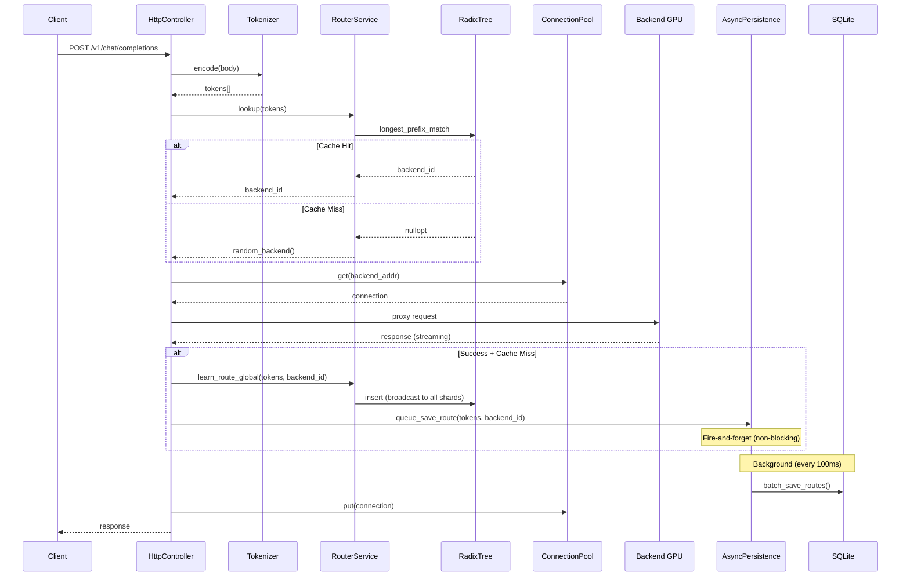
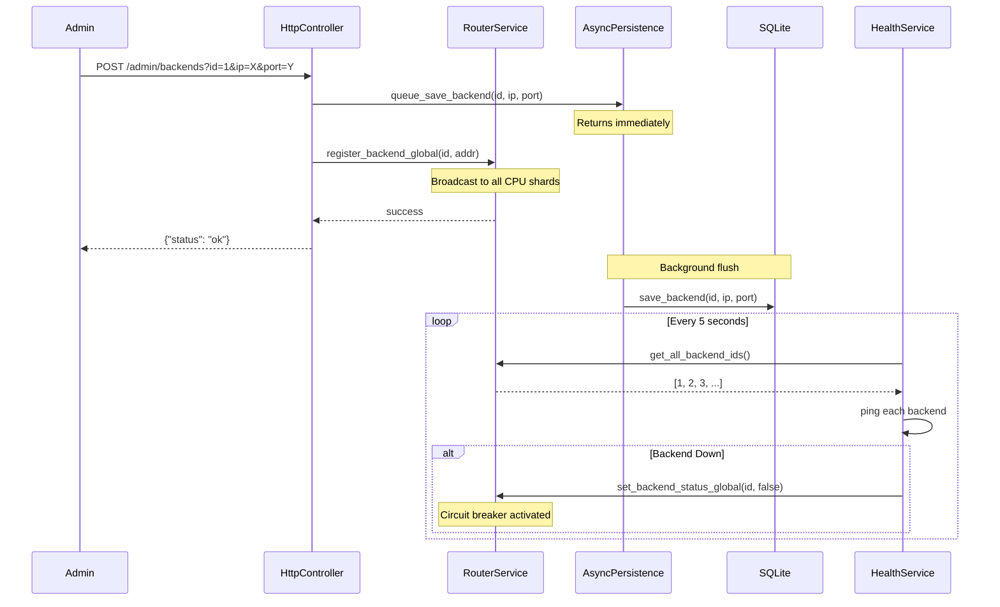
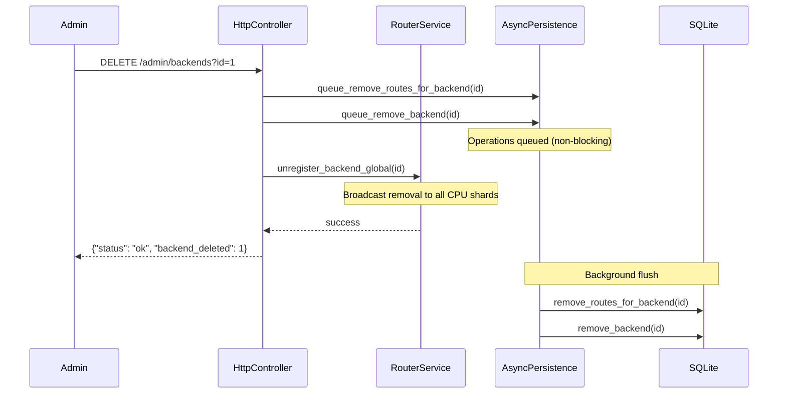
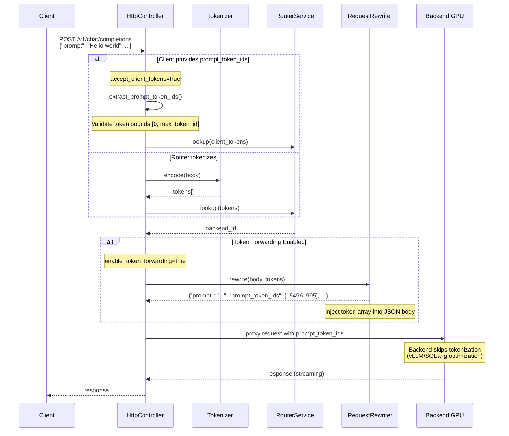

# Request Flow

## Proxy Request Sequence

This diagram shows how a client request flows through Ranvier Core to a backend GPU.



## Key Points

1. **Tokenization**: Request body is tokenized to create the lookup key
2. **Prefix Lookup**: RadixTree finds the longest matching prefix
3. **Cache Hit**: Route directly to the backend that owns this prefix
4. **Cache Miss**: Pick a random healthy backend
5. **Snooping**: On successful response, learn the route for future requests
6. **Async Persistence**: Routes are queued for background persistence (non-blocking)
7. **Batched Writes**: AsyncPersistenceManager flushes batches to SQLite every 100ms

## Backend Registration Flow



## Backend Removal Flow



## Token Forwarding Flow

This diagram shows how the router injects pre-computed `prompt_token_ids` into requests, reducing backend CPU load by eliminating redundant tokenization.



### Token Forwarding Benefits

1. **Reduced Backend CPU**: Backends like vLLM skip internal tokenization when `prompt_token_ids` is present, reducing CPU overhead by 10-15%.
2. **Guaranteed Routing Consistency**: Same tokens used for cache lookup are sent to the backend, ensuring KV-cache hits align with routing decisions.
3. **Pre-tokenized Client Support**: High-throughput clients can send pre-computed tokens (with `accept_client_tokens=true`) to skip router tokenization entirely.

### Configuration

Enable token forwarding in `ranvier.yaml`:
```yaml
router:
  enable_token_forwarding: true   # Inject tokens into backend requests
  accept_client_tokens: false     # Accept client-provided tokens (optional)
  max_token_id: 100000            # Security: reject out-of-range tokens
```
